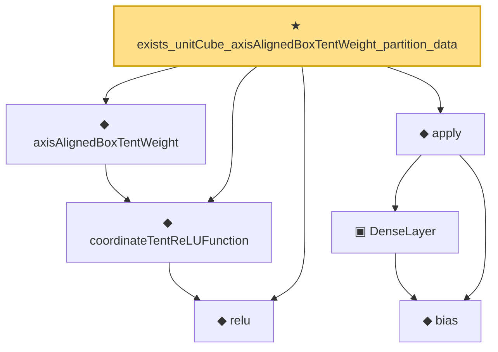

# Proof narrative — exists_unitCube_axisAlignedBoxTentWeight_partition_data

Root: **exists_unitCube_axisAlignedBoxTentWeight_partition_data** (theorem) `Statlib/Nonparametric/Approximation/NeuralNetworkAlgebra.lean:9780` · topic `Nonparametric`
Closure: 7 declarations across 3 files. Generated from `proof_graph.json` — no files were moved.

Reading order (foundations first, headline last):

  ◆ `relu` — def · `Statlib/Nonparametric/Vocabulary/NeuralNetwork.lean:15`  _(also used by 43: squareReLUHingeInterpolant_error_le_of_mem_cell, unitIntervalSquareReLUHingeNet_realize, exists_fullyConnectedReLUNet_interval_square_approx, …)_
  ◆ `coordinateTentReLUFunction` — noncomputable def · `Statlib/Nonparametric/Vocabulary/NeuralNetwork.lean:339`  _(also used by 7: coordinateTentReLUNet_realize, coordinateTentReLUFunction_mem_reluNetworkClass_with_parameter_bound, axisAlignedBoxTentWeight_bounds_and_support, …)_
  ◆ `axisAlignedBoxTentWeight` — noncomputable def · `Statlib/Nonparametric/Vocabulary/NeuralNetwork.lean:379`  _(also used by 15: axisAlignedBoxTentWeight_bounds_and_support, axisAlignedBoxTentWeight_partition_pointwise_approximation_error_bound, exists_reluNetworkClass_axisAlignedBoxTentWeight_approx_with_size_bound, …)_
    ◆ `bias` — noncomputable def · `Statlib/Nonparametric/Vocabulary/Estimator.lean:28`  _(also used by 24: exists_fullyConnectedReLUNet_mul_approx_on_box, exists_fullyConnectedReLUNet_linear_combination_two, exists_fullyConnectedReLUNet_coordinate_mul_approx_on_box, …)_
    ▣ `DenseLayer` — structure · `Statlib/Nonparametric/Vocabulary/NeuralNetwork.lean:23`  _(also used by 16: exists_fullyConnectedReLUNet_finite_linear_combination_approx, exists_fullyConnectedReLUNet_product_of_depth_one_approximants_on_box, exists_fullyConnectedReLUNet_finite_centered_monomial_polynomial_approx_on_box, …)_
  ◆ `apply` — noncomputable def · `Statlib/Nonparametric/Vocabulary/NeuralNetwork.lean:30`  _(also used by 79: unit_cube_grid_finite_measurable_cover, kernel_holder_bias_integratedSquaredError_bound, classApproximationError_le_of_exists_pointwise_bound, …)_
★ `exists_unitCube_axisAlignedBoxTentWeight_partition_data` — theorem · `Statlib/Nonparametric/Approximation/NeuralNetworkAlgebra.lean:9780` **← headline**

## Dependency diagram

