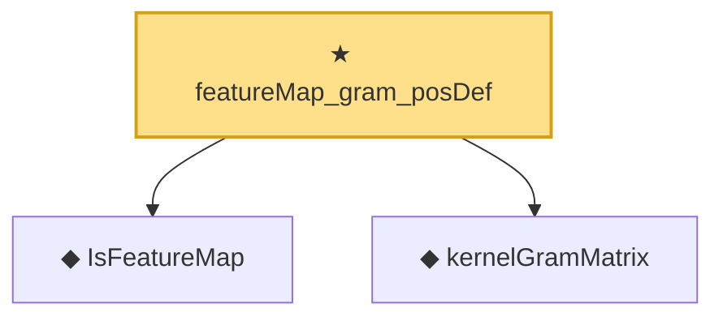

# Proof narrative — featureMap_gram_posDef

Root: **featureMap_gram_posDef** (theorem) `Statlib/Nonparametric/Vocabulary/KernelMethods.lean:81` · topic `Nonparametric`
Closure: 3 declarations across 1 files. Generated from `proof_graph.json` — no files were moved.

Reading order (foundations first, headline last):

  ◆ `IsFeatureMap` — def · `Statlib/Nonparametric/Vocabulary/KernelMethods.lean:44`  _(also used by 1: featureMap_gram_psd)_
  ◆ `kernelGramMatrix` — def · `Statlib/Nonparametric/Vocabulary/KernelMethods.lean:51`  _(also used by 3: krr_closed_form_pos_lam, krr_closed_form_zero_lam_of_posDef, featureMap_gram_psd)_
★ `featureMap_gram_posDef` — theorem · `Statlib/Nonparametric/Vocabulary/KernelMethods.lean:81` **← headline**

## Dependency diagram

