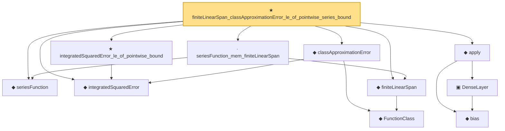

# Proof narrative — finiteLinearSpan_classApproximationError_le_of_pointwise_series_bound

Root: **finiteLinearSpan_classApproximationError_le_of_pointwise_series_bound** (theorem) `Statlib/Nonparametric/Approximation/Sieve.lean:151` · topic `Nonparametric`
Closure: 11 declarations across 7 files. Generated from `proof_graph.json` — no files were moved.

Reading order (foundations first, headline last):

  ◆ `seriesFunction` — noncomputable def · `Statlib/Nonparametric/Vocabulary/Sieve.lean:27`  _(also used by 38: holder_selectorIndicator_series_pointwise_bound, holder_selectorIndicator_series_integratedSquaredError_bound, finiteLinearSpan_classApproximationError_le_of_holder_selector_net, …)_
  ◆ `integratedSquaredError` — noncomputable def · `Statlib/Nonparametric/Vocabulary/Risk.lean:60`  _(also used by 32: supNormBall_classApproximationError_self_le_zero, holder_net_integratedSquaredError_bound, holder_classApproximationError_le_of_net_member, …)_
    ◆ `FunctionClass` — abbrev · `Statlib/Nonparametric/Vocabulary/FunctionClasses.lean:16`  _(also used by 20: holder_classApproximationError_le_of_net_member, kernel_smoother_classApproximationError_le_of_holder_bias_member, kernel_smoother_classApproximationError_le_of_holder_bias_rate, …)_
  ◆ `finiteLinearSpan` — noncomputable def · `Statlib/Nonparametric/Vocabulary/Sieve.lean:23`  _(also used by 9: finiteLinearSpan_classApproximationError_le_of_holder_selector_net, holder_selector_net_classApproximationError_le_rate, finiteLinearSpan_classApproximationError_le_of_coefficients, …)_
  ◆ `classApproximationError` — noncomputable def · `Statlib/Nonparametric/Vocabulary/Risk.lean:75`  _(also used by 21: supNormBall_classApproximationError_self_le_zero, holder_classApproximationError_le_of_net_member, holderBall_classApproximationError_self_le_zero, …)_
  · `seriesFunction_mem_finiteLinearSpan` — lemma · `Statlib/Nonparametric/Approximation/Sieve.lean:13`  _(also used by 5: finiteLinearSpan_classApproximationError_le_of_holder_selector_net, finiteLinearSpan_classApproximationError_le_of_coefficients, finiteLinearSpan_classApproximationError_le_of_exists_pointwise_series, …)_
  ★ `integratedSquaredError_le_of_pointwise_bound` — theorem · `Statlib/Nonparametric/Approximation/Metric.lean:10`  _(also used by 11: holder_net_integratedSquaredError_bound, holder_classApproximationError_le_of_net_member, holder_selectorIndicator_series_integratedSquaredError_bound, …)_
    ◆ `bias` — noncomputable def · `Statlib/Nonparametric/Vocabulary/Estimator.lean:28`
    ▣ `DenseLayer` — structure · `Statlib/Nonparametric/Vocabulary/NeuralNetwork.lean:23`  _(also used by 2: reluApply, OneHiddenReLUNet)_
  ◆ `apply` — noncomputable def · `Statlib/Nonparametric/Vocabulary/NeuralNetwork.lean:30`  _(also used by 12: unitCube_grid_finite_measurable_cover, kernel_holder_bias_integratedSquaredError_bound, classApproximationError_le_of_exists_pointwise_bound, …)_
★ `finiteLinearSpan_classApproximationError_le_of_pointwise_series_bound` — theorem · `Statlib/Nonparametric/Approximation/Sieve.lean:151` **← headline**

## Dependency diagram

