# Proof narrative — finite_axisAlignedBoxTentWeight_common_fixed_width_depth_rate_from_mul_gadget

Root: **finite_axisAlignedBoxTentWeight_common_fixed_width_depth_rate_from_mul_gadget** (theorem) `Statlib/Nonparametric/Approximation/NeuralNetworkAlgebra.lean:19658` · topic `Nonparametric`
Closure: 39 declarations across 4 files. Generated from `proof_graph.json` — no files were moved.

Reading order (foundations first, headline last):

  ◆ `fullyConnectedReLUParameterCount` — def · `Statlib/Nonparametric/Vocabulary/NeuralNetwork.lean:70`  _(also used by 46: exists_fullyConnectedReLUNet_unitInterval_square_approx, exists_fullyConnectedReLUNet_linear_combination_two, exists_fullyConnectedReLUNet_coordinate_mul_approx_on_box, …)_
    ◆ `bias` — noncomputable def · `Statlib/Nonparametric/Vocabulary/Estimator.lean:28`  _(also used by 15: exists_fullyConnectedReLUNet_linear_combination_two, exists_fullyConnectedReLUNet_coordinate_mul_approx_on_box, exists_fullyConnectedReLUNet_finite_linear_combination_approx, …)_
      ▣ `DenseLayer` — structure · `Statlib/Nonparametric/Vocabulary/NeuralNetwork.lean:23`  _(also used by 9: exists_fullyConnectedReLUNet_finite_linear_combination_approx, exists_fullyConnectedReLUNet_product_of_depth_one_approximants_on_box, exists_fullyConnectedReLUNet_finite_centered_monomial_polynomial_approx_on_box, …)_
    ◆ `parameterCount` — def · `Statlib/Nonparametric/Vocabulary/NeuralNetwork.lean:39`  _(also used by 25: reluNetworkClass_classApproximationError_le_of_pointwise_candidate, reluNetworkClass_classApproximationError_le_of_candidate_ise, reluNetworkClass_classApproximationError_le_of_exists_pointwise, …)_
    ◆ `FunctionClass` — abbrev · `Statlib/Nonparametric/Vocabulary/FunctionClasses.lean:16`  _(also used by 24: holder_class_approximation_error_le_of_net_member, kernel_smoother_classApproximationError_le_of_holder_bias_member, kernel_smoother_classApproximationError_le_of_holder_bias_rate, …)_
    ▣ `FullyConnectedReLUNet` — structure · `Statlib/Nonparametric/Vocabulary/NeuralNetwork.lean:167`  _(also used by 39: reluNetworkClass_classApproximationError_le_of_pointwise_candidate, reluNetworkClass_classApproximationError_le_of_candidate_ise, reluNetworkClass_classApproximationError_le_of_exists_pointwise, …)_
      ▣ `OneHiddenReLUNet` — structure · `Statlib/Nonparametric/Vocabulary/NeuralNetwork.lean:47`  _(also used by 3: parameterCount, mulPolarizationReLUHingeNet, oneHiddenReLUEmpiricalRisk)_
    ◆ `relu` — def · `Statlib/Nonparametric/Vocabulary/NeuralNetwork.lean:15`  _(also used by 28: exists_fullyConnectedReLUNet_product_of_depth_one_approximants_on_box, exists_fullyConnectedReLUNet_finite_centered_monomial_polynomial_approx_on_box, exists_fullyConnectedReLUNet_finite_centered_monomial_polynomial_approx_on_box_with_depth_bound, …)_
    ◆ `apply` — noncomputable def · `Statlib/Nonparametric/Vocabulary/NeuralNetwork.lean:30`  _(also used by 68: unit_cube_grid_finite_measurable_cover, kernel_holder_bias_integratedSquaredError_bound, classApproximationError_le_of_exists_pointwise_bound, …)_
    ◆ `realize` — noncomputable def · `Statlib/Nonparametric/Vocabulary/NeuralNetwork.lean:55`  _(also used by 42: reluNetworkClass_classApproximationError_le_of_pointwise_candidate, reluNetworkClass_classApproximationError_le_of_candidate_ise, reluNetworkClass_classApproximationError_le_of_exists_pointwise, …)_
  ◆ `reluNetworkClass` — def · `Statlib/Nonparametric/Vocabulary/NeuralNetwork.lean:219`  _(also used by 42: reluNetworkClass_classApproximationError_le_of_pointwise_candidate, reluNetworkClass_classApproximationError_le_of_candidate_ise, reluNetworkClass_classApproximationError_le_of_exists_pointwise, …)_
    ◆ `coordinateTentReLUFunction` — noncomputable def · `Statlib/Nonparametric/Vocabulary/NeuralNetwork.lean:339`  _(also used by 3: exists_reluNetworkClass_holderSmooth_axisAligned_tent_partition_approximation_on_domain_bound, exists_unitCube_axisAlignedBoxTentWeight_partition_data, exists_unitCube_axisAlignedBoxTentWeight_partition_data_with_domain_coord_bound)_
  ◆ `axisAlignedBoxTentWeight` — noncomputable def · `Statlib/Nonparametric/Vocabulary/NeuralNetwork.lean:379`  _(also used by 12: axisAlignedBoxTentWeight_partition_pointwise_approximation_error_bound, finite_axisAligned_tent_weighted_local_reluNetworkClass_global_error_bound, exists_reluNetworkClass_holderSmooth_axisAligned_tent_partition_approximation_on_domain_bound, …)_
    ★ `axisAlignedBoxTentWeight_bounds_and_support` — theorem · `Statlib/Nonparametric/Approximation/NeuralNetworkAlgebra.lean:6788`  _(also used by 5: axisAlignedBoxTentWeight_partition_pointwise_approximation_error_bound, exists_reluNetworkClass_holderSmooth_axisAligned_tent_partition_approximation_on_domain_bound, exists_reluNetworkClass_axisAligned_tent_partition_approximation_from_bounded_local_table_on_domain, …)_
    ◆ `coordinateTentReLUParameterBound` — def · `Statlib/Nonparametric/Vocabulary/NeuralNetwork.lean:375`
      ◆ `coordinateTentReLUNet` — noncomputable def · `Statlib/Nonparametric/Vocabulary/NeuralNetwork.lean:346`
      ◆ `reluVec` — def · `Statlib/Nonparametric/Vocabulary/NeuralNetwork.lean:19`  _(also used by 13: exists_fullyConnectedReLUNet_linear_combination_two, exists_fullyConnectedReLUNet_coordinate_mul_approx_on_box, exists_fullyConnectedReLUNet_product_of_depth_one_approximants_on_box, …)_
      ◆ `reluApply` — noncomputable def · `Statlib/Nonparametric/Vocabulary/NeuralNetwork.lean:34`  _(also used by 13: exists_fullyConnectedReLUNet_linear_combination_two, exists_fullyConnectedReLUNet_coordinate_mul_approx_on_box, exists_fullyConnectedReLUNet_product_of_depth_one_approximants_on_box, …)_
      ◆ `hiddenState` — noncomputable def · `Statlib/Nonparametric/Vocabulary/NeuralNetwork.lean:182`  _(also used by 14: exists_fullyConnectedReLUNet_linear_combination_two, exists_fullyConnectedReLUNet_coordinate_mul_approx_on_box, exists_fullyConnectedReLUNet_product_of_depth_one_approximants_on_box, …)_
    ★ `coordinateTentReLUFunction_mem_reluNetworkClass_with_parameter_bound` — theorem · `Statlib/Nonparametric/Approximation/NeuralNetworkAlgebra.lean:6766`
    ★ `exists_reluNetworkClass_product_two_fixed_width_from_mul_gadget` — theorem · `Statlib/Nonparametric/Approximation/NeuralNetworkAlgebra.lean:15774`
      ★ `coordinateTentReLUNet_realize` — theorem · `Statlib/Nonparametric/Approximation/NeuralNetworkAlgebra.lean:6701`
            ◆ `intervalSquareReLUHingeNet` — noncomputable def · `Statlib/Nonparametric/Vocabulary/NeuralNetwork.lean:292`  _(also used by 1: mulPolarizationReLUHingeNet)_
            ◆ `squareReLUHingeInterpolant` — noncomputable def · `Statlib/Nonparametric/Vocabulary/NeuralNetwork.lean:270`  _(also used by 1: exists_reluNetworkClass_unitInterval_square_fixed_width_depth_rate)_
            ◆ `unitIntervalSquareReLUHingeNet` — noncomputable def · `Statlib/Nonparametric/Vocabulary/NeuralNetwork.lean:277`  _(also used by 1: exists_fullyConnectedReLUNet_unitInterval_square_approx)_
            ★ `unitIntervalSquareReLUHingeNet_realize` — theorem · `Statlib/Nonparametric/Approximation/NeuralNetworkAlgebra.lean:160`  _(also used by 1: exists_fullyConnectedReLUNet_unitInterval_square_approx)_
            ◆ `toFullyConnected` — noncomputable def · `Statlib/Nonparametric/Vocabulary/NeuralNetwork.lean:207`  _(also used by 2: exists_fullyConnectedReLUNet_unitInterval_square_approx, exists_fullyConnectedReLUNet_finite_centered_monomial_polynomial_uniform_resolution_size_bound)_
            ◆ `intervalSquareReLUHingeInterpolant` — noncomputable def · `Statlib/Nonparametric/Vocabulary/NeuralNetwork.lean:286`
            ◆ `squareSecantInterpolant` — noncomputable def · `Statlib/Nonparametric/Vocabulary/NeuralNetwork.lean:260`
            ◆ `squareCellInterpolant` — noncomputable def · `Statlib/Nonparametric/Vocabulary/NeuralNetwork.lean:265`
            ★ `squareReLUHingeInterpolant_error_le_of_mem_cell` — theorem · `Statlib/Nonparametric/Approximation/NeuralNetworkAlgebra.lean:18`
            ★ `squareReLUHingeInterpolant_error_le_of_mem_unitInterval` — theorem · `Statlib/Nonparametric/Approximation/NeuralNetworkAlgebra.lean:191`  _(also used by 2: exists_fullyConnectedReLUNet_unitInterval_square_approx, exists_reluNetworkClass_unitInterval_square_fixed_width_depth_rate)_
          ★ `exists_fullyConnectedReLUNet_interval_square_approx` — theorem · `Statlib/Nonparametric/Approximation/NeuralNetworkAlgebra.lean:253`
        ★ `exists_fullyConnectedReLUNet_mul_approx_on_box` — theorem · `Statlib/Nonparametric/Approximation/NeuralNetworkAlgebra.lean:462`  _(also used by 5: exists_fullyConnectedReLUNet_coordinate_mul_approx_on_box, exists_fullyConnectedReLUNet_product_of_depth_one_approximants_on_box, exists_fullyConnectedReLUNet_finite_centered_monomial_polynomial_approx_on_box, …)_
      ★ `exists_fullyConnectedReLUNet_product_approx_on_box_with_size_bound` — theorem · `Statlib/Nonparametric/Approximation/NeuralNetworkAlgebra.lean:6841`  _(also used by 1: exists_reluNetworkClass_weighted_local_product_approx_with_size_bound)_
    ★ `exists_reluNetworkClass_axisAlignedBoxTentWeight_approx_with_size_bound` — theorem · `Statlib/Nonparametric/Approximation/NeuralNetworkAlgebra.lean:7709`  _(also used by 2: exists_reluNetworkClass_holderSmooth_axisAligned_tent_partition_approximation_on_domain_bound, exists_reluNetworkClass_axisAligned_tent_partition_approximation_from_bounded_local_table_on_domain)_
    ★ `exists_reluNetworkClass_product_two_fixed_width_from_mul_gadget_depth_sum_bound` — theorem · `Statlib/Nonparametric/Approximation/NeuralNetworkAlgebra.lean:16389`  _(also used by 2: finite_axisAligned_tent_weighted_local_products_fixed_width_depth_sum_bound, exists_reluNetworkClass_centered_monomial_fixed_width_depth_rate_from_mul_gadget)_
  ★ `exists_reluNetworkClass_axisAlignedBoxTentWeight_fixed_width_depth_rate_from_mul_gadget` — theorem · `Statlib/Nonparametric/Approximation/NeuralNetworkAlgebra.lean:17002`
★ `finite_axisAlignedBoxTentWeight_common_fixed_width_depth_rate_from_mul_gadget` — theorem · `Statlib/Nonparametric/Approximation/NeuralNetworkAlgebra.lean:19658` **← headline**

## Dependency diagram

```mermaid
flowchart TD
  n0["◆ fullyConnectedReLUParameterCount"]
  n1["◆ bias"]
  n2["▣ DenseLayer"]
  n3["◆ parameterCount"]
  n4["◆ FunctionClass"]
  n5["▣ FullyConnectedReLUNet"]
  n6["▣ OneHiddenReLUNet"]
  n7["◆ relu"]
  n8["◆ apply"]
  n9["◆ realize"]
  n10["◆ reluNetworkClass"]
  n11["◆ coordinateTentReLUFunction"]
  n12["◆ axisAlignedBoxTentWeight"]
  n13["★ axisAlignedBoxTentWeight_bounds_and_support"]
  n14["◆ coordinateTentReLUParameterBound"]
  n15["◆ coordinateTentReLUNet"]
  n16["◆ reluVec"]
  n17["◆ reluApply"]
  n18["◆ hiddenState"]
  n19["★ coordinateTentReLUFunction_mem_reluNetworkClass_with_parameter_bound"]
  n20["★ exists_reluNetworkClass_product_two_fixed_width_from_mul_gadget"]
  n21["★ coordinateTentReLUNet_realize"]
  n22["◆ intervalSquareReLUHingeNet"]
  n23["◆ squareReLUHingeInterpolant"]
  n24["◆ unitIntervalSquareReLUHingeNet"]
  n25["★ unitIntervalSquareReLUHingeNet_realize"]
  n26["◆ toFullyConnected"]
  n27["◆ intervalSquareReLUHingeInterpolant"]
  n28["◆ squareSecantInterpolant"]
  n29["◆ squareCellInterpolant"]
  n30["★ squareReLUHingeInterpolant_error_le_of_mem_cell"]
  n31["★ squareReLUHingeInterpolant_error_le_of_mem_unitInterval"]
  n32["★ exists_fullyConnectedReLUNet_interval_square_approx"]
  n33["★ exists_fullyConnectedReLUNet_mul_approx_on_box"]
  n34["★ exists_fullyConnectedReLUNet_product_approx_on_box_with_size_bound"]
  n35["★ exists_reluNetworkClass_axisAlignedBoxTentWeight_approx_with_size_bound"]
  n36["★ exists_reluNetworkClass_product_two_fixed_width_from_mul_gadget_depth_sum_bound"]
  n37["★ exists_reluNetworkClass_axisAlignedBoxTentWeight_fixed_width_depth_rate_from_mul_gadget"]
  n38["★ finite_axisAlignedBoxTentWeight_common_fixed_width_depth_rate_from_mul_gadget"]
  n2 --> n1
  n3 --> n2
  n5 --> n2
  n6 --> n2
  n8 --> n2
  n8 --> n1
  n9 --> n6
  n9 --> n7
  n9 --> n8
  n10 --> n3
  n10 --> n4
  n10 --> n5
  n10 --> n9
  n11 --> n7
  n12 --> n11
  n13 --> n12
  n13 --> n7
  n13 --> n11
  n14 --> n0
  n15 --> n5
  n15 --> n1
  n16 --> n7
  n17 --> n2
  n17 --> n16
  n17 --> n8
  n18 --> n5
  n18 --> n17
  n19 --> n14
  n19 --> n11
  n19 --> n10
  n19 --> n15
  n19 --> n3
  n19 --> n9
  n19 --> n18
  n19 --> n8
  n19 --> n17
  n19 --> n16
  n19 --> n7
  n20 --> n0
  n20 --> n10
  n20 --> n5
  n20 --> n3
  n20 --> n9
  n20 --> n2
  n20 --> n1
  n20 --> n8
  n20 --> n7
  n20 --> n17
  n20 --> n16
  n20 --> n18
  n21 --> n15
  n21 --> n9
  n21 --> n11
  n21 --> n8
  n21 --> n17
  n21 --> n7
  n21 --> n16
  n21 --> n18
  n22 --> n6
  n22 --> n1
  n23 --> n7
  n24 --> n6
  n24 --> n1
  n25 --> n24
  n25 --> n9
  n25 --> n23
  n25 --> n8
  n25 --> n7
  n26 --> n6
  n26 --> n5
  n27 --> n7
  n27 --> n23
  n29 --> n28
  n30 --> n23
  n30 --> n29
  n30 --> n7
  n30 --> n8
  n30 --> n28
  n31 --> n23
  n31 --> n30
  n32 --> n5
  n32 --> n3
  n32 --> n9
  n32 --> n22
  n32 --> n0
  n32 --> n23
  n32 --> n7
  n32 --> n8
  n32 --> n24
  n32 --> n25
  n32 --> n26
  n32 --> n18
  n32 --> n17
  n32 --> n16
  n32 --> n27
  n32 --> n31
  n33 --> n5
  n33 --> n3
  n33 --> n9
  n33 --> n32
  n33 --> n1
  n33 --> n0
  n33 --> n8
  n33 --> n18
  n33 --> n17
  n33 --> n16
  n33 --> n7
  n34 --> n5
  n34 --> n9
  n34 --> n3
  n34 --> n0
  n34 --> n2
  n34 --> n17
  n34 --> n16
  n34 --> n8
  n34 --> n7
  n34 --> n18
  n34 --> n33
  n34 --> n1
  n35 --> n0
  n35 --> n10
  n35 --> n12
  n35 --> n5
  n35 --> n3
  n35 --> n9
  n35 --> n11
  n35 --> n1
  n35 --> n15
  n35 --> n21
  n35 --> n7
  n35 --> n34
  n36 --> n0
  n36 --> n10
  n36 --> n5
  n36 --> n3
  n36 --> n9
  n36 --> n2
  n36 --> n1
  n36 --> n8
  n36 --> n7
  n36 --> n17
  n36 --> n16
  n36 --> n18
  n37 --> n0
  n37 --> n10
  n37 --> n12
  n37 --> n11
  n37 --> n5
  n37 --> n1
  n37 --> n9
  n37 --> n7
  n37 --> n13
  n37 --> n19
  n37 --> n8
  n37 --> n14
  n37 --> n20
  n37 --> n3
  n37 --> n35
  n37 --> n36
  n38 --> n0
  n38 --> n10
  n38 --> n12
  n38 --> n37
  class n38 headline;
  classDef headline fill:#ffe08a,stroke:#d4a017,stroke-width:2px;
  classDef axiomNode fill:#ffd0d0,stroke:#c0392b,stroke-dasharray:4 2;
```

