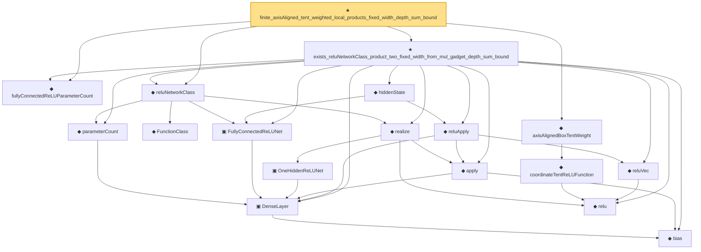

# Proof narrative — finite_axisAligned_tent_weighted_local_products_fixed_width_depth_sum_bound

Root: **finite_axisAligned_tent_weighted_local_products_fixed_width_depth_sum_bound** (theorem) `Statlib/Nonparametric/Approximation/NeuralNetworkAlgebra.lean:19797` · topic `Nonparametric`
Closure: 18 declarations across 4 files. Generated from `proof_graph.json` — no files were moved.

Reading order (foundations first, headline last):

  ◆ `fullyConnectedReLUParameterCount` — def · `Statlib/Nonparametric/Vocabulary/NeuralNetwork.lean:70`  _(also used by 53: exists_fullyConnectedReLUNet_unitInterval_square_approx, exists_fullyConnectedReLUNet_interval_square_approx, exists_fullyConnectedReLUNet_mul_approx_on_box, …)_
    ◆ `bias` — noncomputable def · `Statlib/Nonparametric/Vocabulary/Estimator.lean:28`  _(also used by 23: exists_fullyConnectedReLUNet_mul_approx_on_box, exists_fullyConnectedReLUNet_linear_combination_two, exists_fullyConnectedReLUNet_coordinate_mul_approx_on_box, …)_
    ▣ `DenseLayer` — structure · `Statlib/Nonparametric/Vocabulary/NeuralNetwork.lean:23`  _(also used by 11: exists_fullyConnectedReLUNet_finite_linear_combination_approx, exists_fullyConnectedReLUNet_product_of_depth_one_approximants_on_box, exists_fullyConnectedReLUNet_finite_centered_monomial_polynomial_approx_on_box, …)_
    ◆ `parameterCount` — def · `Statlib/Nonparametric/Vocabulary/NeuralNetwork.lean:39`  _(also used by 32: reluNetworkClass_classApproximationError_le_of_pointwise_candidate, reluNetworkClass_classApproximationError_le_of_candidate_ise, reluNetworkClass_classApproximationError_le_of_exists_pointwise, …)_
    ◆ `FunctionClass` — abbrev · `Statlib/Nonparametric/Vocabulary/FunctionClasses.lean:16`  _(also used by 24: holder_class_approximation_error_le_of_net_member, kernel_smoother_classApproximationError_le_of_holder_bias_member, kernel_smoother_classApproximationError_le_of_holder_bias_rate, …)_
    ▣ `FullyConnectedReLUNet` — structure · `Statlib/Nonparametric/Vocabulary/NeuralNetwork.lean:167`  _(also used by 47: reluNetworkClass_classApproximationError_le_of_pointwise_candidate, reluNetworkClass_classApproximationError_le_of_candidate_ise, reluNetworkClass_classApproximationError_le_of_exists_pointwise, …)_
      ▣ `OneHiddenReLUNet` — structure · `Statlib/Nonparametric/Vocabulary/NeuralNetwork.lean:47`  _(also used by 6: parameterCount, toFullyConnected, unitIntervalSquareReLUHingeNet, …)_
    ◆ `relu` — def · `Statlib/Nonparametric/Vocabulary/NeuralNetwork.lean:15`  _(also used by 41: squareReLUHingeInterpolant_error_le_of_mem_cell, unitIntervalSquareReLUHingeNet_realize, exists_fullyConnectedReLUNet_interval_square_approx, …)_
    ◆ `apply` — noncomputable def · `Statlib/Nonparametric/Vocabulary/NeuralNetwork.lean:30`  _(also used by 77: unit_cube_grid_finite_measurable_cover, kernel_holder_bias_integratedSquaredError_bound, classApproximationError_le_of_exists_pointwise_bound, …)_
    ◆ `realize` — noncomputable def · `Statlib/Nonparametric/Vocabulary/NeuralNetwork.lean:55`  _(also used by 51: reluNetworkClass_classApproximationError_le_of_pointwise_candidate, reluNetworkClass_classApproximationError_le_of_candidate_ise, reluNetworkClass_classApproximationError_le_of_exists_pointwise, …)_
  ◆ `reluNetworkClass` — def · `Statlib/Nonparametric/Vocabulary/NeuralNetwork.lean:219`  _(also used by 46: reluNetworkClass_classApproximationError_le_of_pointwise_candidate, reluNetworkClass_classApproximationError_le_of_candidate_ise, reluNetworkClass_classApproximationError_le_of_exists_pointwise, …)_
    ◆ `coordinateTentReLUFunction` — noncomputable def · `Statlib/Nonparametric/Vocabulary/NeuralNetwork.lean:339`  _(also used by 8: coordinateTentReLUNet_realize, coordinateTentReLUFunction_mem_reluNetworkClass_with_parameter_bound, axisAlignedBoxTentWeight_bounds_and_support, …)_
  ◆ `axisAlignedBoxTentWeight` — noncomputable def · `Statlib/Nonparametric/Vocabulary/NeuralNetwork.lean:379`  _(also used by 15: axisAlignedBoxTentWeight_bounds_and_support, axisAlignedBoxTentWeight_partition_pointwise_approximation_error_bound, exists_reluNetworkClass_axisAlignedBoxTentWeight_approx_with_size_bound, …)_
    ◆ `reluVec` — def · `Statlib/Nonparametric/Vocabulary/NeuralNetwork.lean:19`  _(also used by 19: exists_fullyConnectedReLUNet_interval_square_approx, exists_fullyConnectedReLUNet_mul_approx_on_box, exists_fullyConnectedReLUNet_linear_combination_two, …)_
    ◆ `reluApply` — noncomputable def · `Statlib/Nonparametric/Vocabulary/NeuralNetwork.lean:34`  _(also used by 19: exists_fullyConnectedReLUNet_interval_square_approx, exists_fullyConnectedReLUNet_mul_approx_on_box, exists_fullyConnectedReLUNet_linear_combination_two, …)_
    ◆ `hiddenState` — noncomputable def · `Statlib/Nonparametric/Vocabulary/NeuralNetwork.lean:182`  _(also used by 20: exists_fullyConnectedReLUNet_interval_square_approx, exists_fullyConnectedReLUNet_mul_approx_on_box, exists_fullyConnectedReLUNet_linear_combination_two, …)_
  ★ `exists_reluNetworkClass_product_two_fixed_width_from_mul_gadget_depth_sum_bound` — theorem · `Statlib/Nonparametric/Approximation/NeuralNetworkAlgebra.lean:16389`  _(also used by 2: exists_reluNetworkClass_axisAlignedBoxTentWeight_fixed_width_depth_rate_from_mul_gadget, exists_reluNetworkClass_centered_monomial_fixed_width_depth_rate_from_mul_gadget)_
★ `finite_axisAligned_tent_weighted_local_products_fixed_width_depth_sum_bound` — theorem · `Statlib/Nonparametric/Approximation/NeuralNetworkAlgebra.lean:19797` **← headline**

## Dependency diagram

