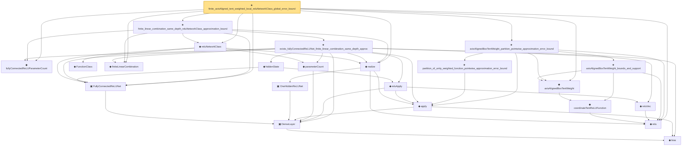

# Proof narrative — finite_axisAligned_tent_weighted_local_reluNetworkClass_global_error_bound

Root: **finite_axisAligned_tent_weighted_local_reluNetworkClass_global_error_bound** (theorem) `Statlib/Nonparametric/Approximation/NeuralNetworkAlgebra.lean:8203` · topic `Nonparametric`
Closure: 23 declarations across 5 files. Generated from `proof_graph.json` — no files were moved.

Reading order (foundations first, headline last):

      ◆ `bias` — noncomputable def · `Statlib/Nonparametric/Vocabulary/Estimator.lean:28`  _(also used by 23: exists_fullyConnectedReLUNet_mul_approx_on_box, exists_fullyConnectedReLUNet_linear_combination_two, exists_fullyConnectedReLUNet_coordinate_mul_approx_on_box, …)_
    ▣ `DenseLayer` — structure · `Statlib/Nonparametric/Vocabulary/NeuralNetwork.lean:23`  _(also used by 11: exists_fullyConnectedReLUNet_finite_linear_combination_approx, exists_fullyConnectedReLUNet_product_of_depth_one_approximants_on_box, exists_fullyConnectedReLUNet_finite_centered_monomial_polynomial_approx_on_box, …)_
  ▣ `FullyConnectedReLUNet` — structure · `Statlib/Nonparametric/Vocabulary/NeuralNetwork.lean:167`  _(also used by 45: reluNetworkClass_classApproximationError_le_of_pointwise_candidate, reluNetworkClass_classApproximationError_le_of_candidate_ise, reluNetworkClass_classApproximationError_le_of_exists_pointwise, …)_
  ◆ `fullyConnectedReLUParameterCount` — def · `Statlib/Nonparametric/Vocabulary/NeuralNetwork.lean:70`  _(also used by 52: exists_fullyConnectedReLUNet_unitInterval_square_approx, exists_fullyConnectedReLUNet_interval_square_approx, exists_fullyConnectedReLUNet_mul_approx_on_box, …)_
    ▣ `OneHiddenReLUNet` — structure · `Statlib/Nonparametric/Vocabulary/NeuralNetwork.lean:47`  _(also used by 6: parameterCount, toFullyConnected, unitIntervalSquareReLUHingeNet, …)_
  ◆ `relu` — def · `Statlib/Nonparametric/Vocabulary/NeuralNetwork.lean:15`  _(also used by 39: squareReLUHingeInterpolant_error_le_of_mem_cell, unitIntervalSquareReLUHingeNet_realize, exists_fullyConnectedReLUNet_interval_square_approx, …)_
    ◆ `apply` — noncomputable def · `Statlib/Nonparametric/Vocabulary/NeuralNetwork.lean:30`  _(also used by 75: unit_cube_grid_finite_measurable_cover, kernel_holder_bias_integratedSquaredError_bound, classApproximationError_le_of_exists_pointwise_bound, …)_
  ◆ `realize` — noncomputable def · `Statlib/Nonparametric/Vocabulary/NeuralNetwork.lean:55`  _(also used by 49: reluNetworkClass_classApproximationError_le_of_pointwise_candidate, reluNetworkClass_classApproximationError_le_of_candidate_ise, reluNetworkClass_classApproximationError_le_of_exists_pointwise, …)_
    ◆ `coordinateTentReLUFunction` — noncomputable def · `Statlib/Nonparametric/Vocabulary/NeuralNetwork.lean:339`  _(also used by 7: coordinateTentReLUNet_realize, coordinateTentReLUFunction_mem_reluNetworkClass_with_parameter_bound, exists_reluNetworkClass_axisAlignedBoxTentWeight_approx_with_size_bound, …)_
  ◆ `axisAlignedBoxTentWeight` — noncomputable def · `Statlib/Nonparametric/Vocabulary/NeuralNetwork.lean:379`  _(also used by 13: exists_reluNetworkClass_axisAlignedBoxTentWeight_approx_with_size_bound, exists_reluNetworkClass_holderSmooth_axisAligned_tent_partition_approximation_on_domain_bound, exists_reluNetworkClass_axisAligned_tent_partition_approximation_from_bounded_local_table_on_domain, …)_
    ◆ `parameterCount` — def · `Statlib/Nonparametric/Vocabulary/NeuralNetwork.lean:39`  _(also used by 32: reluNetworkClass_classApproximationError_le_of_pointwise_candidate, reluNetworkClass_classApproximationError_le_of_candidate_ise, reluNetworkClass_classApproximationError_le_of_exists_pointwise, …)_
    ◆ `FunctionClass` — abbrev · `Statlib/Nonparametric/Vocabulary/FunctionClasses.lean:16`  _(also used by 24: holder_class_approximation_error_le_of_net_member, kernel_smoother_classApproximationError_le_of_holder_bias_member, kernel_smoother_classApproximationError_le_of_holder_bias_rate, …)_
  ◆ `reluNetworkClass` — def · `Statlib/Nonparametric/Vocabulary/NeuralNetwork.lean:219`  _(also used by 46: reluNetworkClass_classApproximationError_le_of_pointwise_candidate, reluNetworkClass_classApproximationError_le_of_candidate_ise, reluNetworkClass_classApproximationError_le_of_exists_pointwise, …)_
  ◆ `finiteLinearCombination` — noncomputable def · `Statlib/Nonparametric/Vocabulary/NeuralNetwork.lean:384`  _(also used by 21: exists_fullyConnectedReLUNet_finite_linear_combination_approx, exists_fullyConnectedReLUNet_finite_quadratic_polynomial_approx_on_box, exists_fullyConnectedReLUNet_finite_centered_monomial_polynomial_approx_on_box, …)_
      ◆ `reluVec` — def · `Statlib/Nonparametric/Vocabulary/NeuralNetwork.lean:19`  _(also used by 19: exists_fullyConnectedReLUNet_interval_square_approx, exists_fullyConnectedReLUNet_mul_approx_on_box, exists_fullyConnectedReLUNet_linear_combination_two, …)_
      ◆ `reluApply` — noncomputable def · `Statlib/Nonparametric/Vocabulary/NeuralNetwork.lean:34`  _(also used by 19: exists_fullyConnectedReLUNet_interval_square_approx, exists_fullyConnectedReLUNet_mul_approx_on_box, exists_fullyConnectedReLUNet_linear_combination_two, …)_
      ◆ `hiddenState` — noncomputable def · `Statlib/Nonparametric/Vocabulary/NeuralNetwork.lean:182`  _(also used by 20: exists_fullyConnectedReLUNet_interval_square_approx, exists_fullyConnectedReLUNet_mul_approx_on_box, exists_fullyConnectedReLUNet_linear_combination_two, …)_
    ★ `exists_fullyConnectedReLUNet_finite_linear_combination_same_depth_approx` — theorem · `Statlib/Nonparametric/Approximation/NeuralNetworkAlgebra.lean:6427`
  ★ `finite_linear_combination_same_depth_reluNetworkClass_approximation_bound` — theorem · `Statlib/Nonparametric/Approximation/NeuralNetworkAlgebra.lean:7647`  _(also used by 1: finite_linear_combination_reluNetworkClass_approximation_bound_from_class_members)_
    ★ `partition_of_unity_weighted_function_pointwise_approximation_error_bound` — theorem · `Statlib/Nonparametric/Approximation/Sieve.lean:501`  _(also used by 3: finite_axisAligned_tent_weighted_local_reluNetworkClass_serial_fixed_width_global_error_bound, finite_axisAligned_tent_weighted_local_reluNetworkClass_serial_fixed_width_explicit_depth_global_error_bound, unitCubeBSplineQuasiInterpolantCertificate_exists_of_taylorStability)_
    ★ `axisAlignedBoxTentWeight_bounds_and_support` — theorem · `Statlib/Nonparametric/Approximation/NeuralNetworkAlgebra.lean:6788`  _(also used by 5: exists_reluNetworkClass_holderSmooth_axisAligned_tent_partition_approximation_on_domain_bound, exists_reluNetworkClass_axisAligned_tent_partition_approximation_from_bounded_local_table_on_domain, exists_reluNetworkClass_axisAlignedBoxTentWeight_fixed_width_depth_rate_from_mul_gadget, …)_
  ★ `axisAlignedBoxTentWeight_partition_pointwise_approximation_error_bound` — theorem · `Statlib/Nonparametric/Approximation/NeuralNetworkAlgebra.lean:7678`
★ `finite_axisAligned_tent_weighted_local_reluNetworkClass_global_error_bound` — theorem · `Statlib/Nonparametric/Approximation/NeuralNetworkAlgebra.lean:8203` **← headline**

## Dependency diagram

