# Proof narrative — finite_holderSmooth_local_table_reluNetworkClass_active_cell_error_bound

Root: **finite_holderSmooth_local_table_reluNetworkClass_active_cell_error_bound** (theorem) `Statlib/Nonparametric/Approximation/NeuralNetworkAlgebra.lean:8483` · topic `Nonparametric`
Closure: 43 declarations across 4 files. Generated from `proof_graph.json` — no files were moved.

Reading order (foundations first, headline last):

  ◆ `finiteCenteredMonomialPolynomialDepthBound` — def · `Statlib/Nonparametric/Vocabulary/NeuralNetwork.lean:137`  _(also used by 13: exists_fullyConnectedReLUNet_taylor_polynomial_approx_on_centered_box_with_size_bound, exists_fullyConnectedReLUNet_holderSmooth_local_approx_on_centered_box_with_size_bound, exists_reluNetworkClass_holderSmooth_local_approx_on_centered_box_with_symbolic_budget, …)_
    ◆ `centeredMonomialWidthBound` — def · `Statlib/Nonparametric/Vocabulary/NeuralNetwork.lean:107`
  ◆ `finiteCenteredMonomialPolynomialWidthBound` — def · `Statlib/Nonparametric/Vocabulary/NeuralNetwork.lean:143`  _(also used by 14: exists_fullyConnectedReLUNet_taylor_polynomial_approx_on_centered_box_with_size_bound, exists_fullyConnectedReLUNet_holderSmooth_local_approx_on_centered_box_with_size_bound, exists_reluNetworkClass_holderSmooth_local_approx_on_centered_box_with_symbolic_budget, …)_
    ◆ `fullyConnectedReLUParameterCount` — def · `Statlib/Nonparametric/Vocabulary/NeuralNetwork.lean:70`  _(also used by 50: exists_fullyConnectedReLUNet_unitInterval_square_approx, exists_fullyConnectedReLUNet_coordinate_mul_approx_on_box, exists_fullyConnectedReLUNet_finite_linear_combination_approx, …)_
  ◆ `finiteCenteredMonomialPolynomialParameterBound` — def · `Statlib/Nonparametric/Vocabulary/NeuralNetwork.lean:149`  _(also used by 11: exists_fullyConnectedReLUNet_taylor_polynomial_approx_on_centered_box_with_size_bound, exists_fullyConnectedReLUNet_holderSmooth_local_approx_on_centered_box_with_size_bound, exists_reluNetworkClass_holderSmooth_local_approx_on_centered_box_with_symbolic_budget, …)_
    ◆ `FunctionClass` — abbrev · `Statlib/Nonparametric/Vocabulary/FunctionClasses.lean:16`  _(also used by 22: holder_class_approximation_error_le_of_net_member, kernel_smoother_classApproximationError_le_of_holder_bias_member, kernel_smoother_classApproximationError_le_of_holder_bias_rate, …)_
    ◆ `IsHolderFunction` — def · `Statlib/Nonparametric/Vocabulary/FunctionClasses.lean:44`  _(also used by 19: holder_net_sup_approximation_bound, holder_net_integrated_squared_error_bound, holder_class_approximation_error_le_of_net_member, …)_
    ◆ `IsHolderSmoothFunction` — def · `Statlib/Nonparametric/Vocabulary/FunctionClasses.lean:73`  _(also used by 2: unit_cube_bspline_zero_order_holder_projection_rate_of_support_node, tensor_product_linear_bspline_holder_projection_rate_of_local_partition)_
    ◆ `holderBall` — def · `Statlib/Nonparametric/Vocabulary/FunctionClasses.lean:60`  _(also used by 14: holder_ball_class_approximation_error_self_le_zero, selector_indicator_uniform_sieve_holder_approximation_bound, exists_selector_indicator_sieve_holder_approximation_bound_of_finite_net, …)_
  ◆ `holderSmoothBall` — def · `Statlib/Nonparametric/Vocabulary/FunctionClasses.lean:86`  _(also used by 74: exists_fullyConnectedReLUNet_holderSmooth_local_approx_on_centered_box_with_size_bound, exists_fullyConnectedReLUNet_holderSmooth_local_approx_on_centered_box, exists_fullyConnectedReLUNet_holderSmooth_local_approx_on_centered_box_with_depth_bound, …)_
  ◆ `centeredMonomialApproxError` — noncomputable def · `Statlib/Nonparametric/Vocabulary/NeuralNetwork.lean:79`  _(also used by 9: exists_reluNetworkClass_holderSmooth_local_approx_on_centered_box_with_coefficient_budget, exists_reluNetworkClass_holderSmooth_axisAligned_tent_partition_approximation_on_domain_bound, finite_holderSmooth_local_table_reluNetworkClass_active_cell_error_and_domain_output_bound, …)_
  ◆ `relu` — def · `Statlib/Nonparametric/Vocabulary/NeuralNetwork.lean:15`  _(also used by 35: exists_fullyConnectedReLUNet_product_of_depth_one_approximants_on_box, exists_fullyConnectedReLUNet_finite_centered_monomial_polynomial_approx_on_box, exists_fullyConnectedReLUNet_finite_centered_monomial_polynomial_approx_on_box_with_depth_bound, …)_
    ◆ `bias` — noncomputable def · `Statlib/Nonparametric/Vocabulary/Estimator.lean:28`  _(also used by 19: exists_fullyConnectedReLUNet_coordinate_mul_approx_on_box, exists_fullyConnectedReLUNet_finite_linear_combination_approx, exists_fullyConnectedReLUNet_finite_quadratic_polynomial_approx_on_box, …)_
    ▣ `DenseLayer` — structure · `Statlib/Nonparametric/Vocabulary/NeuralNetwork.lean:23`  _(also used by 11: exists_fullyConnectedReLUNet_finite_linear_combination_approx, exists_fullyConnectedReLUNet_product_of_depth_one_approximants_on_box, exists_fullyConnectedReLUNet_finite_centered_monomial_polynomial_approx_on_box, …)_
    ◆ `parameterCount` — def · `Statlib/Nonparametric/Vocabulary/NeuralNetwork.lean:39`  _(also used by 29: reluNetworkClass_classApproximationError_le_of_pointwise_candidate, reluNetworkClass_classApproximationError_le_of_candidate_ise, reluNetworkClass_classApproximationError_le_of_exists_pointwise, …)_
  ▣ `FullyConnectedReLUNet` — structure · `Statlib/Nonparametric/Vocabulary/NeuralNetwork.lean:167`  _(also used by 42: reluNetworkClass_classApproximationError_le_of_pointwise_candidate, reluNetworkClass_classApproximationError_le_of_candidate_ise, reluNetworkClass_classApproximationError_le_of_exists_pointwise, …)_
      ▣ `OneHiddenReLUNet` — structure · `Statlib/Nonparametric/Vocabulary/NeuralNetwork.lean:47`  _(also used by 3: parameterCount, mulPolarizationReLUHingeNet, oneHiddenReLUEmpiricalRisk)_
    ◆ `apply` — noncomputable def · `Statlib/Nonparametric/Vocabulary/NeuralNetwork.lean:30`  _(also used by 70: unit_cube_grid_finite_measurable_cover, kernel_holder_bias_integratedSquaredError_bound, classApproximationError_le_of_exists_pointwise_bound, …)_
  ◆ `realize` — noncomputable def · `Statlib/Nonparametric/Vocabulary/NeuralNetwork.lean:55`  _(also used by 46: reluNetworkClass_classApproximationError_le_of_pointwise_candidate, reluNetworkClass_classApproximationError_le_of_candidate_ise, reluNetworkClass_classApproximationError_le_of_exists_pointwise, …)_
  ◆ `reluNetworkClass` — def · `Statlib/Nonparametric/Vocabulary/NeuralNetwork.lean:219`  _(also used by 47: reluNetworkClass_classApproximationError_le_of_pointwise_candidate, reluNetworkClass_classApproximationError_le_of_candidate_ise, reluNetworkClass_classApproximationError_le_of_exists_pointwise, …)_
  ◆ `finiteLinearCombination` — noncomputable def · `Statlib/Nonparametric/Vocabulary/NeuralNetwork.lean:384`  _(also used by 20: exists_fullyConnectedReLUNet_finite_linear_combination_approx, exists_fullyConnectedReLUNet_finite_quadratic_polynomial_approx_on_box, exists_fullyConnectedReLUNet_finite_centered_monomial_polynomial_approx_on_box, …)_
  ◆ `finiteCenteredMonomialPolynomialApproxError` — noncomputable def · `Statlib/Nonparametric/Vocabulary/NeuralNetwork.lean:157`  _(also used by 6: exists_fullyConnectedReLUNet_taylor_polynomial_approx_on_centered_box_with_size_bound, exists_fullyConnectedReLUNet_holderSmooth_local_approx_on_centered_box_with_size_bound, exists_reluNetworkClass_holderSmooth_local_approx_on_centered_box_with_symbolic_budget, …)_
    ◆ `toFullyConnected` — noncomputable def · `Statlib/Nonparametric/Vocabulary/NeuralNetwork.lean:207`  _(also used by 1: exists_fullyConnectedReLUNet_unitInterval_square_approx)_
    ◆ `reluVec` — def · `Statlib/Nonparametric/Vocabulary/NeuralNetwork.lean:19`  _(also used by 16: exists_fullyConnectedReLUNet_coordinate_mul_approx_on_box, exists_fullyConnectedReLUNet_product_of_depth_one_approximants_on_box, exists_fullyConnectedReLUNet_finite_centered_monomial_polynomial_approx_on_box, …)_
    ◆ `reluApply` — noncomputable def · `Statlib/Nonparametric/Vocabulary/NeuralNetwork.lean:34`  _(also used by 16: exists_fullyConnectedReLUNet_coordinate_mul_approx_on_box, exists_fullyConnectedReLUNet_product_of_depth_one_approximants_on_box, exists_fullyConnectedReLUNet_finite_centered_monomial_polynomial_approx_on_box, …)_
    ◆ `hiddenState` — noncomputable def · `Statlib/Nonparametric/Vocabulary/NeuralNetwork.lean:182`  _(also used by 17: exists_fullyConnectedReLUNet_coordinate_mul_approx_on_box, exists_fullyConnectedReLUNet_product_of_depth_one_approximants_on_box, exists_fullyConnectedReLUNet_finite_centered_monomial_polynomial_approx_on_box, …)_
    ★ `exists_fullyConnectedReLUNet_linear_combination_two` — theorem · `Statlib/Nonparametric/Approximation/NeuralNetworkAlgebra.lean:714`  _(also used by 2: exists_fullyConnectedReLUNet_linear_combination_two_approx, exists_fullyConnectedReLUNet_quadratic_two_term_approx_on_box)_
        ◆ `intervalSquareReLUHingeNet` — noncomputable def · `Statlib/Nonparametric/Vocabulary/NeuralNetwork.lean:292`  _(also used by 1: mulPolarizationReLUHingeNet)_
        ◆ `squareReLUHingeInterpolant` — noncomputable def · `Statlib/Nonparametric/Vocabulary/NeuralNetwork.lean:270`  _(also used by 1: exists_reluNetworkClass_unitInterval_square_fixed_width_depth_rate)_
        ◆ `unitIntervalSquareReLUHingeNet` — noncomputable def · `Statlib/Nonparametric/Vocabulary/NeuralNetwork.lean:277`  _(also used by 1: exists_fullyConnectedReLUNet_unitInterval_square_approx)_
        ★ `unitIntervalSquareReLUHingeNet_realize` — theorem · `Statlib/Nonparametric/Approximation/NeuralNetworkAlgebra.lean:160`  _(also used by 1: exists_fullyConnectedReLUNet_unitInterval_square_approx)_
        ◆ `intervalSquareReLUHingeInterpolant` — noncomputable def · `Statlib/Nonparametric/Vocabulary/NeuralNetwork.lean:286`
            ◆ `squareSecantInterpolant` — noncomputable def · `Statlib/Nonparametric/Vocabulary/NeuralNetwork.lean:260`
            ◆ `squareCellInterpolant` — noncomputable def · `Statlib/Nonparametric/Vocabulary/NeuralNetwork.lean:265`
          ★ `squareReLUHingeInterpolant_error_le_of_mem_cell` — theorem · `Statlib/Nonparametric/Approximation/NeuralNetworkAlgebra.lean:18`
        ★ `squareReLUHingeInterpolant_error_le_of_mem_unitInterval` — theorem · `Statlib/Nonparametric/Approximation/NeuralNetworkAlgebra.lean:191`  _(also used by 2: exists_fullyConnectedReLUNet_unitInterval_square_approx, exists_reluNetworkClass_unitInterval_square_fixed_width_depth_rate)_
      ★ `exists_fullyConnectedReLUNet_interval_square_approx` — theorem · `Statlib/Nonparametric/Approximation/NeuralNetworkAlgebra.lean:253`
    ★ `exists_fullyConnectedReLUNet_mul_approx_on_box` — theorem · `Statlib/Nonparametric/Approximation/NeuralNetworkAlgebra.lean:462`  _(also used by 5: exists_fullyConnectedReLUNet_coordinate_mul_approx_on_box, exists_fullyConnectedReLUNet_product_of_depth_one_approximants_on_box, exists_fullyConnectedReLUNet_finite_centered_monomial_polynomial_approx_on_box, …)_
  ★ `exists_fullyConnectedReLUNet_finite_centered_monomial_polynomial_uniform_resolution_size_bound` — theorem · `Statlib/Nonparametric/Approximation/NeuralNetworkAlgebra.lean:4478`  _(also used by 2: exists_fullyConnectedReLUNet_taylor_polynomial_approx_on_centered_box_with_size_bound, exists_reluNetworkClass_holderSmooth_local_approx_on_centered_box_with_symbolic_budget)_
    ★ `holderSmoothBall_taylor_remainder_bound_on_box` — theorem · `Statlib/Nonparametric/Approximation/NeuralNetworkAlgebra.lean:2533`  _(also used by 3: exists_fullyConnectedReLUNet_holderSmooth_local_approx_on_centered_box_with_size_bound, exists_fullyConnectedReLUNet_holderSmooth_local_approx_on_centered_box, finite_holderSmooth_local_table_reluNetworkClass_active_cell_error_and_domain_output_bound)_
    ★ `taylor_polynomial_as_finite_centered_coordinate_polynomial` — theorem · `Statlib/Nonparametric/Approximation/NeuralNetworkAlgebra.lean:4315`  _(also used by 5: exists_fullyConnectedReLUNet_taylor_polynomial_approx_on_centered_box, exists_fullyConnectedReLUNet_taylor_polynomial_approx_on_centered_box_with_size_bound, exists_fullyConnectedReLUNet_taylor_polynomial_approx_on_centered_box_with_depth_bound, …)_
  ★ `holderSmoothBall_finite_centered_coordinate_polynomial_error_on_norm_ball` — theorem · `Statlib/Nonparametric/Approximation/NeuralNetworkAlgebra.lean:4452`  _(also used by 5: exists_fullyConnectedReLUNet_holderSmooth_local_approx_on_centered_box_with_depth_bound, exists_reluNetworkClass_holderSmooth_local_approx_on_centered_box_with_symbolic_budget, holderSmoothBall_unitCube_taylor_coefficients_admit_uniform_bound, …)_
★ `finite_holderSmooth_local_table_reluNetworkClass_active_cell_error_bound` — theorem · `Statlib/Nonparametric/Approximation/NeuralNetworkAlgebra.lean:8483` **← headline**

## Dependency diagram

```mermaid
flowchart TD
  n0["◆ finiteCenteredMonomialPolynomialDepthBound"]
  n1["◆ centeredMonomialWidthBound"]
  n2["◆ finiteCenteredMonomialPolynomialWidthBound"]
  n3["◆ fullyConnectedReLUParameterCount"]
  n4["◆ finiteCenteredMonomialPolynomialParameterBound"]
  n5["◆ FunctionClass"]
  n6["◆ IsHolderFunction"]
  n7["◆ IsHolderSmoothFunction"]
  n8["◆ holderBall"]
  n9["◆ holderSmoothBall"]
  n10["◆ centeredMonomialApproxError"]
  n11["◆ relu"]
  n12["◆ bias"]
  n13["▣ DenseLayer"]
  n14["◆ parameterCount"]
  n15["▣ FullyConnectedReLUNet"]
  n16["▣ OneHiddenReLUNet"]
  n17["◆ apply"]
  n18["◆ realize"]
  n19["◆ reluNetworkClass"]
  n20["◆ finiteLinearCombination"]
  n21["◆ finiteCenteredMonomialPolynomialApproxError"]
  n22["◆ toFullyConnected"]
  n23["◆ reluVec"]
  n24["◆ reluApply"]
  n25["◆ hiddenState"]
  n26["★ exists_fullyConnectedReLUNet_linear_combination_two"]
  n27["◆ intervalSquareReLUHingeNet"]
  n28["◆ squareReLUHingeInterpolant"]
  n29["◆ unitIntervalSquareReLUHingeNet"]
  n30["★ unitIntervalSquareReLUHingeNet_realize"]
  n31["◆ intervalSquareReLUHingeInterpolant"]
  n32["◆ squareSecantInterpolant"]
  n33["◆ squareCellInterpolant"]
  n34["★ squareReLUHingeInterpolant_error_le_of_mem_cell"]
  n35["★ squareReLUHingeInterpolant_error_le_of_mem_unitInterval"]
  n36["★ exists_fullyConnectedReLUNet_interval_square_approx"]
  n37["★ exists_fullyConnectedReLUNet_mul_approx_on_box"]
  n38["★ exists_fullyConnectedReLUNet_finite_centered_monomial_polynomial_uniform_resolution_size_bound"]
  n39["★ holderSmoothBall_taylor_remainder_bound_on_box"]
  n40["★ taylor_polynomial_as_finite_centered_coordinate_polynomial"]
  n41["★ holderSmoothBall_finite_centered_coordinate_polynomial_error_on_norm_ball"]
  n42["★ finite_holderSmooth_local_table_reluNetworkClass_active_cell_error_bound"]
  n2 --> n1
  n4 --> n3
  n4 --> n0
  n4 --> n2
  n7 --> n6
  n8 --> n5
  n8 --> n6
  n9 --> n5
  n9 --> n7
  n9 --> n6
  n9 --> n8
  n13 --> n12
  n14 --> n13
  n15 --> n13
  n16 --> n13
  n17 --> n13
  n17 --> n12
  n18 --> n16
  n18 --> n11
  n18 --> n17
  n19 --> n14
  n19 --> n5
  n19 --> n15
  n19 --> n18
  n21 --> n10
  n22 --> n16
  n22 --> n15
  n23 --> n11
  n24 --> n13
  n24 --> n23
  n24 --> n17
  n25 --> n15
  n25 --> n24
  n26 --> n15
  n26 --> n14
  n26 --> n18
  n26 --> n12
  n26 --> n3
  n26 --> n25
  n26 --> n24
  n26 --> n23
  n26 --> n17
  n27 --> n16
  n27 --> n12
  n28 --> n11
  n29 --> n16
  n29 --> n12
  n30 --> n29
  n30 --> n18
  n30 --> n28
  n30 --> n17
  n30 --> n11
  n31 --> n11
  n31 --> n28
  n33 --> n32
  n34 --> n28
  n34 --> n33
  n34 --> n11
  n34 --> n17
  n34 --> n32
  n35 --> n28
  n35 --> n34
  n36 --> n15
  n36 --> n14
  n36 --> n18
  n36 --> n27
  n36 --> n3
  n36 --> n28
  n36 --> n11
  n36 --> n17
  n36 --> n29
  n36 --> n30
  n36 --> n22
  n36 --> n25
  n36 --> n24
  n36 --> n23
  n36 --> n31
  n36 --> n35
  n37 --> n15
  n37 --> n14
  n37 --> n18
  n37 --> n36
  n37 --> n12
  n37 --> n3
  n37 --> n17
  n37 --> n25
  n37 --> n24
  n37 --> n23
  n37 --> n11
  n38 --> n15
  n38 --> n0
  n38 --> n2
  n38 --> n14
  n38 --> n4
  n38 --> n18
  n38 --> n20
  n38 --> n21
  n38 --> n1
  n38 --> n10
  n38 --> n22
  n38 --> n12
  n38 --> n25
  n38 --> n24
  n38 --> n17
  n38 --> n23
  n38 --> n11
  n38 --> n26
  n38 --> n37
  n38 --> n13
  n38 --> n3
  n39 --> n9
  n39 --> n6
  n39 --> n17
  n40 --> n20
  n40 --> n17
  n41 --> n9
  n41 --> n20
  n41 --> n39
  n41 --> n40
  n42 --> n0
  n42 --> n2
  n42 --> n4
  n42 --> n9
  n42 --> n10
  n42 --> n11
  n42 --> n19
  n42 --> n15
  n42 --> n18
  n42 --> n20
  n42 --> n38
  n42 --> n21
  n42 --> n41
  class n42 headline;
  classDef headline fill:#ffe08a,stroke:#d4a017,stroke-width:2px;
  classDef axiomNode fill:#ffd0d0,stroke:#c0392b,stroke-dasharray:4 2;
```

