# Proof narrative — finite_holderSmooth_local_table_reluNetworkClass_fixed_width_active_cell_error_and_domain_output_bound_from_mul_gadget

Root: **finite_holderSmooth_local_table_reluNetworkClass_fixed_width_active_cell_error_and_domain_output_bound_from_mul_gadget** (theorem) `Statlib/Nonparametric/Approximation/NeuralNetworkAlgebra.lean:23672` · topic `Nonparametric`
Closure: 32 declarations across 4 files. Generated from `proof_graph.json` — no files were moved.

Reading order (foundations first, headline last):

  ◆ `fullyConnectedReLUParameterCount` — def · `Statlib/Nonparametric/Vocabulary/NeuralNetwork.lean:70`  _(also used by 48: exists_fullyConnectedReLUNet_unitInterval_square_approx, exists_fullyConnectedReLUNet_interval_square_approx, exists_fullyConnectedReLUNet_mul_approx_on_box, …)_
      ◆ `bias` — noncomputable def · `Statlib/Nonparametric/Vocabulary/Estimator.lean:28`  _(also used by 21: exists_fullyConnectedReLUNet_mul_approx_on_box, exists_fullyConnectedReLUNet_linear_combination_two, exists_fullyConnectedReLUNet_coordinate_mul_approx_on_box, …)_
      ▣ `DenseLayer` — structure · `Statlib/Nonparametric/Vocabulary/NeuralNetwork.lean:23`  _(also used by 9: exists_fullyConnectedReLUNet_finite_linear_combination_approx, exists_fullyConnectedReLUNet_product_of_depth_one_approximants_on_box, exists_fullyConnectedReLUNet_finite_centered_monomial_polynomial_approx_on_box, …)_
    ◆ `parameterCount` — def · `Statlib/Nonparametric/Vocabulary/NeuralNetwork.lean:39`  _(also used by 30: reluNetworkClass_classApproximationError_le_of_pointwise_candidate, reluNetworkClass_classApproximationError_le_of_candidate_ise, reluNetworkClass_classApproximationError_le_of_exists_pointwise, …)_
    ◆ `FunctionClass` — abbrev · `Statlib/Nonparametric/Vocabulary/FunctionClasses.lean:16`  _(also used by 22: holder_class_approximation_error_le_of_net_member, kernel_smoother_classApproximationError_le_of_holder_bias_member, kernel_smoother_classApproximationError_le_of_holder_bias_rate, …)_
    ▣ `FullyConnectedReLUNet` — structure · `Statlib/Nonparametric/Vocabulary/NeuralNetwork.lean:167`  _(also used by 43: reluNetworkClass_classApproximationError_le_of_pointwise_candidate, reluNetworkClass_classApproximationError_le_of_candidate_ise, reluNetworkClass_classApproximationError_le_of_exists_pointwise, …)_
      ▣ `OneHiddenReLUNet` — structure · `Statlib/Nonparametric/Vocabulary/NeuralNetwork.lean:47`  _(also used by 6: parameterCount, toFullyConnected, unitIntervalSquareReLUHingeNet, …)_
  ◆ `relu` — def · `Statlib/Nonparametric/Vocabulary/NeuralNetwork.lean:15`  _(also used by 39: squareReLUHingeInterpolant_error_le_of_mem_cell, unitIntervalSquareReLUHingeNet_realize, exists_fullyConnectedReLUNet_interval_square_approx, …)_
    ◆ `apply` — noncomputable def · `Statlib/Nonparametric/Vocabulary/NeuralNetwork.lean:30`  _(also used by 71: unit_cube_grid_finite_measurable_cover, kernel_holder_bias_integratedSquaredError_bound, classApproximationError_le_of_exists_pointwise_bound, …)_
    ◆ `realize` — noncomputable def · `Statlib/Nonparametric/Vocabulary/NeuralNetwork.lean:55`  _(also used by 47: reluNetworkClass_classApproximationError_le_of_pointwise_candidate, reluNetworkClass_classApproximationError_le_of_candidate_ise, reluNetworkClass_classApproximationError_le_of_exists_pointwise, …)_
  ◆ `reluNetworkClass` — def · `Statlib/Nonparametric/Vocabulary/NeuralNetwork.lean:219`  _(also used by 42: reluNetworkClass_classApproximationError_le_of_pointwise_candidate, reluNetworkClass_classApproximationError_le_of_candidate_ise, reluNetworkClass_classApproximationError_le_of_exists_pointwise, …)_
    ◆ `centeredMonomialFixedWidthBound` — def · `Statlib/Nonparametric/Vocabulary/NeuralNetwork.lean:115`  _(also used by 1: exists_reluNetworkClass_finite_centered_monomial_polynomial_fixed_width_depth_rate_from_mul_gadget)_
  ◆ `finiteCenteredMonomialPolynomialFixedWidthBound` — def · `Statlib/Nonparametric/Vocabulary/NeuralNetwork.lean:124`  _(also used by 1: exists_reluNetworkClass_finite_centered_monomial_polynomial_fixed_width_depth_rate_from_mul_gadget)_
    ◆ `IsHolderFunction` — def · `Statlib/Nonparametric/Vocabulary/FunctionClasses.lean:44`  _(also used by 19: holder_net_sup_approximation_bound, holder_net_integrated_squared_error_bound, holder_class_approximation_error_le_of_net_member, …)_
    ◆ `IsHolderSmoothFunction` — def · `Statlib/Nonparametric/Vocabulary/FunctionClasses.lean:73`  _(also used by 2: unit_cube_bspline_zero_order_holder_projection_rate_of_support_node, tensor_product_linear_bspline_holder_projection_rate_of_local_partition)_
    ◆ `holderBall` — def · `Statlib/Nonparametric/Vocabulary/FunctionClasses.lean:60`  _(also used by 14: holder_ball_class_approximation_error_self_le_zero, selector_indicator_uniform_sieve_holder_approximation_bound, exists_selector_indicator_sieve_holder_approximation_bound_of_finite_net, …)_
  ◆ `holderSmoothBall` — def · `Statlib/Nonparametric/Vocabulary/FunctionClasses.lean:86`  _(also used by 74: exists_fullyConnectedReLUNet_holderSmooth_local_approx_on_centered_box_with_size_bound, exists_fullyConnectedReLUNet_holderSmooth_local_approx_on_centered_box, exists_fullyConnectedReLUNet_holderSmooth_local_approx_on_centered_box_with_depth_bound, …)_
  ◆ `centeredMonomialFixedWidthApproxError` — noncomputable def · `Statlib/Nonparametric/Vocabulary/NeuralNetwork.lean:94`  _(also used by 4: exists_centeredMonomialFixedWidthApproxError_unit_radius_sigma_sum_le, exists_reluNetworkClass_finite_centered_monomial_polynomial_fixed_width_depth_rate_from_mul_gadget, exists_centeredMonomialFixedWidthApproxError_unit_radius_sigma_sum_quadratic_bound, …)_
  ◆ `finiteLinearCombination` — noncomputable def · `Statlib/Nonparametric/Vocabulary/NeuralNetwork.lean:384`  _(also used by 17: exists_fullyConnectedReLUNet_finite_linear_combination_approx, exists_fullyConnectedReLUNet_finite_quadratic_polynomial_approx_on_box, exists_fullyConnectedReLUNet_finite_centered_monomial_polynomial_approx_on_box, …)_
      ◆ `reluVec` — def · `Statlib/Nonparametric/Vocabulary/NeuralNetwork.lean:19`  _(also used by 16: exists_fullyConnectedReLUNet_interval_square_approx, exists_fullyConnectedReLUNet_mul_approx_on_box, exists_fullyConnectedReLUNet_linear_combination_two, …)_
      ◆ `reluApply` — noncomputable def · `Statlib/Nonparametric/Vocabulary/NeuralNetwork.lean:34`  _(also used by 16: exists_fullyConnectedReLUNet_interval_square_approx, exists_fullyConnectedReLUNet_mul_approx_on_box, exists_fullyConnectedReLUNet_linear_combination_two, …)_
      ◆ `hiddenState` — noncomputable def · `Statlib/Nonparametric/Vocabulary/NeuralNetwork.lean:182`  _(also used by 17: exists_fullyConnectedReLUNet_interval_square_approx, exists_fullyConnectedReLUNet_mul_approx_on_box, exists_fullyConnectedReLUNet_linear_combination_two, …)_
      ★ `exists_reluNetworkClass_product_two_fixed_width_from_mul_gadget_depth_sum_bound` — theorem · `Statlib/Nonparametric/Approximation/NeuralNetworkAlgebra.lean:16389`  _(also used by 2: exists_reluNetworkClass_axisAlignedBoxTentWeight_fixed_width_depth_rate_from_mul_gadget, finite_axisAligned_tent_weighted_local_products_fixed_width_depth_sum_bound)_
    ★ `exists_reluNetworkClass_centered_monomial_fixed_width_depth_rate_from_mul_gadget` — theorem · `Statlib/Nonparametric/Approximation/NeuralNetworkAlgebra.lean:22581`  _(also used by 1: exists_reluNetworkClass_finite_centered_monomial_polynomial_fixed_width_depth_rate_from_mul_gadget)_
        ★ `exists_fullyConnectedReLUNet_finite_linear_combination_same_depth_approx` — theorem · `Statlib/Nonparametric/Approximation/NeuralNetworkAlgebra.lean:6427`
      ★ `finite_linear_combination_same_depth_reluNetworkClass_approximation_bound` — theorem · `Statlib/Nonparametric/Approximation/NeuralNetworkAlgebra.lean:7647`  _(also used by 1: finite_axisAligned_tent_weighted_local_reluNetworkClass_global_error_bound)_
    ★ `finite_linear_combination_reluNetworkClass_approximation_bound_from_class_members` — theorem · `Statlib/Nonparametric/Approximation/NeuralNetworkAlgebra.lean:8259`  _(also used by 4: exists_reluNetworkClass_holderSmooth_axisAligned_tent_partition_approximation_on_domain_bound, exists_reluNetworkClass_axisAligned_tent_partition_approximation_from_bounded_local_table_on_domain, exists_reluNetworkClass_mul_fixed_width_depth_rate_on_box, …)_
  ★ `exists_reluNetworkClass_finite_centered_monomial_polynomial_fixed_width_depth_rate_uniform_coeff_bound_from_mul_gadget` — theorem · `Statlib/Nonparametric/Approximation/NeuralNetworkAlgebra.lean:23333`
    ★ `holderSmoothBall_taylor_remainder_bound_on_box` — theorem · `Statlib/Nonparametric/Approximation/NeuralNetworkAlgebra.lean:2533`  _(also used by 3: exists_fullyConnectedReLUNet_holderSmooth_local_approx_on_centered_box_with_size_bound, exists_fullyConnectedReLUNet_holderSmooth_local_approx_on_centered_box, finite_holderSmooth_local_table_reluNetworkClass_active_cell_error_and_domain_output_bound)_
    ★ `taylor_polynomial_as_finite_centered_coordinate_polynomial` — theorem · `Statlib/Nonparametric/Approximation/NeuralNetworkAlgebra.lean:4315`  _(also used by 5: exists_fullyConnectedReLUNet_taylor_polynomial_approx_on_centered_box, exists_fullyConnectedReLUNet_taylor_polynomial_approx_on_centered_box_with_size_bound, exists_fullyConnectedReLUNet_taylor_polynomial_approx_on_centered_box_with_depth_bound, …)_
  ★ `holderSmoothBall_finite_centered_coordinate_polynomial_error_on_norm_ball` — theorem · `Statlib/Nonparametric/Approximation/NeuralNetworkAlgebra.lean:4452`  _(also used by 5: exists_fullyConnectedReLUNet_holderSmooth_local_approx_on_centered_box_with_depth_bound, exists_reluNetworkClass_holderSmooth_local_approx_on_centered_box_with_symbolic_budget, finite_holderSmooth_local_table_reluNetworkClass_active_cell_error_bound, …)_
★ `finite_holderSmooth_local_table_reluNetworkClass_fixed_width_active_cell_error_and_domain_output_bound_from_mul_gadget` — theorem · `Statlib/Nonparametric/Approximation/NeuralNetworkAlgebra.lean:23672` **← headline**

## Dependency diagram

```mermaid
flowchart TD
  n0["◆ fullyConnectedReLUParameterCount"]
  n1["◆ bias"]
  n2["▣ DenseLayer"]
  n3["◆ parameterCount"]
  n4["◆ FunctionClass"]
  n5["▣ FullyConnectedReLUNet"]
  n6["▣ OneHiddenReLUNet"]
  n7["◆ relu"]
  n8["◆ apply"]
  n9["◆ realize"]
  n10["◆ reluNetworkClass"]
  n11["◆ centeredMonomialFixedWidthBound"]
  n12["◆ finiteCenteredMonomialPolynomialFixedWidthBound"]
  n13["◆ IsHolderFunction"]
  n14["◆ IsHolderSmoothFunction"]
  n15["◆ holderBall"]
  n16["◆ holderSmoothBall"]
  n17["◆ centeredMonomialFixedWidthApproxError"]
  n18["◆ finiteLinearCombination"]
  n19["◆ reluVec"]
  n20["◆ reluApply"]
  n21["◆ hiddenState"]
  n22["★ exists_reluNetworkClass_product_two_fixed_width_from_mul_gadget_depth_sum_bound"]
  n23["★ exists_reluNetworkClass_centered_monomial_fixed_width_depth_rate_from_mul_gadget"]
  n24["★ exists_fullyConnectedReLUNet_finite_linear_combination_same_depth_approx"]
  n25["★ finite_linear_combination_same_depth_reluNetworkClass_approximation_bound"]
  n26["★ finite_linear_combination_reluNetworkClass_approximation_bound_from_class_members"]
  n27["★ exists_reluNetworkClass_finite_centered_monomial_polynomial_fixed_width_depth_rate_uniform_coeff_bound_from_mul_gadget"]
  n28["★ holderSmoothBall_taylor_remainder_bound_on_box"]
  n29["★ taylor_polynomial_as_finite_centered_coordinate_polynomial"]
  n30["★ holderSmoothBall_finite_centered_coordinate_polynomial_error_on_norm_ball"]
  n31["★ finite_holderSmooth_local_table_reluNetworkClass_fixed_width_active_cell_error_and_domain_output_bound_from_mul_gadget"]
  n2 --> n1
  n3 --> n2
  n5 --> n2
  n6 --> n2
  n8 --> n2
  n8 --> n1
  n9 --> n6
  n9 --> n7
  n9 --> n8
  n10 --> n3
  n10 --> n4
  n10 --> n5
  n10 --> n9
  n12 --> n11
  n14 --> n13
  n15 --> n4
  n15 --> n13
  n16 --> n4
  n16 --> n14
  n16 --> n13
  n16 --> n15
  n19 --> n7
  n20 --> n2
  n20 --> n19
  n20 --> n8
  n21 --> n5
  n21 --> n20
  n22 --> n0
  n22 --> n10
  n22 --> n5
  n22 --> n3
  n22 --> n9
  n22 --> n2
  n22 --> n1
  n22 --> n8
  n22 --> n7
  n22 --> n20
  n22 --> n19
  n22 --> n21
  n23 --> n0
  n23 --> n10
  n23 --> n11
  n23 --> n17
  n23 --> n7
  n23 --> n5
  n23 --> n1
  n23 --> n9
  n23 --> n21
  n23 --> n20
  n23 --> n8
  n23 --> n19
  n23 --> n22
  n24 --> n5
  n24 --> n9
  n24 --> n3
  n24 --> n0
  n24 --> n18
  n24 --> n2
  n24 --> n1
  n24 --> n20
  n24 --> n8
  n24 --> n19
  n24 --> n21
  n25 --> n5
  n25 --> n0
  n25 --> n9
  n25 --> n10
  n25 --> n18
  n25 --> n24
  n26 --> n10
  n26 --> n0
  n26 --> n18
  n26 --> n5
  n26 --> n9
  n26 --> n2
  n26 --> n20
  n26 --> n19
  n26 --> n7
  n26 --> n8
  n26 --> n21
  n26 --> n3
  n26 --> n25
  n27 --> n0
  n27 --> n10
  n27 --> n12
  n27 --> n18
  n27 --> n17
  n27 --> n11
  n27 --> n23
  n27 --> n8
  n27 --> n26
  n28 --> n16
  n28 --> n13
  n28 --> n8
  n29 --> n18
  n29 --> n8
  n30 --> n16
  n30 --> n18
  n30 --> n28
  n30 --> n29
  n31 --> n0
  n31 --> n10
  n31 --> n12
  n31 --> n16
  n31 --> n17
  n31 --> n7
  n31 --> n18
  n31 --> n27
  n31 --> n30
  class n31 headline;
  classDef headline fill:#ffe08a,stroke:#d4a017,stroke-width:2px;
  classDef axiomNode fill:#ffd0d0,stroke:#c0392b,stroke-dasharray:4 2;
```

