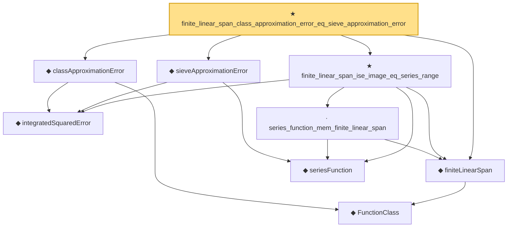

# Proof narrative — finite_linear_span_class_approximation_error_eq_sieve_approximation_error

Root: **finite_linear_span_class_approximation_error_eq_sieve_approximation_error** (theorem) `Statlib/Nonparametric/Approximation/Sieve.lean:298` · topic `Nonparametric`
Closure: 9 declarations across 4 files. Generated from `proof_graph.json` — no files were moved.

Reading order (foundations first, headline last):

    ◆ `FunctionClass` — abbrev · `Statlib/Nonparametric/Vocabulary/FunctionClasses.lean:16`  _(also used by 23: holder_class_approximation_error_le_of_net_member, kernel_smoother_classApproximationError_le_of_holder_bias_member, kernel_smoother_classApproximationError_le_of_holder_bias_rate, …)_
    ◆ `integratedSquaredError` — noncomputable def · `Statlib/Nonparametric/Vocabulary/Risk.lean:60`  _(also used by 32: supNormBall_classApproximationError_self_le_zero, holder_net_integrated_squared_error_bound, holder_class_approximation_error_le_of_net_member, …)_
  ◆ `classApproximationError` — noncomputable def · `Statlib/Nonparametric/Vocabulary/Risk.lean:75`  _(also used by 21: supNormBall_classApproximationError_self_le_zero, holder_class_approximation_error_le_of_net_member, holder_ball_class_approximation_error_self_le_zero, …)_
  ◆ `finiteLinearSpan` — noncomputable def · `Statlib/Nonparametric/Vocabulary/Sieve.lean:23`  _(also used by 8: selector_indicator_holder_class_approximation_error_le_of_net, selector_indicator_holder_class_approximation_error_le_rate, finite_linear_span_class_approximation_error_le_of_coefficients, …)_
    ◆ `seriesFunction` — noncomputable def · `Statlib/Nonparametric/Vocabulary/Sieve.lean:27`  _(also used by 66: selector_indicator_holder_series_pointwise_approximation_bound, selector_indicator_holder_series_integrated_squared_error_bound, selector_indicator_holder_class_approximation_error_le_of_net, …)_
  ◆ `sieveApproximationError` — noncomputable def · `Statlib/Nonparametric/Vocabulary/Sieve.lean:42`  _(also used by 60: selector_indicator_holder_sieve_approximation_error_le_of_net, selector_indicator_uniform_sieve_holder_approximation_bound, exists_selector_indicator_sieve_holder_approximation_bound_of_finite_net, …)_
    · `series_function_mem_finite_linear_span` — lemma · `Statlib/Nonparametric/Approximation/Sieve.lean:13`  _(also used by 5: selector_indicator_holder_class_approximation_error_le_of_net, finite_linear_span_class_approximation_error_le_of_coefficients, finite_linear_span_class_approximation_error_le_of_pointwise_series_approximation, …)_
  ★ `finite_linear_span_ise_image_eq_series_range` — theorem · `Statlib/Nonparametric/Approximation/Sieve.lean:276`
★ `finite_linear_span_class_approximation_error_eq_sieve_approximation_error` — theorem · `Statlib/Nonparametric/Approximation/Sieve.lean:298` **← headline**

## Dependency diagram

