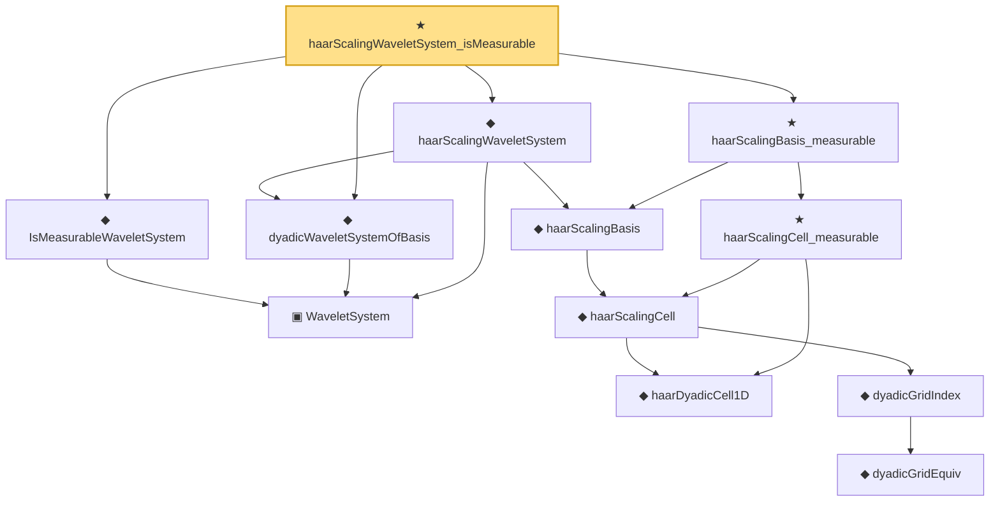

# Proof narrative — haarScalingWaveletSystem_isMeasurable

Root: **haarScalingWaveletSystem_isMeasurable** (theorem) `Statlib/Nonparametric/Approximation/WaveletFacts.lean:32` · topic `Nonparametric`
Closure: 12 declarations across 2 files. Generated from `proof_graph.json` — no files were moved.

Reading order (foundations first, headline last):

    ▣ `WaveletSystem` — structure · `Statlib/Nonparametric/Vocabulary/Wavelet.lean:16`  _(also used by 21: wavelet_sieve_series_function_measurable_of_system, wavelet_sieve_holder_smooth_approximation_bound_of_exists_pointwise_series, wavelet_sieve_holder_smooth_approximation_bound_of_pointwise_approximation, …)_
  ◆ `IsMeasurableWaveletSystem` — def · `Statlib/Nonparametric/Vocabulary/Wavelet.lean:82`  _(also used by 12: wavelet_sieve_series_function_measurable_of_system, wavelet_sieve_holder_smooth_approximation_bound_of_pointwise_approximation, wavelet_sieve_holder_smooth_approximation_bound_of_level_rate, …)_
  ◆ `dyadicWaveletSystemOfBasis` — def · `Statlib/Nonparametric/Vocabulary/Wavelet.lean:22`  _(also used by 6: dyadic_wavelet_holder_smooth_approximation_bound_of_projection_rate, dyadic_wavelet_holder_smooth_approximation_bound_of_projection_certificate, dyadic_wavelet_high_order_holder_smooth_uniform_sieve_approximation_rate_of_projection_certificate, …)_
      ◆ `haarDyadicCell1D` — def · `Statlib/Nonparametric/Vocabulary/Wavelet.lean:41`
          ◆ `dyadicGridEquiv` — noncomputable def · `Statlib/Nonparametric/Vocabulary/Wavelet.lean:30`
        ◆ `dyadicGridIndex` — noncomputable def · `Statlib/Nonparametric/Vocabulary/Wavelet.lean:36`
      ◆ `haarScalingCell` — noncomputable def · `Statlib/Nonparametric/Vocabulary/Wavelet.lean:46`
    ◆ `haarScalingBasis` — noncomputable def · `Statlib/Nonparametric/Vocabulary/Wavelet.lean:51`  _(also used by 2: haar_wavelet_zero_order_holder_projection_rate_of_cell_selector, haar_wavelet_zero_order_uniform_sieve_holder_approximation_rate_of_projection_error)_
  ◆ `haarScalingWaveletSystem` — noncomputable def · `Statlib/Nonparametric/Vocabulary/Wavelet.lean:56`  _(also used by 2: haar_wavelet_zero_order_holder_projection_rate_of_cell_selector, haar_wavelet_zero_order_uniform_sieve_holder_approximation_rate_of_projection_error)_
    ★ `haarScalingCell_measurable` — theorem · `Statlib/Nonparametric/Approximation/WaveletFacts.lean:14`
  ★ `haarScalingBasis_measurable` — theorem · `Statlib/Nonparametric/Approximation/WaveletFacts.lean:24`  _(also used by 1: haar_wavelet_zero_order_uniform_sieve_holder_approximation_rate_of_projection_error)_
★ `haarScalingWaveletSystem_isMeasurable` — theorem · `Statlib/Nonparametric/Approximation/WaveletFacts.lean:32` **← headline**

## Dependency diagram

