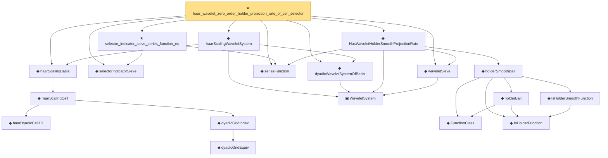

# Proof narrative — haar_wavelet_zero_order_holder_projection_rate_of_cell_selector

Root: **haar_wavelet_zero_order_holder_projection_rate_of_cell_selector** (theorem) `Statlib/Nonparametric/Approximation/Wavelet.lean:574` · topic `Nonparametric`
Closure: 19 declarations across 5 files. Generated from `proof_graph.json` — no files were moved.

Reading order (foundations first, headline last):

      ◆ `haarDyadicCell1D` — def · `Statlib/Nonparametric/Vocabulary/Wavelet.lean:41`  _(also used by 1: haarScalingCell_measurable)_
        ◆ `dyadicGridEquiv` — noncomputable def · `Statlib/Nonparametric/Vocabulary/Wavelet.lean:30`
      ◆ `dyadicGridIndex` — noncomputable def · `Statlib/Nonparametric/Vocabulary/Wavelet.lean:36`
    ◆ `haarScalingCell` — noncomputable def · `Statlib/Nonparametric/Vocabulary/Wavelet.lean:46`  _(also used by 1: haarScalingCell_measurable)_
  ◆ `haarScalingBasis` — noncomputable def · `Statlib/Nonparametric/Vocabulary/Wavelet.lean:51`  _(also used by 2: haar_wavelet_zero_order_uniform_sieve_holder_approximation_rate_of_projection_error, haarScalingBasis_measurable)_
  ◆ `selectorIndicatorSieve` — def · `Statlib/Nonparametric/Approximation/Sieve.lean:459`  _(also used by 16: selector_indicator_holder_series_pointwise_approximation_bound, selector_indicator_holder_series_integrated_squared_error_bound, selector_indicator_holder_class_approximation_error_le_of_net, …)_
    ▣ `WaveletSystem` — structure · `Statlib/Nonparametric/Vocabulary/Wavelet.lean:16`  _(also used by 20: wavelet_sieve_series_function_measurable_of_system, wavelet_sieve_holder_smooth_approximation_bound_of_exists_pointwise_series, wavelet_sieve_holder_smooth_approximation_bound_of_pointwise_approximation, …)_
      ◆ `FunctionClass` — abbrev · `Statlib/Nonparametric/Vocabulary/FunctionClasses.lean:16`  _(also used by 23: holder_class_approximation_error_le_of_net_member, kernel_smoother_classApproximationError_le_of_holder_bias_member, kernel_smoother_classApproximationError_le_of_holder_bias_rate, …)_
      ◆ `IsHolderFunction` — def · `Statlib/Nonparametric/Vocabulary/FunctionClasses.lean:44`  _(also used by 20: holder_net_sup_approximation_bound, holder_net_integrated_squared_error_bound, holder_class_approximation_error_le_of_net_member, …)_
      ◆ `IsHolderSmoothFunction` — def · `Statlib/Nonparametric/Vocabulary/FunctionClasses.lean:73`  _(also used by 2: unit_cube_bspline_zero_order_holder_projection_rate_of_support_node, tensor_product_linear_bspline_holder_projection_rate_of_local_partition)_
      ◆ `holderBall` — def · `Statlib/Nonparametric/Vocabulary/FunctionClasses.lean:60`  _(also used by 14: holder_ball_class_approximation_error_self_le_zero, selector_indicator_uniform_sieve_holder_approximation_bound, exists_selector_indicator_sieve_holder_approximation_bound_of_finite_net, …)_
    ◆ `holderSmoothBall` — def · `Statlib/Nonparametric/Vocabulary/FunctionClasses.lean:86`  _(also used by 76: holderSmoothBall_taylor_remainder_bound_on_box, holderSmoothBall_finite_centered_coordinate_polynomial_error_on_norm_ball, exists_fullyConnectedReLUNet_holderSmooth_local_approx_on_centered_box_with_size_bound, …)_
  ◆ `seriesFunction` — noncomputable def · `Statlib/Nonparametric/Vocabulary/Sieve.lean:27`  _(also used by 66: selector_indicator_holder_series_pointwise_approximation_bound, selector_indicator_holder_series_integrated_squared_error_bound, selector_indicator_holder_class_approximation_error_le_of_net, …)_
  ◆ `waveletSieve` — def · `Statlib/Nonparametric/Vocabulary/Wavelet.lean:72`  _(also used by 23: wavelet_sieve_series_function_measurable_of_system, wavelet_sieve_holder_smooth_approximation_bound_of_exists_pointwise_series, wavelet_sieve_holder_smooth_approximation_bound_of_pointwise_approximation, …)_
  ◆ `HasWaveletHolderSmoothProjectionRate` — def · `Statlib/Nonparametric/Vocabulary/Wavelet.lean:110`  _(also used by 3: wavelet_sieve_holder_smooth_approximation_exact_basis_count_of_projection_rate, dyadic_wavelet_holder_smooth_approximation_bound_of_projection_rate, IsWaveletHolderSmoothApproximationSieve)_
  ◆ `dyadicWaveletSystemOfBasis` — def · `Statlib/Nonparametric/Vocabulary/Wavelet.lean:22`  _(also used by 6: dyadic_wavelet_holder_smooth_approximation_bound_of_projection_rate, dyadic_wavelet_holder_smooth_approximation_bound_of_projection_certificate, dyadic_wavelet_high_order_holder_smooth_uniform_sieve_approximation_rate_of_projection_certificate, …)_
  ◆ `haarScalingWaveletSystem` — noncomputable def · `Statlib/Nonparametric/Vocabulary/Wavelet.lean:56`  _(also used by 2: haar_wavelet_zero_order_uniform_sieve_holder_approximation_rate_of_projection_error, haarScalingWaveletSystem_isMeasurable)_
  ★ `selector_indicator_sieve_series_function_eq` — theorem · `Statlib/Nonparametric/Approximation/Sieve.lean:486`  _(also used by 4: selector_indicator_holder_series_pointwise_approximation_bound, selector_indicator_holder_class_approximation_error_le_of_net, selector_indicator_holder_sieve_approximation_error_le_of_net, …)_
★ `haar_wavelet_zero_order_holder_projection_rate_of_cell_selector` — theorem · `Statlib/Nonparametric/Approximation/Wavelet.lean:574` **← headline**

## Dependency diagram

