# Proof narrative — haar_wavelet_zero_order_uniform_sieve_holder_approximation_rate_of_projection_error

Root: **haar_wavelet_zero_order_uniform_sieve_holder_approximation_rate_of_projection_error** (theorem) `Statlib/Nonparametric/Approximation/Wavelet.lean:655` · topic `Nonparametric`
Closure: 48 declarations across 10 files. Generated from `proof_graph.json` — no files were moved.

Reading order (foundations first, headline last):

    ◆ `FunctionClass` — abbrev · `Statlib/Nonparametric/Vocabulary/FunctionClasses.lean:16`  _(also used by 23: holder_class_approximation_error_le_of_net_member, kernel_smoother_classApproximationError_le_of_holder_bias_member, kernel_smoother_classApproximationError_le_of_holder_bias_rate, …)_
    ◆ `IsHolderFunction` — def · `Statlib/Nonparametric/Vocabulary/FunctionClasses.lean:44`  _(also used by 20: holder_net_sup_approximation_bound, holder_net_integrated_squared_error_bound, holder_class_approximation_error_le_of_net_member, …)_
    ◆ `IsHolderSmoothFunction` — def · `Statlib/Nonparametric/Vocabulary/FunctionClasses.lean:73`  _(also used by 2: unit_cube_bspline_zero_order_holder_projection_rate_of_support_node, tensor_product_linear_bspline_holder_projection_rate_of_local_partition)_
    ◆ `holderBall` — def · `Statlib/Nonparametric/Vocabulary/FunctionClasses.lean:60`  _(also used by 14: holder_ball_class_approximation_error_self_le_zero, selector_indicator_uniform_sieve_holder_approximation_bound, exists_selector_indicator_sieve_holder_approximation_bound_of_finite_net, …)_
  ◆ `holderSmoothBall` — def · `Statlib/Nonparametric/Vocabulary/FunctionClasses.lean:86`  _(also used by 62: holderSmoothBall_taylor_remainder_bound_on_box, holderSmoothBall_finite_centered_coordinate_polynomial_error_on_norm_ball, exists_fullyConnectedReLUNet_holderSmooth_local_approx_on_centered_box_with_size_bound, …)_
  ◆ `seriesFunction` — noncomputable def · `Statlib/Nonparametric/Vocabulary/Sieve.lean:27`  _(also used by 53: selector_indicator_holder_series_pointwise_approximation_bound, selector_indicator_holder_series_integrated_squared_error_bound, selector_indicator_holder_class_approximation_error_le_of_net, …)_
    ▣ `WaveletSystem` — structure · `Statlib/Nonparametric/Vocabulary/Wavelet.lean:16`  _(also used by 6: wavelet_sieve_holder_smooth_approximation_exact_basis_count_of_projection_certificate, wavelet_high_order_holder_smooth_uniform_sieve_approximation_rate_of_approximation_sieve, wavelet_high_order_holder_smooth_uniform_sieve_approximation_rate_of_projection_certificate, …)_
  ◆ `waveletSieve` — def · `Statlib/Nonparametric/Vocabulary/Wavelet.lean:72`  _(also used by 8: wavelet_sieve_holder_smooth_approximation_exact_basis_count_of_projection_certificate, wavelet_high_order_holder_smooth_uniform_sieve_approximation_rate_of_approximation_sieve, wavelet_high_order_holder_smooth_uniform_sieve_approximation_rate_of_projection_certificate, …)_
    ◆ `dyadicWaveletSystemOfBasis` — def · `Statlib/Nonparametric/Vocabulary/Wavelet.lean:22`  _(also used by 4: dyadic_wavelet_high_order_holder_smooth_uniform_sieve_approximation_rate_of_projection_certificate, dyadic_wavelet_high_order_holder_smooth_uniform_sieve_approximation_rate_of_projection_error, haar_wavelet_zero_order_holder_projection_rate_of_cell_selector, …)_
      ◆ `haarDyadicCell1D` — def · `Statlib/Nonparametric/Vocabulary/Wavelet.lean:41`
          ◆ `dyadicGridEquiv` — noncomputable def · `Statlib/Nonparametric/Vocabulary/Wavelet.lean:30`
        ◆ `dyadicGridIndex` — noncomputable def · `Statlib/Nonparametric/Vocabulary/Wavelet.lean:36`
      ◆ `haarScalingCell` — noncomputable def · `Statlib/Nonparametric/Vocabulary/Wavelet.lean:46`
  ◆ `haarScalingBasis` — noncomputable def · `Statlib/Nonparametric/Vocabulary/Wavelet.lean:51`  _(also used by 1: haar_wavelet_zero_order_holder_projection_rate_of_cell_selector)_
  ◆ `haarScalingWaveletSystem` — noncomputable def · `Statlib/Nonparametric/Vocabulary/Wavelet.lean:56`  _(also used by 2: haar_wavelet_zero_order_holder_projection_rate_of_cell_selector, haarScalingWaveletSystem_isMeasurable)_
    ◆ `integratedSquaredError` — noncomputable def · `Statlib/Nonparametric/Vocabulary/Risk.lean:60`  _(also used by 30: supNormBall_classApproximationError_self_le_zero, holder_net_integrated_squared_error_bound, holder_class_approximation_error_le_of_net_member, …)_
  ◆ `sieveApproximationError` — noncomputable def · `Statlib/Nonparametric/Vocabulary/Sieve.lean:42`  _(also used by 45: selector_indicator_holder_sieve_approximation_error_le_of_net, selector_indicator_uniform_sieve_holder_approximation_bound, exists_selector_indicator_sieve_holder_approximation_bound_of_finite_net, …)_
      ▣ `WaveletProjectionCertificate` — structure · `Statlib/Nonparametric/Vocabulary/Wavelet.lean:125`  _(also used by 4: wavelet_sieve_holder_smooth_approximation_exact_basis_count_of_projection_certificate, wavelet_high_order_holder_smooth_uniform_sieve_approximation_rate_of_projection_certificate, dyadic_wavelet_high_order_holder_smooth_uniform_sieve_approximation_rate_of_projection_certificate, …)_
        ◆ `HasWaveletHolderSmoothProjectionRate` — def · `Statlib/Nonparametric/Vocabulary/Wavelet.lean:110`  _(also used by 1: haar_wavelet_zero_order_holder_projection_rate_of_cell_selector)_
          ◆ `IsMeasurableWaveletSystem` — def · `Statlib/Nonparametric/Vocabulary/Wavelet.lean:82`  _(also used by 4: wavelet_sieve_holder_smooth_approximation_exact_basis_count_of_projection_certificate, wavelet_high_order_holder_smooth_uniform_sieve_approximation_rate_of_projection_certificate, dyadic_wavelet_high_order_holder_smooth_uniform_sieve_approximation_rate_of_projection_error, …)_
        ◆ `IsWaveletHolderSmoothApproximationSieve` — def · `Statlib/Nonparametric/Vocabulary/Wavelet.lean:141`  _(also used by 3: wavelet_high_order_holder_smooth_uniform_sieve_approximation_rate_of_approximation_sieve, wavelet_high_order_holder_smooth_uniform_sieve_approximation_rate_of_projection_certificate, dyadic_wavelet_high_order_holder_smooth_uniform_sieve_approximation_rate_of_projection_certificate)_
            ◆ `bias` — noncomputable def · `Statlib/Nonparametric/Vocabulary/Estimator.lean:28`  _(also used by 24: exists_fullyConnectedReLUNet_mul_approx_on_box, exists_fullyConnectedReLUNet_linear_combination_two, exists_fullyConnectedReLUNet_coordinate_mul_approx_on_box, …)_
            ▣ `DenseLayer` — structure · `Statlib/Nonparametric/Vocabulary/NeuralNetwork.lean:23`  _(also used by 16: exists_fullyConnectedReLUNet_finite_linear_combination_approx, exists_fullyConnectedReLUNet_product_of_depth_one_approximants_on_box, exists_fullyConnectedReLUNet_finite_centered_monomial_polynomial_approx_on_box, …)_
          ◆ `apply` — noncomputable def · `Statlib/Nonparametric/Vocabulary/NeuralNetwork.lean:30`  _(also used by 77: unit_cube_grid_finite_measurable_cover, kernel_holder_bias_integratedSquaredError_bound, classApproximationError_le_of_exists_pointwise_bound, …)_
            ◆ `HasWaveletHolderSmoothPointwiseRate` — def · `Statlib/Nonparametric/Vocabulary/Wavelet.lean:96`
            ★ `integratedSquaredError_le_of_pointwise_bound` — theorem · `Statlib/Nonparametric/Approximation/Metric.lean:10`  _(also used by 11: holder_net_integrated_squared_error_bound, holder_class_approximation_error_le_of_net_member, selector_indicator_holder_series_integrated_squared_error_bound, …)_
            ★ `sieve_approximation_error_le_of_coefficients` — theorem · `Statlib/Nonparametric/Approximation/Sieve.lean:165`
            ★ `sieve_approximation_error_le_of_pointwise_series_approximation` — theorem · `Statlib/Nonparametric/Approximation/Sieve.lean:306`  _(also used by 3: selector_indicator_holder_sieve_approximation_error_le_of_net, unit_cube_bspline_sieve_approximation_error_bound_of_local_error, unit_cube_bspline_trace_uniform_sieve_holder_smooth_approximation_rate_of_projection)_
            ★ `sieve_approximation_error_range_bddBelow` — theorem · `Statlib/Nonparametric/Approximation/Sieve.lean:179`  _(also used by 2: unit_cube_bspline_sieve_approximation_error_bound_of_local_error, unit_cube_bspline_trace_uniform_sieve_holder_smooth_approximation_rate_of_projection)_
            ★ `sieve_approximation_error_le_of_exists_pointwise_series_approximation` — theorem · `Statlib/Nonparametric/Approximation/Sieve.lean:327`
            ★ `uniform_sieve_approximation_error_bound_of_pointwise_series_approximation` — theorem · `Statlib/Nonparametric/Approximation/Sieve.lean:343`  _(also used by 3: selector_indicator_uniform_sieve_holder_approximation_bound, exists_uniform_sieve_approximation_error_bound_of_pointwise_series_approximation, tensor_product_spline_sieve_holder_smooth_approximation_bound_of_exists_pointwise_series)_
            ★ `wavelet_sieve_holder_smooth_approximation_bound_of_exists_pointwise_series` — theorem · `Statlib/Nonparametric/Approximation/Wavelet.lean:25`
            ★ `series_function_measurable_of_basis_measurable` — theorem · `Statlib/Nonparametric/Approximation/Sieve.lean:156`  _(also used by 1: tensor_product_spline_sieve_series_function_measurable)_
            ★ `waveletSieve_measurable_of_system` — theorem · `Statlib/Nonparametric/Approximation/WaveletFacts.lean:38`
            ★ `wavelet_sieve_series_function_measurable_of_system` — theorem · `Statlib/Nonparametric/Approximation/Wavelet.lean:14`
            ★ `wavelet_sieve_holder_smooth_approximation_bound_of_pointwise_approximation` — theorem · `Statlib/Nonparametric/Approximation/Wavelet.lean:45`
            ★ `wavelet_sieve_holder_smooth_approximation_bound_of_level_rate` — theorem · `Statlib/Nonparametric/Approximation/Wavelet.lean:68`
            ★ `wavelet_sieve_holder_smooth_approximation_bound_of_pointwise_rate` — theorem · `Statlib/Nonparametric/Approximation/Wavelet.lean:92`
            ★ `wavelet_sieve_holder_smooth_approximation_basis_count_rate` — theorem · `Statlib/Nonparametric/Approximation/Wavelet.lean:110`
            ★ `wavelet_sieve_holder_smooth_approximation_exact_basis_count` — theorem · `Statlib/Nonparametric/Approximation/Wavelet.lean:138`
          ★ `wavelet_sieve_holder_smooth_approximation_exact_basis_count_of_projection_rate` — theorem · `Statlib/Nonparametric/Approximation/Wavelet.lean:251`  _(also used by 1: wavelet_sieve_holder_smooth_approximation_exact_basis_count_of_projection_certificate)_
        ★ `wavelet_sieve_holder_smooth_approximation_bound_of_approximation_sieve` — theorem · `Statlib/Nonparametric/Approximation/Wavelet.lean:300`  _(also used by 1: wavelet_high_order_holder_smooth_uniform_sieve_approximation_rate_of_approximation_sieve)_
      ★ `dyadic_wavelet_holder_smooth_approximation_bound_of_projection_rate` — theorem · `Statlib/Nonparametric/Approximation/Wavelet.lean:390`
    ★ `dyadic_wavelet_holder_smooth_approximation_bound_of_projection_certificate` — theorem · `Statlib/Nonparametric/Approximation/Wavelet.lean:424`
  ★ `dyadic_wavelet_holder_smooth_approximation_bound_of_projection_error` — theorem · `Statlib/Nonparametric/Approximation/Wavelet.lean:535`
    ★ `haarScalingCell_measurable` — theorem · `Statlib/Nonparametric/Approximation/WaveletFacts.lean:14`
  ★ `haarScalingBasis_measurable` — theorem · `Statlib/Nonparametric/Approximation/WaveletFacts.lean:24`  _(also used by 1: haarScalingWaveletSystem_isMeasurable)_
★ `haar_wavelet_zero_order_uniform_sieve_holder_approximation_rate_of_projection_error` — theorem · `Statlib/Nonparametric/Approximation/Wavelet.lean:655` **← headline**

## Dependency diagram

```mermaid
flowchart TD
  n0["◆ FunctionClass"]
  n1["◆ IsHolderFunction"]
  n2["◆ IsHolderSmoothFunction"]
  n3["◆ holderBall"]
  n4["◆ holderSmoothBall"]
  n5["◆ seriesFunction"]
  n6["▣ WaveletSystem"]
  n7["◆ waveletSieve"]
  n8["◆ dyadicWaveletSystemOfBasis"]
  n9["◆ haarDyadicCell1D"]
  n10["◆ dyadicGridEquiv"]
  n11["◆ dyadicGridIndex"]
  n12["◆ haarScalingCell"]
  n13["◆ haarScalingBasis"]
  n14["◆ haarScalingWaveletSystem"]
  n15["◆ integratedSquaredError"]
  n16["◆ sieveApproximationError"]
  n17["▣ WaveletProjectionCertificate"]
  n18["◆ HasWaveletHolderSmoothProjectionRate"]
  n19["◆ IsMeasurableWaveletSystem"]
  n20["◆ IsWaveletHolderSmoothApproximationSieve"]
  n21["◆ bias"]
  n22["▣ DenseLayer"]
  n23["◆ apply"]
  n24["◆ HasWaveletHolderSmoothPointwiseRate"]
  n25["★ integratedSquaredError_le_of_pointwise_bound"]
  n26["★ sieve_approximation_error_le_of_coefficients"]
  n27["★ sieve_approximation_error_le_of_pointwise_series_approximation"]
  n28["★ sieve_approximation_error_range_bddBelow"]
  n29["★ sieve_approximation_error_le_of_exists_pointwise_series_approximation"]
  n30["★ uniform_sieve_approximation_error_bound_of_pointwise_series_approximation"]
  n31["★ wavelet_sieve_holder_smooth_approximation_bound_of_exists_pointwise_series"]
  n32["★ series_function_measurable_of_basis_measurable"]
  n33["★ waveletSieve_measurable_of_system"]
  n34["★ wavelet_sieve_series_function_measurable_of_system"]
  n35["★ wavelet_sieve_holder_smooth_approximation_bound_of_pointwise_approximation"]
  n36["★ wavelet_sieve_holder_smooth_approximation_bound_of_level_rate"]
  n37["★ wavelet_sieve_holder_smooth_approximation_bound_of_pointwise_rate"]
  n38["★ wavelet_sieve_holder_smooth_approximation_basis_count_rate"]
  n39["★ wavelet_sieve_holder_smooth_approximation_exact_basis_count"]
  n40["★ wavelet_sieve_holder_smooth_approximation_exact_basis_count_of_projection_rate"]
  n41["★ wavelet_sieve_holder_smooth_approximation_bound_of_approximation_sieve"]
  n42["★ dyadic_wavelet_holder_smooth_approximation_bound_of_projection_rate"]
  n43["★ dyadic_wavelet_holder_smooth_approximation_bound_of_projection_certificate"]
  n44["★ dyadic_wavelet_holder_smooth_approximation_bound_of_projection_error"]
  n45["★ haarScalingCell_measurable"]
  n46["★ haarScalingBasis_measurable"]
  n47["★ haar_wavelet_zero_order_uniform_sieve_holder_approximation_rate_of_projection_error"]
  n2 --> n1
  n3 --> n0
  n3 --> n1
  n4 --> n0
  n4 --> n2
  n4 --> n1
  n4 --> n3
  n7 --> n6
  n8 --> n6
  n11 --> n10
  n12 --> n9
  n12 --> n11
  n13 --> n12
  n14 --> n6
  n14 --> n8
  n14 --> n13
  n16 --> n15
  n16 --> n5
  n17 --> n6
  n17 --> n4
  n17 --> n5
  n17 --> n7
  n18 --> n6
  n18 --> n4
  n18 --> n5
  n18 --> n7
  n19 --> n6
  n20 --> n6
  n20 --> n19
  n20 --> n18
  n22 --> n21
  n23 --> n22
  n23 --> n21
  n24 --> n6
  n24 --> n4
  n24 --> n5
  n24 --> n7
  n25 --> n15
  n26 --> n15
  n26 --> n5
  n26 --> n16
  n27 --> n5
  n27 --> n15
  n27 --> n16
  n27 --> n25
  n27 --> n26
  n28 --> n15
  n28 --> n5
  n28 --> n23
  n29 --> n5
  n29 --> n16
  n29 --> n27
  n29 --> n28
  n30 --> n5
  n30 --> n16
  n30 --> n29
  n31 --> n6
  n31 --> n4
  n31 --> n5
  n31 --> n7
  n31 --> n16
  n31 --> n30
  n32 --> n5
  n33 --> n6
  n33 --> n19
  n33 --> n7
  n34 --> n6
  n34 --> n19
  n34 --> n5
  n34 --> n7
  n34 --> n32
  n34 --> n33
  n35 --> n6
  n35 --> n19
  n35 --> n4
  n35 --> n5
  n35 --> n7
  n35 --> n16
  n35 --> n31
  n35 --> n34
  n36 --> n6
  n36 --> n19
  n36 --> n4
  n36 --> n5
  n36 --> n7
  n36 --> n16
  n36 --> n35
  n37 --> n6
  n37 --> n19
  n37 --> n4
  n37 --> n24
  n37 --> n16
  n37 --> n7
  n37 --> n36
  n38 --> n6
  n38 --> n19
  n38 --> n4
  n38 --> n24
  n38 --> n16
  n38 --> n7
  n38 --> n37
  n39 --> n6
  n39 --> n19
  n39 --> n4
  n39 --> n24
  n39 --> n16
  n39 --> n7
  n39 --> n23
  n39 --> n38
  n40 --> n6
  n40 --> n19
  n40 --> n4
  n40 --> n18
  n40 --> n16
  n40 --> n7
  n40 --> n39
  n41 --> n6
  n41 --> n20
  n41 --> n4
  n41 --> n16
  n41 --> n7
  n41 --> n23
  n41 --> n40
  n42 --> n4
  n42 --> n18
  n42 --> n8
  n42 --> n16
  n42 --> n7
  n42 --> n20
  n42 --> n41
  n43 --> n4
  n43 --> n17
  n43 --> n8
  n43 --> n16
  n43 --> n7
  n43 --> n42
  n44 --> n4
  n44 --> n5
  n44 --> n7
  n44 --> n8
  n44 --> n16
  n44 --> n43
  n45 --> n12
  n45 --> n9
  n46 --> n13
  n46 --> n45
  n47 --> n4
  n47 --> n5
  n47 --> n7
  n47 --> n14
  n47 --> n16
  n47 --> n44
  n47 --> n13
  n47 --> n46
  class n47 headline;
  classDef headline fill:#ffe08a,stroke:#d4a017,stroke-width:2px;
  classDef axiomNode fill:#ffd0d0,stroke:#c0392b,stroke-dasharray:4 2;
```

