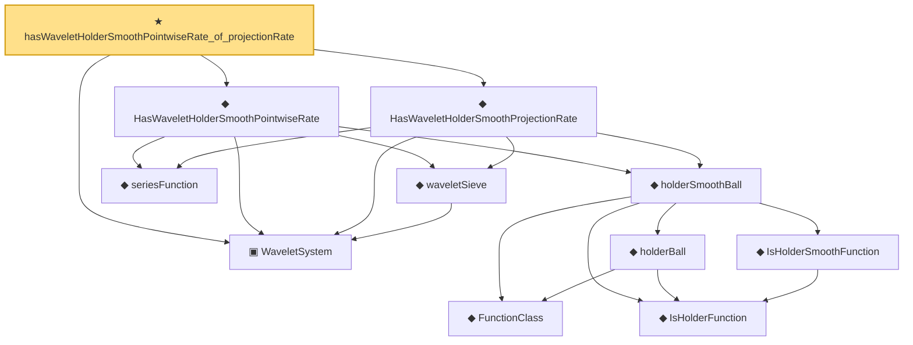

# Proof narrative — hasWaveletHolderSmoothPointwiseRate_of_projectionRate

Root: **hasWaveletHolderSmoothPointwiseRate_of_projectionRate** (theorem) `Statlib/Nonparametric/Approximation/Wavelet.lean:42` · topic `Nonparametric`
Closure: 11 declarations across 4 files. Generated from `proof_graph.json` — no files were moved.

Reading order (foundations first, headline last):

  ▣ `WaveletSystem` — structure · `Statlib/Nonparametric/Vocabulary/Wavelet.lean:14`  _(also used by 12: waveletSieve_seriesFunction_measurable_of_system, waveletSieve_holderSmoothBall_error_bound_of_exists_pointwise_series, waveletSieve_holderSmoothBall_error_bound_of_pointwise_approx, …)_
      ◆ `FunctionClass` — abbrev · `Statlib/Nonparametric/Vocabulary/FunctionClasses.lean:16`  _(also used by 20: holder_classApproximationError_le_of_net_member, kernel_smoother_classApproximationError_le_of_holder_bias_member, kernel_smoother_classApproximationError_le_of_holder_bias_rate, …)_
      ◆ `IsHolderFunction` — def · `Statlib/Nonparametric/Vocabulary/FunctionClasses.lean:44`  _(also used by 16: holder_net_approx_sup_bound, holder_net_integratedSquaredError_bound, holder_classApproximationError_le_of_net_member, …)_
      ◆ `IsHolderSmoothFunction` — def · `Statlib/Nonparametric/Vocabulary/FunctionClasses.lean:69`
      ◆ `holderBall` — def · `Statlib/Nonparametric/Vocabulary/FunctionClasses.lean:56`  _(also used by 9: holderBall_classApproximationError_self_le_zero, holderBall_selectorIndicator_sieveApproximationError_uniform_bound, exists_selectorIndicatorSieve_for_holderBall_of_finite_net, …)_
    ◆ `holderSmoothBall` — def · `Statlib/Nonparametric/Vocabulary/FunctionClasses.lean:82`  _(also used by 14: HasTensorProductSplineHolderSmoothPointwiseRate, HasTensorProductSplineHolderSmoothProjectionRate, tensorProductSplineSieve_holderSmoothBall_error_bound_of_exists_pointwise_series, …)_
    ◆ `seriesFunction` — noncomputable def · `Statlib/Nonparametric/Vocabulary/Sieve.lean:27`  _(also used by 38: holder_selectorIndicator_series_pointwise_bound, holder_selectorIndicator_series_integratedSquaredError_bound, finiteLinearSpan_classApproximationError_le_of_holder_selector_net, …)_
    ◆ `waveletSieve` — def · `Statlib/Nonparametric/Vocabulary/Wavelet.lean:20`  _(also used by 10: waveletSieve_seriesFunction_measurable_of_system, waveletSieve_holderSmoothBall_error_bound_of_exists_pointwise_series, waveletSieve_holderSmoothBall_error_bound_of_pointwise_approx, …)_
  ◆ `HasWaveletHolderSmoothProjectionRate` — def · `Statlib/Nonparametric/Approximation/Wavelet.lean:31`
  ◆ `HasWaveletHolderSmoothPointwiseRate` — def · `Statlib/Nonparametric/Approximation/Wavelet.lean:17`  _(also used by 3: waveletSieve_holderSmoothBall_error_bound_of_has_pointwise_rate, waveletSieve_holderSmoothBall_error_bound_of_has_pointwise_rate_and_basisCount_rate, waveletSieve_holderSmoothBall_error_bound_of_has_pointwise_rate_and_exact_basisCount)_
★ `hasWaveletHolderSmoothPointwiseRate_of_projectionRate` — theorem · `Statlib/Nonparametric/Approximation/Wavelet.lean:42` **← headline**

## Dependency diagram

