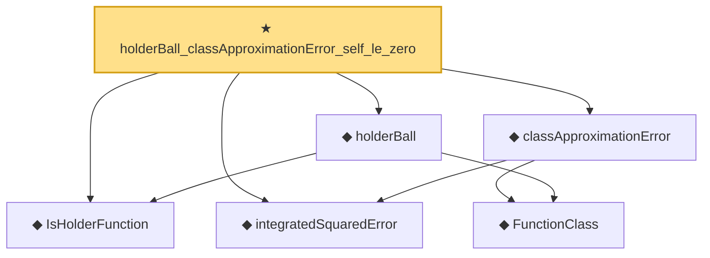

# Proof narrative — holderBall_classApproximationError_self_le_zero

Root: **holderBall_classApproximationError_self_le_zero** (theorem) `Statlib/Nonparametric/Approximation/Holder.lean:97` · topic `Nonparametric`
Closure: 6 declarations across 3 files. Generated from `proof_graph.json` — no files were moved.

Reading order (foundations first, headline last):

  ◆ `IsHolderFunction` — def · `Statlib/Nonparametric/Vocabulary/FunctionClasses.lean:44`  _(also used by 17: holder_net_approx_sup_bound, holder_net_integratedSquaredError_bound, holder_classApproximationError_le_of_net_member, …)_
  ◆ `integratedSquaredError` — noncomputable def · `Statlib/Nonparametric/Vocabulary/Risk.lean:60`  _(also used by 33: supNormBall_classApproximationError_self_le_zero, holder_net_integratedSquaredError_bound, holder_classApproximationError_le_of_net_member, …)_
    ◆ `FunctionClass` — abbrev · `Statlib/Nonparametric/Vocabulary/FunctionClasses.lean:16`  _(also used by 20: holder_classApproximationError_le_of_net_member, kernel_smoother_classApproximationError_le_of_holder_bias_member, kernel_smoother_classApproximationError_le_of_holder_bias_rate, …)_
  ◆ `holderBall` — def · `Statlib/Nonparametric/Vocabulary/FunctionClasses.lean:56`  _(also used by 9: holderBall_selectorIndicator_sieveApproximationError_uniform_bound, exists_selectorIndicatorSieve_for_holderBall_of_finite_net, exists_selectorIndicatorSieve_for_holderBall_of_finite_measurable_cover, …)_
  ◆ `classApproximationError` — noncomputable def · `Statlib/Nonparametric/Vocabulary/Risk.lean:75`  _(also used by 21: supNormBall_classApproximationError_self_le_zero, holder_classApproximationError_le_of_net_member, finiteLinearSpan_classApproximationError_le_of_holder_selector_net, …)_
★ `holderBall_classApproximationError_self_le_zero` — theorem · `Statlib/Nonparametric/Approximation/Holder.lean:97` **← headline**

## Dependency diagram

