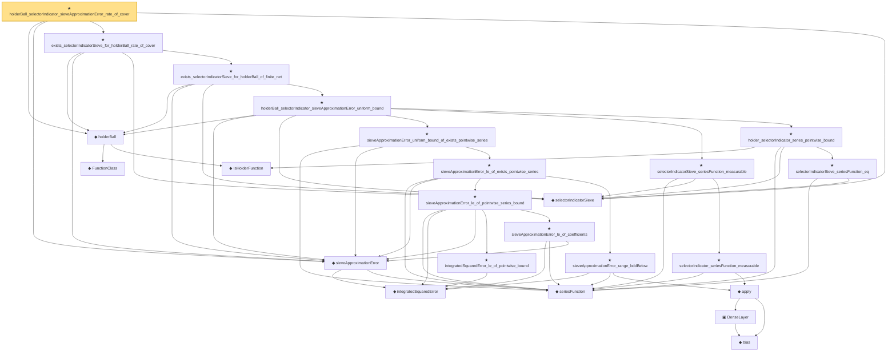

# Proof narrative — holderBall_selectorIndicator_sieveApproximationError_rate_of_cover

Root: **holderBall_selectorIndicator_sieveApproximationError_rate_of_cover** (theorem) `Statlib/Nonparametric/Approximation/Holder.lean:498` · topic `Nonparametric`
Closure: 24 declarations across 8 files. Generated from `proof_graph.json` — no files were moved.

Reading order (foundations first, headline last):

    ◆ `FunctionClass` — abbrev · `Statlib/Nonparametric/Vocabulary/FunctionClasses.lean:16`  _(also used by 21: holder_classApproximationError_le_of_net_member, kernel_smoother_classApproximationError_le_of_holder_bias_member, kernel_smoother_classApproximationError_le_of_holder_bias_rate, …)_
    ◆ `IsHolderFunction` — def · `Statlib/Nonparametric/Vocabulary/FunctionClasses.lean:44`  _(also used by 17: holder_net_approx_sup_bound, holder_net_integratedSquaredError_bound, holder_classApproximationError_le_of_net_member, …)_
  ◆ `holderBall` — def · `Statlib/Nonparametric/Vocabulary/FunctionClasses.lean:56`  _(also used by 6: holderBall_classApproximationError_self_le_zero, exists_selectorIndicatorSieve_for_holderBall_of_finite_measurable_cover, exists_selectorIndicator_sieve_for_holderBall_of_finite_net, …)_
    ◆ `integratedSquaredError` — noncomputable def · `Statlib/Nonparametric/Vocabulary/Risk.lean:60`  _(also used by 30: supNormBall_classApproximationError_self_le_zero, holder_net_integratedSquaredError_bound, holder_classApproximationError_le_of_net_member, …)_
    ◆ `seriesFunction` — noncomputable def · `Statlib/Nonparametric/Vocabulary/Sieve.lean:27`  _(also used by 30: holder_selectorIndicator_series_integratedSquaredError_bound, finiteLinearSpan_classApproximationError_le_of_holder_selector_net, sieveApproximationError_le_of_holder_selector_net, …)_
  ◆ `sieveApproximationError` — noncomputable def · `Statlib/Nonparametric/Vocabulary/Sieve.lean:42`  _(also used by 19: sieveApproximationError_le_of_holder_selector_net, exists_selectorIndicatorSieve_for_holderBall_of_finite_measurable_cover, exists_selectorIndicator_sieve_for_holderBall_of_finite_net, …)_
  ◆ `selectorIndicatorSieve` — def · `Statlib/Nonparametric/Approximation/Sieve.lean:401`  _(also used by 9: holder_selectorIndicator_series_integratedSquaredError_bound, finiteLinearSpan_classApproximationError_le_of_holder_selector_net, sieveApproximationError_le_of_holder_selector_net, …)_
            ★ `integratedSquaredError_le_of_pointwise_bound` — theorem · `Statlib/Nonparametric/Approximation/Metric.lean:10`  _(also used by 11: holder_net_integratedSquaredError_bound, holder_classApproximationError_le_of_net_member, holder_selectorIndicator_series_integratedSquaredError_bound, …)_
            ★ `sieveApproximationError_le_of_coefficients` — theorem · `Statlib/Nonparametric/Approximation/Sieve.lean:107`
            ★ `sieveApproximationError_le_of_pointwise_series_bound` — theorem · `Statlib/Nonparametric/Approximation/Sieve.lean:248`  _(also used by 1: sieveApproximationError_le_of_holder_selector_net)_
            ◆ `bias` — noncomputable def · `Statlib/Nonparametric/Vocabulary/Estimator.lean:28`
            ▣ `DenseLayer` — structure · `Statlib/Nonparametric/Vocabulary/NeuralNetwork.lean:23`  _(also used by 2: reluApply, OneHiddenReLUNet)_
            ◆ `apply` — noncomputable def · `Statlib/Nonparametric/Vocabulary/NeuralNetwork.lean:30`  _(also used by 11: unitCube_grid_finite_measurable_cover, kernel_holder_bias_integratedSquaredError_bound, classApproximationError_le_of_exists_pointwise_bound, …)_
            ★ `sieveApproximationError_range_bddBelow` — theorem · `Statlib/Nonparametric/Approximation/Sieve.lean:121`
          ★ `sieveApproximationError_le_of_exists_pointwise_series` — theorem · `Statlib/Nonparametric/Approximation/Sieve.lean:269`
        ★ `sieveApproximationError_uniform_bound_of_exists_pointwise_series` — theorem · `Statlib/Nonparametric/Approximation/Sieve.lean:285`  _(also used by 3: exists_sieveApproximationError_uniform_bound_of_exists_pointwise_series, tensorProductSplineSieve_holderSmoothBall_error_bound_of_exists_pointwise_series, waveletSieve_holderSmoothBall_error_bound_of_exists_pointwise_series)_
          ★ `selectorIndicator_seriesFunction_measurable` — theorem · `Statlib/Nonparametric/Approximation/Sieve.lean:405`
        ★ `selectorIndicatorSieve_seriesFunction_measurable` — theorem · `Statlib/Nonparametric/Approximation/Sieve.lean:422`
          ★ `selectorIndicatorSieve_seriesFunction_eq` — theorem · `Statlib/Nonparametric/Approximation/Sieve.lean:428`  _(also used by 3: finiteLinearSpan_classApproximationError_le_of_holder_selector_net, sieveApproximationError_le_of_holder_selector_net, selectorIndicatorBasis_seriesFunction_eq)_
        ★ `holder_selectorIndicator_series_pointwise_bound` — theorem · `Statlib/Nonparametric/Approximation/Holder.lean:116`  _(also used by 1: holder_selectorIndicator_series_integratedSquaredError_bound)_
      ★ `holderBall_selectorIndicator_sieveApproximationError_uniform_bound` — theorem · `Statlib/Nonparametric/Approximation/Holder.lean:271`
    ★ `exists_selectorIndicatorSieve_for_holderBall_of_finite_net` — theorem · `Statlib/Nonparametric/Approximation/Holder.lean:299`  _(also used by 2: exists_selectorIndicatorSieve_for_holderBall_of_finite_measurable_cover, exists_selectorIndicator_sieve_for_holderBall_of_finite_net)_
  ★ `exists_selectorIndicatorSieve_for_holderBall_rate_of_cover` — theorem · `Statlib/Nonparametric/Approximation/Holder.lean:372`  _(also used by 1: exists_selectorIndicatorSieve_for_holderBall_rate_of_finite_measurable_cover)_
★ `holderBall_selectorIndicator_sieveApproximationError_rate_of_cover` — theorem · `Statlib/Nonparametric/Approximation/Holder.lean:498` **← headline**

## Dependency diagram

