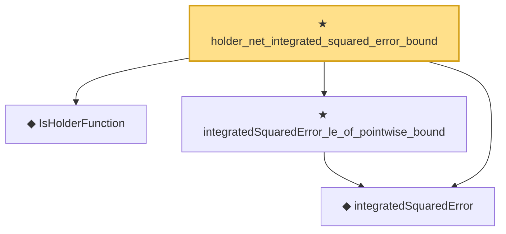

# Proof narrative — holder_net_integrated_squared_error_bound

Root: **holder_net_integrated_squared_error_bound** (theorem) `Statlib/Nonparametric/Approximation/Holder.lean:30` · topic `Nonparametric`
Closure: 4 declarations across 4 files. Generated from `proof_graph.json` — no files were moved.

Reading order (foundations first, headline last):

  ◆ `IsHolderFunction` — def · `Statlib/Nonparametric/Vocabulary/FunctionClasses.lean:44`  _(also used by 22: holder_net_sup_approximation_bound, holder_class_approximation_error_le_of_net_member, holder_ball_class_approximation_error_self_le_zero, …)_
  ◆ `integratedSquaredError` — noncomputable def · `Statlib/Nonparametric/Vocabulary/Risk.lean:60`  _(also used by 33: supNormBall_classApproximationError_self_le_zero, holder_class_approximation_error_le_of_net_member, holder_ball_class_approximation_error_self_le_zero, …)_
  ★ `integratedSquaredError_le_of_pointwise_bound` — theorem · `Statlib/Nonparametric/Approximation/Metric.lean:10`  _(also used by 11: holder_class_approximation_error_le_of_net_member, selector_indicator_holder_series_integrated_squared_error_bound, selector_indicator_holder_class_approximation_error_le_of_net, …)_
★ `holder_net_integrated_squared_error_bound` — theorem · `Statlib/Nonparametric/Approximation/Holder.lean:30` **← headline**

## Dependency diagram

