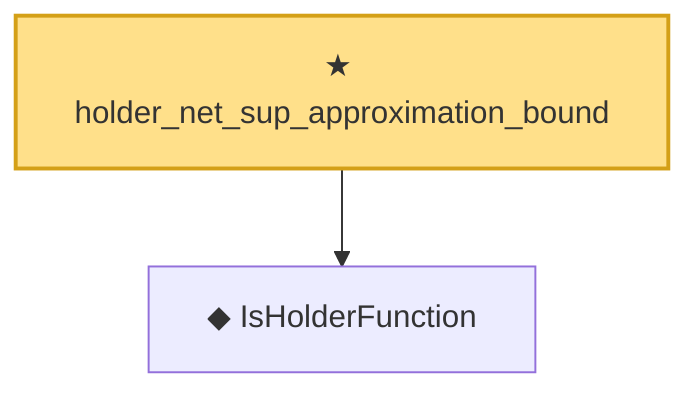

# Proof narrative — holder_net_sup_approximation_bound

Root: **holder_net_sup_approximation_bound** (theorem) `Statlib/Nonparametric/Approximation/Holder.lean:14` · topic `Nonparametric`
Closure: 2 declarations across 2 files. Generated from `proof_graph.json` — no files were moved.

Reading order (foundations first, headline last):

  ◆ `IsHolderFunction` — def · `Statlib/Nonparametric/Vocabulary/FunctionClasses.lean:44`  _(also used by 22: holder_net_integrated_squared_error_bound, holder_class_approximation_error_le_of_net_member, holder_ball_class_approximation_error_self_le_zero, …)_
★ `holder_net_sup_approximation_bound` — theorem · `Statlib/Nonparametric/Approximation/Holder.lean:14` **← headline**

## Dependency diagram

