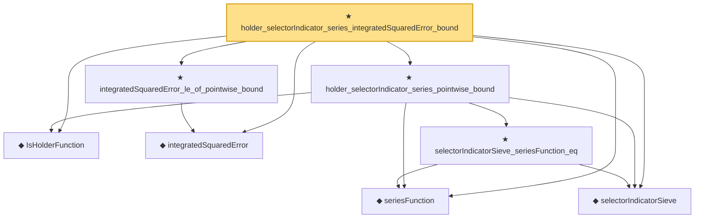

# Proof narrative — holder_selectorIndicator_series_integratedSquaredError_bound

Root: **holder_selectorIndicator_series_integratedSquaredError_bound** (theorem) `Statlib/Nonparametric/Approximation/Holder.lean:141` · topic `Nonparametric`
Closure: 8 declarations across 6 files. Generated from `proof_graph.json` — no files were moved.

Reading order (foundations first, headline last):

  ◆ `IsHolderFunction` — def · `Statlib/Nonparametric/Vocabulary/FunctionClasses.lean:44`  _(also used by 17: holder_net_approx_sup_bound, holder_net_integratedSquaredError_bound, holder_classApproximationError_le_of_net_member, …)_
  ◆ `seriesFunction` — noncomputable def · `Statlib/Nonparametric/Vocabulary/Sieve.lean:27`  _(also used by 37: finiteLinearSpan_classApproximationError_le_of_holder_selector_net, sieveApproximationError_le_of_holder_selector_net, holder_selector_net_classApproximationError_le_rate, …)_
  ◆ `selectorIndicatorSieve` — def · `Statlib/Nonparametric/Approximation/Sieve.lean:401`  _(also used by 13: finiteLinearSpan_classApproximationError_le_of_holder_selector_net, sieveApproximationError_le_of_holder_selector_net, holderBall_selectorIndicator_sieveApproximationError_uniform_bound, …)_
  ◆ `integratedSquaredError` — noncomputable def · `Statlib/Nonparametric/Vocabulary/Risk.lean:60`  _(also used by 33: supNormBall_classApproximationError_self_le_zero, holder_net_integratedSquaredError_bound, holder_classApproximationError_le_of_net_member, …)_
    ★ `selectorIndicatorSieve_seriesFunction_eq` — theorem · `Statlib/Nonparametric/Approximation/Sieve.lean:428`  _(also used by 3: finiteLinearSpan_classApproximationError_le_of_holder_selector_net, sieveApproximationError_le_of_holder_selector_net, selectorIndicatorBasis_seriesFunction_eq)_
  ★ `holder_selectorIndicator_series_pointwise_bound` — theorem · `Statlib/Nonparametric/Approximation/Holder.lean:116`  _(also used by 1: holderBall_selectorIndicator_sieveApproximationError_uniform_bound)_
  ★ `integratedSquaredError_le_of_pointwise_bound` — theorem · `Statlib/Nonparametric/Approximation/Metric.lean:10`  _(also used by 11: holder_net_integratedSquaredError_bound, holder_classApproximationError_le_of_net_member, finiteLinearSpan_classApproximationError_le_of_holder_selector_net, …)_
★ `holder_selectorIndicator_series_integratedSquaredError_bound` — theorem · `Statlib/Nonparametric/Approximation/Holder.lean:141` **← headline**

## Dependency diagram

