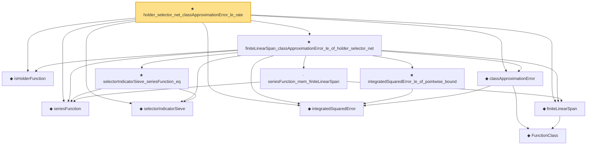

# Proof narrative — holder_selector_net_classApproximationError_le_rate

Root: **holder_selector_net_classApproximationError_le_rate** (theorem) `Statlib/Nonparametric/Approximation/Holder.lean:522` · topic `Nonparametric`
Closure: 12 declarations across 6 files. Generated from `proof_graph.json` — no files were moved.

Reading order (foundations first, headline last):

  ◆ `IsHolderFunction` — def · `Statlib/Nonparametric/Vocabulary/FunctionClasses.lean:44`  _(also used by 17: holder_net_approx_sup_bound, holder_net_integratedSquaredError_bound, holder_classApproximationError_le_of_net_member, …)_
  ◆ `seriesFunction` — noncomputable def · `Statlib/Nonparametric/Vocabulary/Sieve.lean:27`  _(also used by 36: holder_selectorIndicator_series_pointwise_bound, holder_selectorIndicator_series_integratedSquaredError_bound, sieveApproximationError_le_of_holder_selector_net, …)_
  ◆ `selectorIndicatorSieve` — def · `Statlib/Nonparametric/Approximation/Sieve.lean:401`  _(also used by 13: holder_selectorIndicator_series_pointwise_bound, holder_selectorIndicator_series_integratedSquaredError_bound, sieveApproximationError_le_of_holder_selector_net, …)_
  ◆ `integratedSquaredError` — noncomputable def · `Statlib/Nonparametric/Vocabulary/Risk.lean:60`  _(also used by 31: supNormBall_classApproximationError_self_le_zero, holder_net_integratedSquaredError_bound, holder_classApproximationError_le_of_net_member, …)_
    ◆ `FunctionClass` — abbrev · `Statlib/Nonparametric/Vocabulary/FunctionClasses.lean:16`  _(also used by 20: holder_classApproximationError_le_of_net_member, kernel_smoother_classApproximationError_le_of_holder_bias_member, kernel_smoother_classApproximationError_le_of_holder_bias_rate, …)_
  ◆ `finiteLinearSpan` — noncomputable def · `Statlib/Nonparametric/Vocabulary/Sieve.lean:23`  _(also used by 8: finiteLinearSpan_classApproximationError_le_of_coefficients, finiteLinearSpan_classApproximationError_le_of_pointwise_series_bound, finiteLinearSpan_classApproximationError_le_of_exists_pointwise_series, …)_
  ◆ `classApproximationError` — noncomputable def · `Statlib/Nonparametric/Vocabulary/Risk.lean:75`  _(also used by 20: supNormBall_classApproximationError_self_le_zero, holder_classApproximationError_le_of_net_member, holderBall_classApproximationError_self_le_zero, …)_
    · `seriesFunction_mem_finiteLinearSpan` — lemma · `Statlib/Nonparametric/Approximation/Sieve.lean:13`  _(also used by 5: finiteLinearSpan_classApproximationError_le_of_coefficients, finiteLinearSpan_classApproximationError_le_of_pointwise_series_bound, finiteLinearSpan_classApproximationError_le_of_exists_pointwise_series, …)_
    ★ `selectorIndicatorSieve_seriesFunction_eq` — theorem · `Statlib/Nonparametric/Approximation/Sieve.lean:428`  _(also used by 3: holder_selectorIndicator_series_pointwise_bound, sieveApproximationError_le_of_holder_selector_net, selectorIndicatorBasis_seriesFunction_eq)_
    ★ `integratedSquaredError_le_of_pointwise_bound` — theorem · `Statlib/Nonparametric/Approximation/Metric.lean:10`  _(also used by 11: holder_net_integratedSquaredError_bound, holder_classApproximationError_le_of_net_member, holder_selectorIndicator_series_integratedSquaredError_bound, …)_
  ★ `finiteLinearSpan_classApproximationError_le_of_holder_selector_net` — theorem · `Statlib/Nonparametric/Approximation/Holder.lean:172`
★ `holder_selector_net_classApproximationError_le_rate` — theorem · `Statlib/Nonparametric/Approximation/Holder.lean:522` **← headline**

## Dependency diagram

