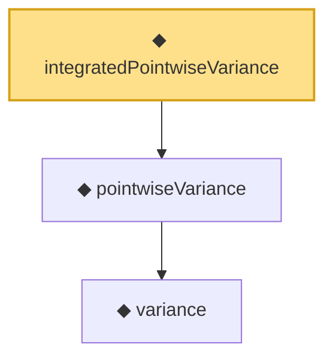

# Proof narrative — integratedPointwiseVariance

Root: **integratedPointwiseVariance** (noncomputable def) `Statlib/Nonparametric/Vocabulary/Estimator.lean:64` · topic `Nonparametric`
Closure: 3 declarations across 1 files. Generated from `proof_graph.json` — no files were moved.

Reading order (foundations first, headline last):

    ◆ `variance` — noncomputable def · `Statlib/Nonparametric/Vocabulary/Estimator.lean:32`
  ◆ `pointwiseVariance` — noncomputable def · `Statlib/Nonparametric/Vocabulary/Estimator.lean:49`
◆ `integratedPointwiseVariance` — noncomputable def · `Statlib/Nonparametric/Vocabulary/Estimator.lean:64` **← headline**

## Dependency diagram

