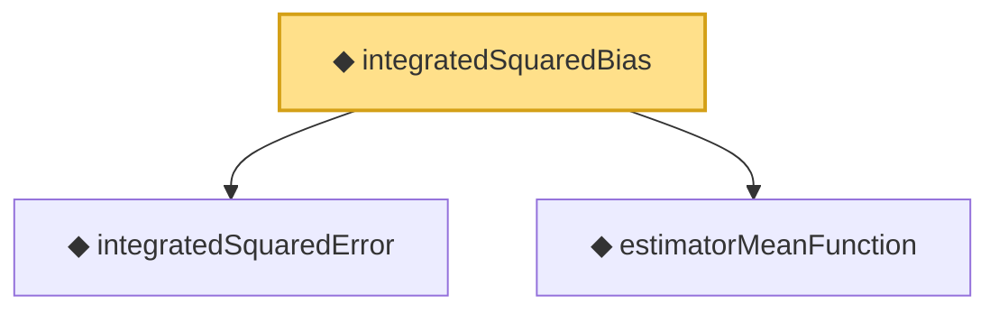

# Proof narrative — integratedSquaredBias

Root: **integratedSquaredBias** (noncomputable def) `Statlib/Nonparametric/Vocabulary/Estimator.lean:69` · topic `Nonparametric`
Closure: 3 declarations across 2 files. Generated from `proof_graph.json` — no files were moved.

Reading order (foundations first, headline last):

  ◆ `integratedSquaredError` — noncomputable def · `Statlib/Nonparametric/Vocabulary/Risk.lean:60`  _(also used by 34: supNormBall_classApproximationError_self_le_zero, holder_net_integratedSquaredError_bound, holder_classApproximationError_le_of_net_member, …)_
  ◆ `estimatorMeanFunction` — noncomputable def · `Statlib/Nonparametric/Vocabulary/Estimator.lean:45`
◆ `integratedSquaredBias` — noncomputable def · `Statlib/Nonparametric/Vocabulary/Estimator.lean:69` **← headline**

## Dependency diagram

