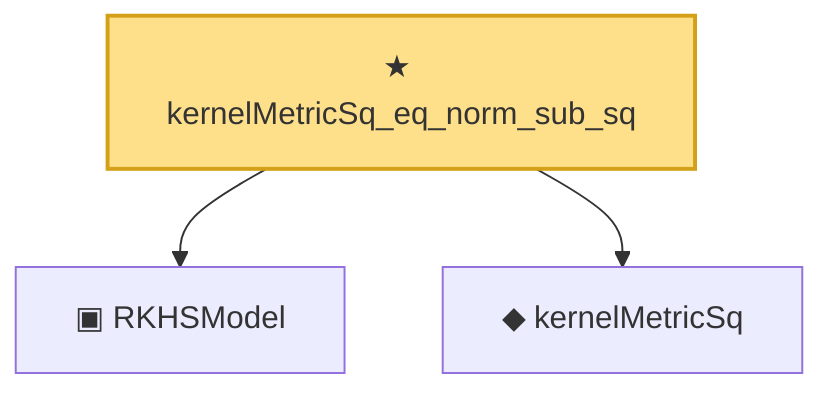

# Proof narrative — kernelMetricSq_eq_norm_sub_sq

Root: **kernelMetricSq_eq_norm_sub_sq** (theorem) `Statlib/Nonparametric/Approximation/RKHS.lean:74` · topic `Nonparametric`
Closure: 3 declarations across 3 files. Generated from `proof_graph.json` — no files were moved.

Reading order (foundations first, headline last):

  ▣ `RKHSModel` — structure · `Statlib/Nonparametric/Vocabulary/RKHS.lean:16`  _(also used by 29: rkhs_eval_bound, rkhsBall_uniform_bound, rkhsBall_lipschitz, …)_
  ◆ `kernelMetricSq` — def · `Statlib/Nonparametric/Vocabulary/KernelMethods.lean:58`  _(also used by 2: rkhsBall_kernelMetric_lipschitz, kernelMetric)_
★ `kernelMetricSq_eq_norm_sub_sq` — theorem · `Statlib/Nonparametric/Approximation/RKHS.lean:74` **← headline**

## Dependency diagram

