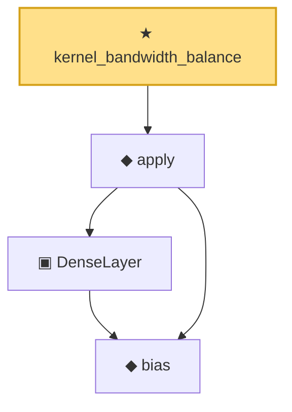

# Proof narrative — kernel_bandwidth_balance

Root: **kernel_bandwidth_balance** (theorem) `Statlib/Nonparametric/KernelRegression/KernelRate.lean:1613` · topic `Nonparametric`
Closure: 4 declarations across 3 files. Generated from `proof_graph.json` — no files were moved.

Reading order (foundations first, headline last):

    ◆ `bias` — noncomputable def · `Statlib/Nonparametric/Vocabulary/Estimator.lean:28`
    ▣ `DenseLayer` — structure · `Statlib/Nonparametric/Vocabulary/NeuralNetwork.lean:23`  _(also used by 2: reluApply, OneHiddenReLUNet)_
  ◆ `apply` — noncomputable def · `Statlib/Nonparametric/Vocabulary/NeuralNetwork.lean:30`  _(also used by 12: unitCube_grid_finite_measurable_cover, kernel_holder_bias_integratedSquaredError_bound, classApproximationError_le_of_exists_pointwise_bound, …)_
★ `kernel_bandwidth_balance` — theorem · `Statlib/Nonparametric/KernelRegression/KernelRate.lean:1613` **← headline**

## Dependency diagram

