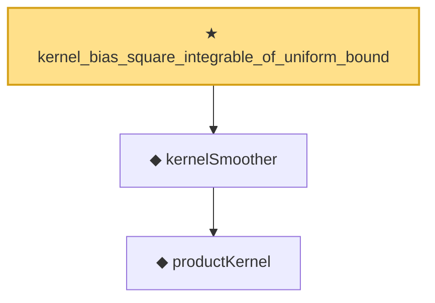

# Proof narrative — kernel_bias_square_integrable_of_uniform_bound

Root: **kernel_bias_square_integrable_of_uniform_bound** (theorem) `Statlib/Nonparametric/KernelRegression/KernelRate.lean:1391` · topic `Nonparametric`
Closure: 3 declarations across 2 files. Generated from `proof_graph.json` — no files were moved.

Reading order (foundations first, headline last):

    ◆ `productKernel` — noncomputable def · `Statlib/Nonparametric/Vocabulary/Kernel.lean:28`  _(also used by 9: kernel_holder_bias_normalized, kernel_holder_bias_integratedSquaredError_bound, kernel_smoother_classApproximationError_le_of_holder_bias_member, …)_
  ◆ `kernelSmoother` — noncomputable def · `Statlib/Nonparametric/Vocabulary/Kernel.lean:39`  _(also used by 17: kernel_holder_bias_integratedSquaredError_bound, kernel_smoother_classApproximationError_le_of_holder_bias_member, kernel_smoother_classApproximationError_le_of_holder_bias_rate, …)_
★ `kernel_bias_square_integrable_of_uniform_bound` — theorem · `Statlib/Nonparametric/KernelRegression/KernelRate.lean:1391` **← headline**

## Dependency diagram

