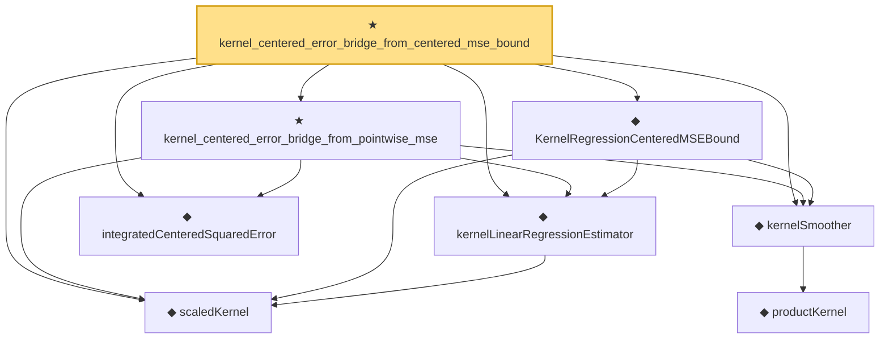

# Proof narrative — kernel_centered_error_bridge_from_centered_mse_bound

Root: **kernel_centered_error_bridge_from_centered_mse_bound** (theorem) `Statlib/Nonparametric/KernelRegression/KernelRate.lean:1349` · topic `Nonparametric`
Closure: 8 declarations across 4 files. Generated from `proof_graph.json` — no files were moved.

Reading order (foundations first, headline last):

  ◆ `scaledKernel` — noncomputable def · `Statlib/Nonparametric/Vocabulary/Kernel.lean:33`  _(also used by 13: kernel_scaled_l2_denominator_bridge, kernel_scaled_l2_denominator_bridge_from_weight_energy_bound, kernel_uniform_interior_l2_energy_bound, …)_
  ◆ `kernelLinearRegressionEstimator` — noncomputable def · `Statlib/Nonparametric/Vocabulary/Kernel.lean:56`  _(also used by 8: kernel_regression_centered_integrability_of_centered_sum_integrability, kernel_regression_risk_integrability_of_error_integrability_and_design_l2, kernel_regression_mse_x_integrable_of_centered_x_and_bias, …)_
      ◆ `productKernel` — noncomputable def · `Statlib/Nonparametric/Vocabulary/Kernel.lean:28`  _(also used by 9: kernel_holder_bias_normalized, kernel_holder_bias_integratedSquaredError_bound, kernel_smoother_classApproximationError_le_of_holder_bias_member, …)_
  ◆ `kernelSmoother` — noncomputable def · `Statlib/Nonparametric/Vocabulary/Kernel.lean:39`  _(also used by 15: kernel_holder_bias_integratedSquaredError_bound, kernel_smoother_classApproximationError_le_of_holder_bias_member, kernel_smoother_classApproximationError_le_of_holder_bias_rate, …)_
  ◆ `KernelRegressionCenteredMSEBound` — def · `Statlib/Nonparametric/Vocabulary/KernelRegression.lean:208`  _(also used by 3: kernel_centered_mse_bound_of_uniform_design_interior_bounded, kernel_regression_centered_mse_bound_of_random_design_regularity, KernelRegressionRandomDesignRegularityAssumptions)_
  ◆ `integratedCenteredSquaredError` — noncomputable def · `Statlib/Nonparametric/Vocabulary/Estimator.lean:74`  _(also used by 2: kernel_regression_integrated_variance_bound, kernel_regression_imse_bias_variance_bound)_
  ★ `kernel_centered_error_bridge_from_pointwise_mse` — theorem · `Statlib/Nonparametric/KernelRegression/KernelRate.lean:1154`
★ `kernel_centered_error_bridge_from_centered_mse_bound` — theorem · `Statlib/Nonparametric/KernelRegression/KernelRate.lean:1349` **← headline**

## Dependency diagram

