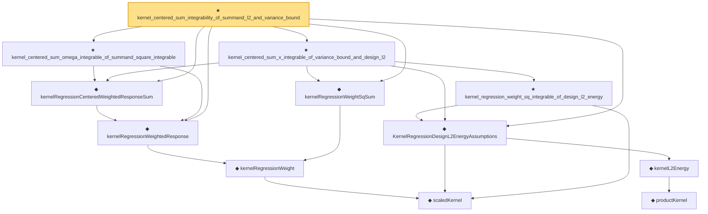

# Proof narrative — kernel_centered_sum_integrability_of_summand_l2_and_variance_bound

Root: **kernel_centered_sum_integrability_of_summand_l2_and_variance_bound** (theorem) `Statlib/Nonparametric/KernelRegression/KernelRate.lean:571` · topic `Nonparametric`
Closure: 12 declarations across 3 files. Generated from `proof_graph.json` — no files were moved.

Reading order (foundations first, headline last):

    ◆ `scaledKernel` — noncomputable def · `Statlib/Nonparametric/Vocabulary/Kernel.lean:33`  _(also used by 14: kernel_scaled_l2_denominator_bridge, kernel_scaled_l2_denominator_bridge_from_weight_energy_bound, kernel_uniform_interior_l2_energy_bound, …)_
    ◆ `kernelRegressionWeight` — noncomputable def · `Statlib/Nonparametric/Vocabulary/KernelRegression.lean:51`
  ◆ `kernelRegressionWeightedResponse` — noncomputable def · `Statlib/Nonparametric/Vocabulary/KernelRegression.lean:58`  _(also used by 1: KernelRegressionUniformInteriorWellposednessAssumptions)_
  ◆ `kernelRegressionCenteredWeightedResponseSum` — noncomputable def · `Statlib/Nonparametric/Vocabulary/KernelRegression.lean:73`  _(also used by 4: kernel_regression_centered_integrability_of_centered_sum_integrability, kernel_regression_risk_integrability_of_centered_sum_bias_and_design_l2, kernel_centered_mse_bound_of_uniform_design_interior_bounded, …)_
  ◆ `kernelRegressionWeightSqSum` — noncomputable def · `Statlib/Nonparametric/Vocabulary/KernelRegression.lean:65`  _(also used by 2: kernel_centered_mse_bound_of_uniform_design_interior_bounded, KernelRegressionUniformInteriorWellposednessAssumptions)_
      ◆ `productKernel` — noncomputable def · `Statlib/Nonparametric/Vocabulary/Kernel.lean:28`  _(also used by 9: kernel_holder_bias_normalized, kernel_holder_bias_integratedSquaredError_bound, kernel_smoother_classApproximationError_le_of_holder_bias_member, …)_
    ◆ `kernelL2Energy` — noncomputable def · `Statlib/Nonparametric/Vocabulary/Kernel.lean:51`  _(also used by 7: kernel_scaled_l2_denominator_bridge, kernel_scaled_l2_denominator_bridge_from_weight_energy_bound, kernel_uniform_interior_l2_energy_bound, …)_
  ◆ `KernelRegressionDesignL2EnergyAssumptions` — def · `Statlib/Nonparametric/Vocabulary/KernelRegression.lean:141`  _(also used by 6: kernel_uniform_interior_l2_energy_bound, kernel_regression_weight_energy_bound_of_design_l2_energy, kernel_regression_risk_integrability_of_error_integrability_and_design_l2, …)_
  ★ `kernel_centered_sum_omega_integrable_of_summand_square_integrable` — theorem · `Statlib/Nonparametric/KernelRegression/KernelRate.lean:347`
    ★ `kernel_regression_weight_sq_integrable_of_design_l2_energy` — theorem · `Statlib/Nonparametric/KernelRegression/KernelRate.lean:273`  _(also used by 1: kernel_regression_risk_integrability_of_error_integrability_and_design_l2)_
  ★ `kernel_centered_sum_x_integrable_of_variance_bound_and_design_l2` — theorem · `Statlib/Nonparametric/KernelRegression/KernelRate.lean:447`
★ `kernel_centered_sum_integrability_of_summand_l2_and_variance_bound` — theorem · `Statlib/Nonparametric/KernelRegression/KernelRate.lean:571` **← headline**

## Dependency diagram

