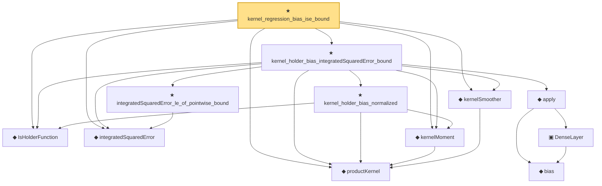

# Proof narrative — kernel_regression_bias_ise_bound

Root: **kernel_regression_bias_ise_bound** (theorem) `Statlib/Nonparametric/KernelRegression/KernelRate.lean:1434` · topic `Nonparametric`
Closure: 12 declarations across 8 files. Generated from `proof_graph.json` — no files were moved.

Reading order (foundations first, headline last):

  ◆ `productKernel` — noncomputable def · `Statlib/Nonparametric/Vocabulary/Kernel.lean:28`  _(also used by 5: kernel_smoother_classApproximationError_le_of_holder_bias_member, kernel_smoother_classApproximationError_le_of_holder_bias_rate, kernelL2Energy, …)_
  ◆ `IsHolderFunction` — def · `Statlib/Nonparametric/Vocabulary/FunctionClasses.lean:44`  _(also used by 16: holder_net_approx_sup_bound, holder_net_integratedSquaredError_bound, holder_classApproximationError_le_of_net_member, …)_
  ◆ `kernelSmoother` — noncomputable def · `Statlib/Nonparametric/Vocabulary/Kernel.lean:39`  _(also used by 16: kernel_smoother_classApproximationError_le_of_holder_bias_member, kernel_smoother_classApproximationError_le_of_holder_bias_rate, kernel_uniform_interior_population_smoother_eq, …)_
  ◆ `integratedSquaredError` — noncomputable def · `Statlib/Nonparametric/Vocabulary/Risk.lean:60`  _(also used by 32: supNormBall_classApproximationError_self_le_zero, holder_net_integratedSquaredError_bound, holder_classApproximationError_le_of_net_member, …)_
  ◆ `kernelMoment` — noncomputable def · `Statlib/Nonparametric/Vocabulary/Kernel.lean:45`  _(also used by 2: kernel_smoother_classApproximationError_le_of_holder_bias_member, kernel_smoother_classApproximationError_le_of_holder_bias_rate)_
    ★ `kernel_holder_bias_normalized` — theorem · `Statlib/Nonparametric/Approximation/Kernel.lean:17`
      ◆ `bias` — noncomputable def · `Statlib/Nonparametric/Vocabulary/Estimator.lean:28`
      ▣ `DenseLayer` — structure · `Statlib/Nonparametric/Vocabulary/NeuralNetwork.lean:23`  _(also used by 2: reluApply, OneHiddenReLUNet)_
    ◆ `apply` — noncomputable def · `Statlib/Nonparametric/Vocabulary/NeuralNetwork.lean:30`  _(also used by 12: unitCube_grid_finite_measurable_cover, classApproximationError_le_of_exists_pointwise_bound, integratedSquaredError_nonneg, …)_
    ★ `integratedSquaredError_le_of_pointwise_bound` — theorem · `Statlib/Nonparametric/Approximation/Metric.lean:10`  _(also used by 11: holder_net_integratedSquaredError_bound, holder_classApproximationError_le_of_net_member, holder_selectorIndicator_series_integratedSquaredError_bound, …)_
  ★ `kernel_holder_bias_integratedSquaredError_bound` — theorem · `Statlib/Nonparametric/Approximation/Kernel.lean:176`  _(also used by 2: kernel_smoother_classApproximationError_le_of_holder_bias_member, kernel_smoother_classApproximationError_le_of_holder_bias_rate)_
★ `kernel_regression_bias_ise_bound` — theorem · `Statlib/Nonparametric/KernelRegression/KernelRate.lean:1434` **← headline**

## Dependency diagram

