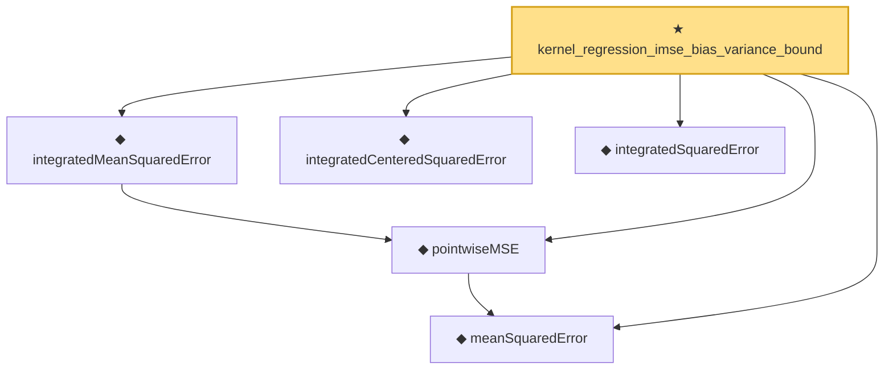

# Proof narrative — kernel_regression_imse_bias_variance_bound

Root: **kernel_regression_imse_bias_variance_bound** (theorem) `Statlib/Nonparametric/KernelRegression/KernelRate.lean:1515` · topic `Nonparametric`
Closure: 6 declarations across 3 files. Generated from `proof_graph.json` — no files were moved.

Reading order (foundations first, headline last):

  ◆ `meanSquaredError` — noncomputable def · `Statlib/Nonparametric/Vocabulary/Estimator.lean:36`
  ◆ `pointwiseMSE` — noncomputable def · `Statlib/Nonparametric/Vocabulary/Estimator.lean:54`
  ◆ `integratedMeanSquaredError` — noncomputable def · `Statlib/Nonparametric/Vocabulary/Estimator.lean:59`
  ◆ `integratedCenteredSquaredError` — noncomputable def · `Statlib/Nonparametric/Vocabulary/Estimator.lean:74`  _(also used by 3: kernel_centered_error_bridge_from_pointwise_mse, kernel_centered_error_bridge_from_centered_mse_bound, kernel_regression_integrated_variance_bound)_
  ◆ `integratedSquaredError` — noncomputable def · `Statlib/Nonparametric/Vocabulary/Risk.lean:60`  _(also used by 34: supNormBall_classApproximationError_self_le_zero, holder_net_integratedSquaredError_bound, holder_classApproximationError_le_of_net_member, …)_
★ `kernel_regression_imse_bias_variance_bound` — theorem · `Statlib/Nonparametric/KernelRegression/KernelRate.lean:1515` **← headline**

## Dependency diagram

