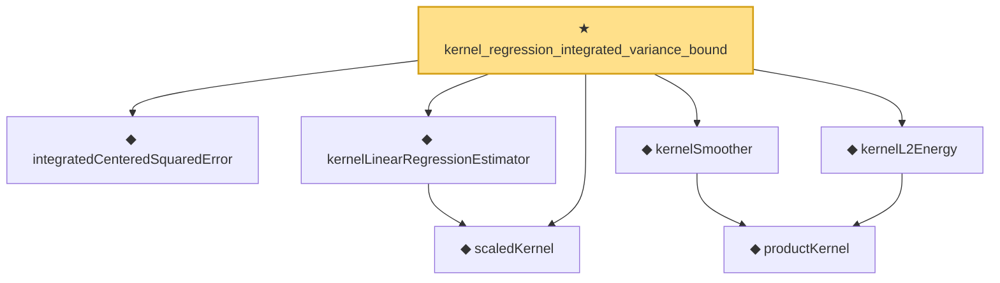

# Proof narrative — kernel_regression_integrated_variance_bound

Root: **kernel_regression_integrated_variance_bound** (theorem) `Statlib/Nonparametric/KernelRegression/KernelRate.lean:1468` · topic `Nonparametric`
Closure: 7 declarations across 3 files. Generated from `proof_graph.json` — no files were moved.

Reading order (foundations first, headline last):

  ◆ `integratedCenteredSquaredError` — noncomputable def · `Statlib/Nonparametric/Vocabulary/Estimator.lean:74`  _(also used by 3: kernel_centered_error_bridge_from_pointwise_mse, kernel_centered_error_bridge_from_centered_mse_bound, kernel_regression_imse_bias_variance_bound)_
  ◆ `scaledKernel` — noncomputable def · `Statlib/Nonparametric/Vocabulary/Kernel.lean:33`  _(also used by 15: kernel_scaled_l2_denominator_bridge, kernel_scaled_l2_denominator_bridge_from_weight_energy_bound, kernel_uniform_interior_l2_energy_bound, …)_
  ◆ `kernelLinearRegressionEstimator` — noncomputable def · `Statlib/Nonparametric/Vocabulary/Kernel.lean:56`  _(also used by 10: kernel_regression_centered_integrability_of_centered_sum_integrability, kernel_regression_risk_integrability_of_error_integrability_and_design_l2, kernel_regression_mse_x_integrable_of_centered_x_and_bias, …)_
    ◆ `productKernel` — noncomputable def · `Statlib/Nonparametric/Vocabulary/Kernel.lean:28`  _(also used by 8: kernel_holder_bias_normalized, kernel_holder_bias_integratedSquaredError_bound, kernel_smoother_classApproximationError_le_of_holder_bias_member, …)_
  ◆ `kernelSmoother` — noncomputable def · `Statlib/Nonparametric/Vocabulary/Kernel.lean:39`  _(also used by 17: kernel_holder_bias_integratedSquaredError_bound, kernel_smoother_classApproximationError_le_of_holder_bias_member, kernel_smoother_classApproximationError_le_of_holder_bias_rate, …)_
  ◆ `kernelL2Energy` — noncomputable def · `Statlib/Nonparametric/Vocabulary/Kernel.lean:51`  _(also used by 7: kernel_scaled_l2_denominator_bridge, kernel_scaled_l2_denominator_bridge_from_weight_energy_bound, kernel_uniform_interior_l2_energy_bound, …)_
★ `kernel_regression_integrated_variance_bound` — theorem · `Statlib/Nonparametric/KernelRegression/KernelRate.lean:1468` **← headline**

## Dependency diagram

