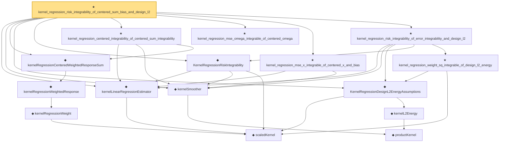

# Proof narrative — kernel_regression_risk_integrability_of_centered_sum_bias_and_design_l2

Root: **kernel_regression_risk_integrability_of_centered_sum_bias_and_design_l2** (theorem) `Statlib/Nonparametric/KernelRegression/KernelRate.lean:1049` · topic `Nonparametric`
Closure: 16 declarations across 3 files. Generated from `proof_graph.json` — no files were moved.

Reading order (foundations first, headline last):

    ◆ `scaledKernel` — noncomputable def · `Statlib/Nonparametric/Vocabulary/Kernel.lean:33`  _(also used by 12: kernel_scaled_l2_denominator_bridge, kernel_scaled_l2_denominator_bridge_from_weight_energy_bound, kernel_uniform_interior_l2_energy_bound, …)_
  ◆ `kernelLinearRegressionEstimator` — noncomputable def · `Statlib/Nonparametric/Vocabulary/Kernel.lean:56`  _(also used by 6: kernel_centered_error_bridge_from_pointwise_mse, kernel_centered_mse_bound_of_uniform_design_interior_bounded, kernel_centered_error_bridge_from_centered_mse_bound, …)_
    ◆ `productKernel` — noncomputable def · `Statlib/Nonparametric/Vocabulary/Kernel.lean:28`  _(also used by 8: kernel_holder_bias_normalized, kernel_holder_bias_integratedSquaredError_bound, kernel_smoother_classApproximationError_le_of_holder_bias_member, …)_
  ◆ `kernelSmoother` — noncomputable def · `Statlib/Nonparametric/Vocabulary/Kernel.lean:39`  _(also used by 13: kernel_holder_bias_integratedSquaredError_bound, kernel_smoother_classApproximationError_le_of_holder_bias_member, kernel_smoother_classApproximationError_le_of_holder_bias_rate, …)_
      ◆ `kernelRegressionWeight` — noncomputable def · `Statlib/Nonparametric/Vocabulary/KernelRegression.lean:51`  _(also used by 1: kernelRegressionWeightSqSum)_
    ◆ `kernelRegressionWeightedResponse` — noncomputable def · `Statlib/Nonparametric/Vocabulary/KernelRegression.lean:58`  _(also used by 3: kernel_centered_sum_omega_integrable_of_summand_square_integrable, kernel_centered_sum_integrability_of_summand_l2_and_variance_bound, KernelRegressionUniformInteriorWellposednessAssumptions)_
  ◆ `kernelRegressionCenteredWeightedResponseSum` — noncomputable def · `Statlib/Nonparametric/Vocabulary/KernelRegression.lean:73`  _(also used by 5: kernel_centered_sum_omega_integrable_of_summand_square_integrable, kernel_centered_sum_x_integrable_of_variance_bound_and_design_l2, kernel_centered_sum_integrability_of_summand_l2_and_variance_bound, …)_
    ◆ `kernelL2Energy` — noncomputable def · `Statlib/Nonparametric/Vocabulary/Kernel.lean:51`  _(also used by 7: kernel_scaled_l2_denominator_bridge, kernel_scaled_l2_denominator_bridge_from_weight_energy_bound, kernel_uniform_interior_l2_energy_bound, …)_
  ◆ `KernelRegressionDesignL2EnergyAssumptions` — def · `Statlib/Nonparametric/Vocabulary/KernelRegression.lean:141`  _(also used by 6: kernel_uniform_interior_l2_energy_bound, kernel_regression_weight_energy_bound_of_design_l2_energy, kernel_centered_sum_x_integrable_of_variance_bound_and_design_l2, …)_
  ◆ `KernelRegressionRiskIntegrability` — def · `Statlib/Nonparametric/Vocabulary/KernelRegression.lean:161`  _(also used by 2: kernel_regression_risk_integrability_of_random_design_regularity, KernelRegressionRandomDesignRegularityAssumptions)_
  ★ `kernel_regression_centered_integrability_of_centered_sum_integrability` — theorem · `Statlib/Nonparametric/KernelRegression/KernelRate.lean:660`
  ★ `kernel_regression_mse_omega_integrable_of_centered_omega` — theorem · `Statlib/Nonparametric/KernelRegression/KernelRate.lean:785`
  ★ `kernel_regression_mse_x_integrable_of_centered_x_and_bias` — theorem · `Statlib/Nonparametric/KernelRegression/KernelRate.lean:843`
    ★ `kernel_regression_weight_sq_integrable_of_design_l2_energy` — theorem · `Statlib/Nonparametric/KernelRegression/KernelRate.lean:273`  _(also used by 1: kernel_centered_sum_x_integrable_of_variance_bound_and_design_l2)_
  ★ `kernel_regression_risk_integrability_of_error_integrability_and_design_l2` — theorem · `Statlib/Nonparametric/KernelRegression/KernelRate.lean:734`
★ `kernel_regression_risk_integrability_of_centered_sum_bias_and_design_l2` — theorem · `Statlib/Nonparametric/KernelRegression/KernelRate.lean:1049` **← headline**

## Dependency diagram

