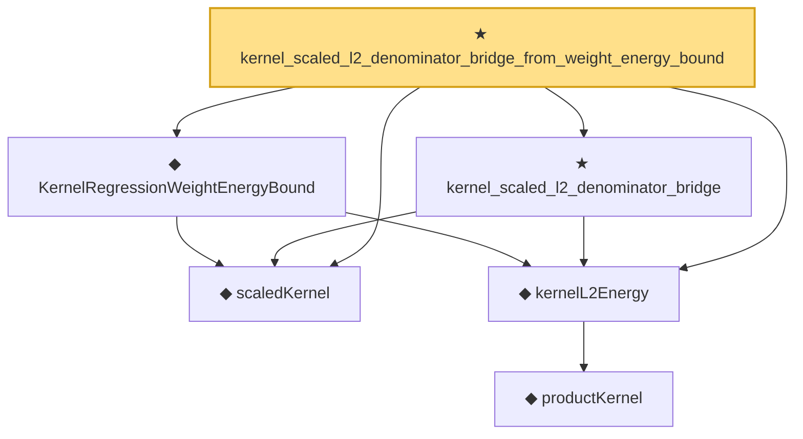

# Proof narrative — kernel_scaled_l2_denominator_bridge_from_weight_energy_bound

Root: **kernel_scaled_l2_denominator_bridge_from_weight_energy_bound** (theorem) `Statlib/Nonparametric/KernelRegression/KernelRate.lean:73` · topic `Nonparametric`
Closure: 6 declarations across 3 files. Generated from `proof_graph.json` — no files were moved.

Reading order (foundations first, headline last):

  ◆ `scaledKernel` — noncomputable def · `Statlib/Nonparametric/Vocabulary/Kernel.lean:33`  _(also used by 14: kernel_uniform_interior_l2_energy_bound, kernel_uniform_interior_population_smoother_eq, kernel_regression_weight_energy_bound_of_design_l2_energy, …)_
      ◆ `productKernel` — noncomputable def · `Statlib/Nonparametric/Vocabulary/Kernel.lean:28`  _(also used by 9: kernel_holder_bias_normalized, kernel_holder_bias_integratedSquaredError_bound, kernel_smoother_classApproximationError_le_of_holder_bias_member, …)_
  ◆ `kernelL2Energy` — noncomputable def · `Statlib/Nonparametric/Vocabulary/Kernel.lean:51`  _(also used by 5: kernel_uniform_interior_l2_energy_bound, kernel_regression_weight_energy_bound_of_design_l2_energy, kernel_regression_integrated_variance_bound, …)_
  ◆ `KernelRegressionWeightEnergyBound` — def · `Statlib/Nonparametric/Vocabulary/KernelRegression.lean:230`  _(also used by 1: kernel_regression_weight_energy_bound_of_design_l2_energy)_
  ★ `kernel_scaled_l2_denominator_bridge` — theorem · `Statlib/Nonparametric/KernelRegression/KernelRate.lean:45`
★ `kernel_scaled_l2_denominator_bridge_from_weight_energy_bound` — theorem · `Statlib/Nonparametric/KernelRegression/KernelRate.lean:73` **← headline**

## Dependency diagram

