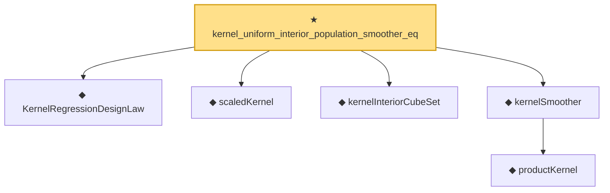

# Proof narrative — kernel_uniform_interior_population_smoother_eq

Root: **kernel_uniform_interior_population_smoother_eq** (theorem) `Statlib/Nonparametric/KernelRegression/KernelRate.lean:139` · topic `Nonparametric`
Closure: 6 declarations across 3 files. Generated from `proof_graph.json` — no files were moved.

Reading order (foundations first, headline last):

  ◆ `KernelRegressionDesignLaw` — def · `Statlib/Nonparametric/Vocabulary/KernelRegression.lean:41`  _(also used by 2: kernel_uniform_interior_l2_energy_bound, KernelRegressionUniformInteriorWellposednessAssumptions)_
  ◆ `scaledKernel` — noncomputable def · `Statlib/Nonparametric/Vocabulary/Kernel.lean:33`  _(also used by 16: kernel_scaled_l2_denominator_bridge, kernel_scaled_l2_denominator_bridge_from_weight_energy_bound, kernel_uniform_interior_l2_energy_bound, …)_
  ◆ `kernelInteriorCubeSet` — def · `Statlib/Nonparametric/Vocabulary/KernelRegression.lean:26`  _(also used by 1: KernelRegressionUniformInteriorWellposednessAssumptions)_
    ◆ `productKernel` — noncomputable def · `Statlib/Nonparametric/Vocabulary/Kernel.lean:28`  _(also used by 9: kernel_holder_bias_normalized, kernel_holder_bias_integratedSquaredError_bound, kernel_smoother_classApproximationError_le_of_holder_bias_member, …)_
  ◆ `kernelSmoother` — noncomputable def · `Statlib/Nonparametric/Vocabulary/Kernel.lean:39`  _(also used by 17: kernel_holder_bias_integratedSquaredError_bound, kernel_smoother_classApproximationError_le_of_holder_bias_member, kernel_smoother_classApproximationError_le_of_holder_bias_rate, …)_
★ `kernel_uniform_interior_population_smoother_eq` — theorem · `Statlib/Nonparametric/KernelRegression/KernelRate.lean:139` **← headline**

## Dependency diagram

