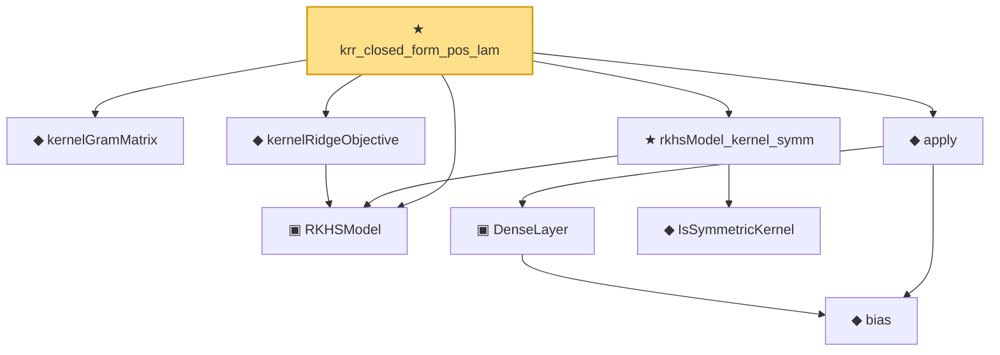

# Proof narrative — krr_closed_form_pos_lam

Root: **krr_closed_form_pos_lam** (theorem) `Statlib/Nonparametric/KernelRegression/KRRClosedForm.lean:21` · topic `Nonparametric`
Closure: 9 declarations across 5 files. Generated from `proof_graph.json` — no files were moved.

Reading order (foundations first, headline last):

  ▣ `RKHSModel` — structure · `Statlib/Nonparametric/Vocabulary/RKHS.lean:16`  _(also used by 27: rkhs_eval_bound, rkhsBall_uniform_bound, rkhsBall_lipschitz, …)_
  ◆ `kernelGramMatrix` — def · `Statlib/Nonparametric/Vocabulary/KernelMethods.lean:51`  _(also used by 3: krr_closed_form_zero_lam_of_posDef, featureMap_gram_psd, featureMap_gram_posDef)_
  ◆ `kernelRidgeObjective` — noncomputable def · `Statlib/Nonparametric/Vocabulary/RKHS.lean:29`  _(also used by 2: representer_projection_minimizer, representer_minimizer_mem_span_of_pos_lam)_
    ◆ `bias` — noncomputable def · `Statlib/Nonparametric/Vocabulary/Estimator.lean:28`  _(also used by 24: exists_fullyConnectedReLUNet_mul_approx_on_box, exists_fullyConnectedReLUNet_linear_combination_two, exists_fullyConnectedReLUNet_coordinate_mul_approx_on_box, …)_
    ▣ `DenseLayer` — structure · `Statlib/Nonparametric/Vocabulary/NeuralNetwork.lean:23`  _(also used by 16: exists_fullyConnectedReLUNet_finite_linear_combination_approx, exists_fullyConnectedReLUNet_product_of_depth_one_approximants_on_box, exists_fullyConnectedReLUNet_finite_centered_monomial_polynomial_approx_on_box, …)_
  ◆ `apply` — noncomputable def · `Statlib/Nonparametric/Vocabulary/NeuralNetwork.lean:30`  _(also used by 79: unit_cube_grid_finite_measurable_cover, kernel_holder_bias_integratedSquaredError_bound, classApproximationError_le_of_exists_pointwise_bound, …)_
    ◆ `IsSymmetricKernel` — def · `Statlib/Nonparametric/Vocabulary/KernelMethods.lean:17`  _(also used by 3: IsPSDKernel, IsPDKernel, rkhsModel_kernel_psd)_
  ★ `rkhsModel_kernel_symm` — theorem · `Statlib/Nonparametric/Vocabulary/RKHS.lean:43`  _(also used by 1: krr_closed_form_zero_lam_of_posDef)_
★ `krr_closed_form_pos_lam` — theorem · `Statlib/Nonparametric/KernelRegression/KRRClosedForm.lean:21` **← headline**

## Dependency diagram

