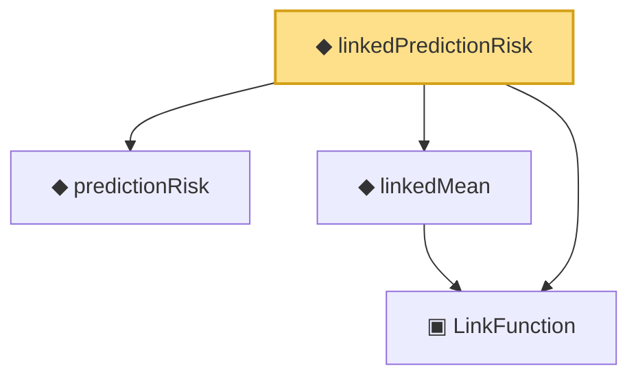

# Proof narrative — linkedPredictionRisk

Root: **linkedPredictionRisk** (noncomputable def) `Statlib/Nonparametric/Vocabulary/Models.lean:57` · topic `Nonparametric`
Closure: 4 declarations across 2 files. Generated from `proof_graph.json` — no files were moved.

Reading order (foundations first, headline last):

  ▣ `LinkFunction` — structure · `Statlib/Nonparametric/Vocabulary/Models.lean:27`  _(also used by 2: logisticLinkFunction, LinkedRegressionModel)_
  ◆ `predictionRisk` — noncomputable def · `Statlib/Nonparametric/Vocabulary/Risk.lean:24`  _(also used by 4: oracleRisk_le_of_member, logisticRisk, oracleRisk, …)_
  ◆ `linkedMean` — def · `Statlib/Nonparametric/Vocabulary/Models.lean:53`  _(also used by 1: logisticRisk)_
◆ `linkedPredictionRisk` — noncomputable def · `Statlib/Nonparametric/Vocabulary/Models.lean:57` **← headline**

## Dependency diagram

