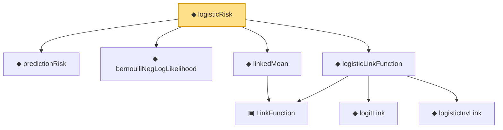

# Proof narrative — logisticRisk

Root: **logisticRisk** (noncomputable def) `Statlib/Nonparametric/Vocabulary/Models.lean:62` · topic `Nonparametric`
Closure: 8 declarations across 3 files. Generated from `proof_graph.json` — no files were moved.

Reading order (foundations first, headline last):

  ◆ `predictionRisk` — noncomputable def · `Statlib/Nonparametric/Vocabulary/Risk.lean:24`  _(also used by 4: oracleRisk_le_of_member, linkedPredictionRisk, oracleRisk, …)_
  ◆ `bernoulliNegLogLikelihood` — noncomputable def · `Statlib/Nonparametric/Vocabulary/Loss.lean:32`
    ▣ `LinkFunction` — structure · `Statlib/Nonparametric/Vocabulary/Models.lean:27`  _(also used by 2: LinkedRegressionModel, linkedPredictionRisk)_
  ◆ `linkedMean` — def · `Statlib/Nonparametric/Vocabulary/Models.lean:53`  _(also used by 1: linkedPredictionRisk)_
    ◆ `logitLink` — noncomputable def · `Statlib/Nonparametric/Vocabulary/Models.lean:36`
    ◆ `logisticInvLink` — noncomputable def · `Statlib/Nonparametric/Vocabulary/Models.lean:32`
  ◆ `logisticLinkFunction` — noncomputable def · `Statlib/Nonparametric/Vocabulary/Models.lean:40`
◆ `logisticRisk` — noncomputable def · `Statlib/Nonparametric/Vocabulary/Models.lean:62` **← headline**

## Dependency diagram

