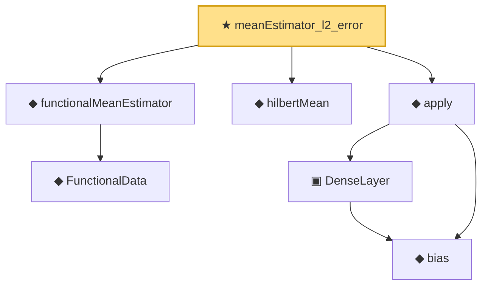

# Proof narrative — meanEstimator_l2_error

Root: **meanEstimator_l2_error** (theorem) `Statlib/Nonparametric/FunctionalData/Mean.lean:47` · topic `Nonparametric`
Closure: 7 declarations across 5 files. Generated from `proof_graph.json` — no files were moved.

Reading order (foundations first, headline last):

    ◆ `FunctionalData` — abbrev · `Statlib/Nonparametric/FunctionalData/Vocabulary.lean:15`  _(also used by 2: meanEstimator_pointwise_holder, sampleNormalEquations)_
  ◆ `functionalMeanEstimator` — noncomputable def · `Statlib/Nonparametric/FunctionalData/Vocabulary.lean:23`  _(also used by 2: meanEstimator_unbiased, meanEstimator_pointwise_holder)_
  ◆ `hilbertMean` — noncomputable def · `Statlib/StatFoundation/RandomVariable/HilbertValue/Vocabulary.lean:22`  _(also used by 5: meanEstimator_unbiased, meanEstimator_pointwise_holder, hilbertCovarianceForm_integrability_bridge, …)_
    ◆ `bias` — noncomputable def · `Statlib/Nonparametric/Vocabulary/Estimator.lean:28`  _(also used by 24: exists_fullyConnectedReLUNet_mul_approx_on_box, exists_fullyConnectedReLUNet_linear_combination_two, exists_fullyConnectedReLUNet_coordinate_mul_approx_on_box, …)_
    ▣ `DenseLayer` — structure · `Statlib/Nonparametric/Vocabulary/NeuralNetwork.lean:23`  _(also used by 16: exists_fullyConnectedReLUNet_finite_linear_combination_approx, exists_fullyConnectedReLUNet_product_of_depth_one_approximants_on_box, exists_fullyConnectedReLUNet_finite_centered_monomial_polynomial_approx_on_box, …)_
  ◆ `apply` — noncomputable def · `Statlib/Nonparametric/Vocabulary/NeuralNetwork.lean:30`  _(also used by 79: unit_cube_grid_finite_measurable_cover, kernel_holder_bias_integratedSquaredError_bound, classApproximationError_le_of_exists_pointwise_bound, …)_
★ `meanEstimator_l2_error` — theorem · `Statlib/Nonparametric/FunctionalData/Mean.lean:47` **← headline**

## Dependency diagram

