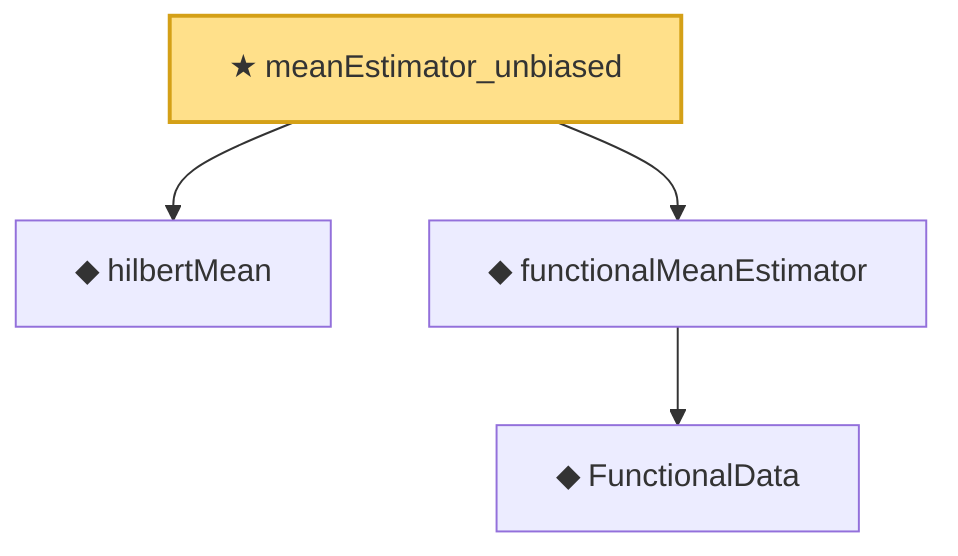

# Proof narrative — meanEstimator_unbiased

Root: **meanEstimator_unbiased** (theorem) `Statlib/Nonparametric/FunctionalData/Mean.lean:19` · topic `Nonparametric`
Closure: 4 declarations across 3 files. Generated from `proof_graph.json` — no files were moved.

Reading order (foundations first, headline last):

  ◆ `hilbertMean` — noncomputable def · `Statlib/StatFoundation/RandomVariable/HilbertValue/Vocabulary.lean:22`  _(also used by 5: meanEstimator_l2_error, meanEstimator_pointwise_holder, hilbertCovarianceForm_integrability_bridge, …)_
    ◆ `FunctionalData` — abbrev · `Statlib/Nonparametric/FunctionalData/Vocabulary.lean:15`  _(also used by 2: meanEstimator_pointwise_holder, sampleNormalEquations)_
  ◆ `functionalMeanEstimator` — noncomputable def · `Statlib/Nonparametric/FunctionalData/Vocabulary.lean:23`  _(also used by 2: meanEstimator_l2_error, meanEstimator_pointwise_holder)_
★ `meanEstimator_unbiased` — theorem · `Statlib/Nonparametric/FunctionalData/Mean.lean:19` **← headline**

## Dependency diagram

