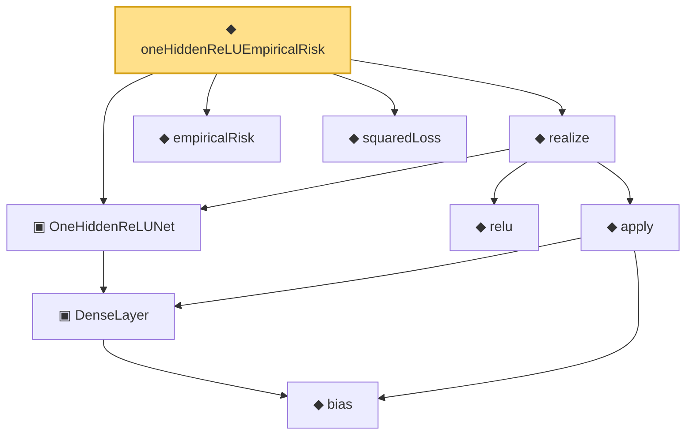

# Proof narrative — oneHiddenReLUEmpiricalRisk

Root: **oneHiddenReLUEmpiricalRisk** (noncomputable def) `Statlib/Nonparametric/Vocabulary/NeuralNetwork.lean:71` · topic `Nonparametric`
Closure: 9 declarations across 4 files. Generated from `proof_graph.json` — no files were moved.

Reading order (foundations first, headline last):

      ◆ `bias` — noncomputable def · `Statlib/Nonparametric/Vocabulary/Estimator.lean:28`
    ▣ `DenseLayer` — structure · `Statlib/Nonparametric/Vocabulary/NeuralNetwork.lean:23`  _(also used by 1: reluApply)_
  ▣ `OneHiddenReLUNet` — structure · `Statlib/Nonparametric/Vocabulary/NeuralNetwork.lean:43`
  ◆ `empiricalRisk` — noncomputable def · `Statlib/Nonparametric/Vocabulary/Risk.lean:29`  _(also used by 1: seriesLeastSquaresObjective)_
  ◆ `squaredLoss` — def · `Statlib/Nonparametric/Vocabulary/Loss.lean:13`  _(also used by 2: squaredPredictionRisk, seriesLeastSquaresObjective)_
    ◆ `relu` — def · `Statlib/Nonparametric/Vocabulary/NeuralNetwork.lean:15`  _(also used by 1: reluVec)_
    ◆ `apply` — noncomputable def · `Statlib/Nonparametric/Vocabulary/NeuralNetwork.lean:30`  _(also used by 12: unitCube_grid_finite_measurable_cover, kernel_holder_bias_integratedSquaredError_bound, classApproximationError_le_of_exists_pointwise_bound, …)_
  ◆ `realize` — noncomputable def · `Statlib/Nonparametric/Vocabulary/NeuralNetwork.lean:51`  _(also used by 5: reluNetworkClass_classApproximationError_le_of_pointwise_candidate, reluNetworkClass_classApproximationError_le_of_candidate_ise, reluNetworkClass_classApproximationError_le_of_exists_pointwise, …)_
◆ `oneHiddenReLUEmpiricalRisk` — noncomputable def · `Statlib/Nonparametric/Vocabulary/NeuralNetwork.lean:71` **← headline**

## Dependency diagram

