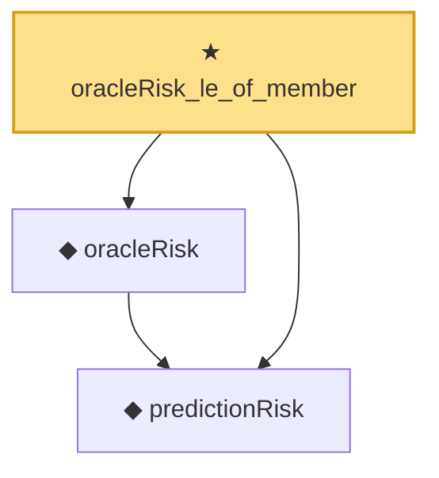

# Proof narrative — oracleRisk_le_of_member

Root: **oracleRisk_le_of_member** (theorem) `Statlib/Nonparametric/OracleInterface/Risk.lean:9` · topic `Nonparametric`
Closure: 3 declarations across 2 files. Generated from `proof_graph.json` — no files were moved.

Reading order (foundations first, headline last):

  ◆ `predictionRisk` — noncomputable def · `Statlib/Nonparametric/Vocabulary/Risk.lean:24`  _(also used by 3: linkedPredictionRisk, logisticRisk, squaredPredictionRisk)_
  ◆ `oracleRisk` — noncomputable def · `Statlib/Nonparametric/Vocabulary/Risk.lean:47`
★ `oracleRisk_le_of_member` — theorem · `Statlib/Nonparametric/OracleInterface/Risk.lean:9` **← headline**

## Dependency diagram

