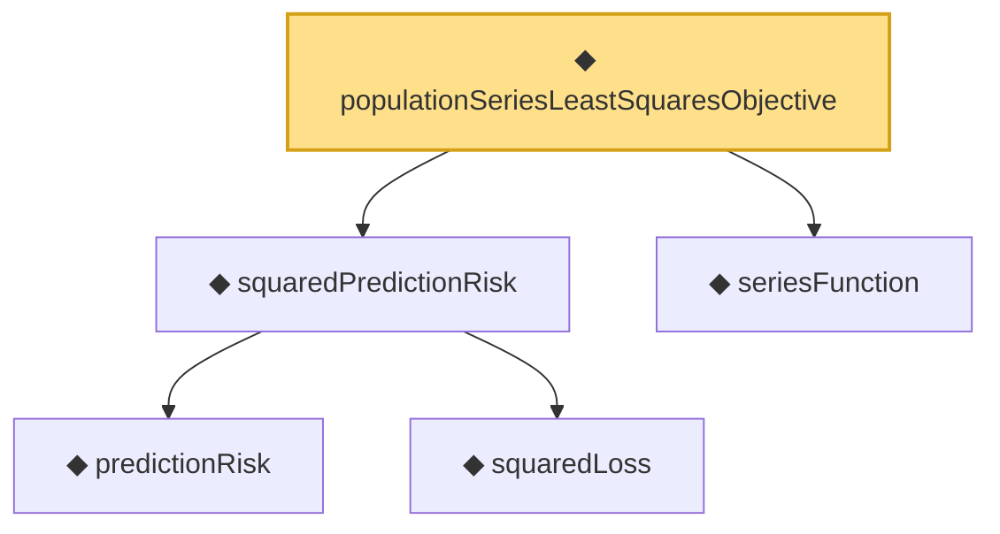

# Proof narrative — populationSeriesLeastSquaresObjective

Root: **populationSeriesLeastSquaresObjective** (noncomputable def) `Statlib/Nonparametric/Vocabulary/Sieve.lean:37` · topic `Nonparametric`
Closure: 5 declarations across 3 files. Generated from `proof_graph.json` — no files were moved.

Reading order (foundations first, headline last):

    ◆ `predictionRisk` — noncomputable def · `Statlib/Nonparametric/Vocabulary/Risk.lean:24`  _(also used by 4: oracleRisk_le_of_member, linkedPredictionRisk, logisticRisk, …)_
    ◆ `squaredLoss` — def · `Statlib/Nonparametric/Vocabulary/Loss.lean:13`  _(also used by 2: oneHiddenReLUEmpiricalRisk, seriesLeastSquaresObjective)_
  ◆ `squaredPredictionRisk` — noncomputable def · `Statlib/Nonparametric/Vocabulary/Risk.lean:80`
  ◆ `seriesFunction` — noncomputable def · `Statlib/Nonparametric/Vocabulary/Sieve.lean:27`  _(also used by 39: holder_selectorIndicator_series_pointwise_bound, holder_selectorIndicator_series_integratedSquaredError_bound, finiteLinearSpan_classApproximationError_le_of_holder_selector_net, …)_
◆ `populationSeriesLeastSquaresObjective` — noncomputable def · `Statlib/Nonparametric/Vocabulary/Sieve.lean:37` **← headline**

## Dependency diagram

