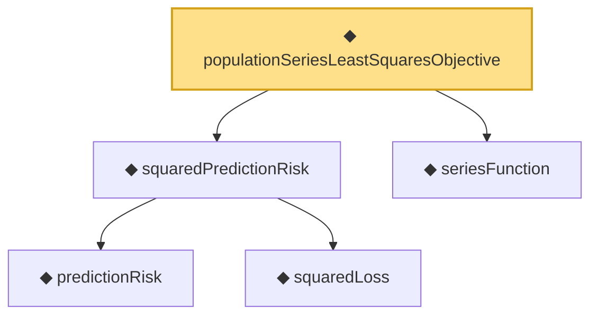

# Proof narrative — populationSeriesLeastSquaresObjective

Root: **populationSeriesLeastSquaresObjective** (noncomputable def) `Statlib/Nonparametric/Vocabulary/Sieve.lean:37` · topic `Nonparametric`
Closure: 5 declarations across 3 files. Generated from `proof_graph.json` — no files were moved.

Reading order (foundations first, headline last):

    ◆ `predictionRisk` — noncomputable def · `Statlib/Nonparametric/Vocabulary/Risk.lean:24`  _(also used by 5: oracleRisk_le_of_member, approximationError_le_of_exists_risk_le, linkedPredictionRisk, …)_
    ◆ `squaredLoss` — def · `Statlib/Nonparametric/Vocabulary/Loss.lean:13`  _(also used by 2: oneHiddenReLUEmpiricalRisk, seriesLeastSquaresObjective)_
  ◆ `squaredPredictionRisk` — noncomputable def · `Statlib/Nonparametric/Vocabulary/Risk.lean:80`
  ◆ `seriesFunction` — noncomputable def · `Statlib/Nonparametric/Vocabulary/Sieve.lean:27`  _(also used by 68: selector_indicator_holder_series_pointwise_approximation_bound, selector_indicator_holder_series_integrated_squared_error_bound, selector_indicator_holder_class_approximation_error_le_of_net, …)_
◆ `populationSeriesLeastSquaresObjective` — noncomputable def · `Statlib/Nonparametric/Vocabulary/Sieve.lean:37` **← headline**

## Dependency diagram

```mermaid
flowchart TD
  n0["◆ predictionRisk"]
  n1["◆ squaredLoss"]
  n2["◆ squaredPredictionRisk"]
  n3["◆ seriesFunction"]
  n4["◆ populationSeriesLeastSquaresObjective"]
  n2 --> n0
  n2 --> n1
  n4 --> n2
  n4 --> n3
  class n4 headline;
  classDef headline fill:#ffe08a,stroke:#d4a017,stroke-width:2px;
  classDef axiomNode fill:#ffd0d0,stroke:#c0392b,stroke-dasharray:4 2;
```
