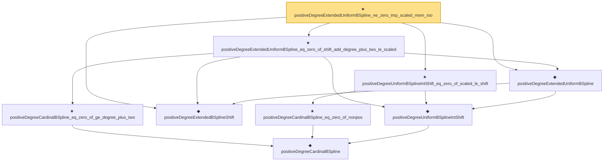

# Proof narrative — positiveDegreeExtendedUniformBSpline_ne_zero_imp_scaled_mem_Ioo

Root: **positiveDegreeExtendedUniformBSpline_ne_zero_imp_scaled_mem_Ioo** (theorem) `Statlib/Nonparametric/Approximation/SplineFacts.lean:357` · topic `Nonparametric`
Closure: 9 declarations across 2 files. Generated from `proof_graph.json` — no files were moved.

Reading order (foundations first, headline last):

      ◆ `positiveDegreeCardinalBSpline` — noncomputable def · `Statlib/Nonparametric/Vocabulary/Spline.lean:82`  _(also used by 13: positiveDegreeCardinalBSpline_continuous, positiveDegreeExtendedUniformBSpline_linearIndependent_on_Icc, positiveDegreeCardinalBSpline_succ_eq_weighted_adjacent, …)_
    ◆ `positiveDegreeUniformBSplineIntShift` — noncomputable def · `Statlib/Nonparametric/Vocabulary/Spline.lean:113`  _(also used by 11: positiveDegreeUniformBSplineIntShift_continuous, positiveDegreeUniformBSplineIntShift_eq_zero_of_shift_add_degree_plus_two_le_scaled, positiveDegreeExtendedUniformBSpline_linearIndependent_on_Icc, …)_
  ◆ `positiveDegreeExtendedBSplineShift` — def · `Statlib/Nonparametric/Vocabulary/Spline.lean:120`  _(also used by 12: positiveDegreeExtendedUniformBSpline_continuous, positiveDegreeExtendedUniformBSpline_linearIndependent_on_Icc, tensorProductPositiveDegreeExtendedBSplineBasis_eq_zero_of_exists_scaled_le_shift, …)_
  ◆ `positiveDegreeExtendedUniformBSpline` — noncomputable def · `Statlib/Nonparametric/Vocabulary/Spline.lean:126`  _(also used by 17: positiveDegreeExtendedUniformBSpline_continuous, positiveDegreeExtendedUniformBSpline_linearIndependent_on_Icc, unitCubePositiveDegreeExtendedBSplineBasis_linearIndependent_oneDim, …)_
    ★ `positiveDegreeCardinalBSpline_eq_zero_of_nonpos` — theorem · `Statlib/Nonparametric/Approximation/SplineFacts.lean:32`  _(also used by 6: positiveDegreeUniformBSpline_eq_zero_of_scaled_le_index, tensorProductPositiveDegreeExtendedBSplineBasis_eq_zero_of_exists_scaled_le_shift, positiveDegreeCardinalBSpline_succ_eq_weighted_adjacent, …)_
  ★ `positiveDegreeUniformBSplineIntShift_eq_zero_of_scaled_le_shift` — theorem · `Statlib/Nonparametric/Approximation/SplineFacts.lean:319`  _(also used by 2: positiveDegreeExtendedUniformBSpline_linearIndependent_on_Icc, unitCubePositiveDegreeExtendedBSplineDual_exists_uniform_reproducing_degreeSucc_localStability)_
    ★ `positiveDegreeCardinalBSpline_eq_zero_of_ge_degree_plus_two` — theorem · `Statlib/Nonparametric/Approximation/SplineFacts.lean:52`  _(also used by 6: positiveDegreeUniformBSplineIntShift_eq_zero_of_shift_add_degree_plus_two_le_scaled, tensorProductPositiveDegreeExtendedBSplineBasis_eq_zero_of_exists_shift_add_degree_plus_two_le_scaled, positiveDegreeCardinalBSpline_succ_eq_weighted_adjacent, …)_
  ★ `positiveDegreeExtendedUniformBSpline_eq_zero_of_shift_add_degree_plus_two_le_scaled` — theorem · `Statlib/Nonparametric/Approximation/SplineFacts.lean:344`  _(also used by 1: positiveDegreeExtendedUniformBSpline_linearIndependent_on_Icc)_
★ `positiveDegreeExtendedUniformBSpline_ne_zero_imp_scaled_mem_Ioo` — theorem · `Statlib/Nonparametric/Approximation/SplineFacts.lean:357` **← headline**

## Dependency diagram

