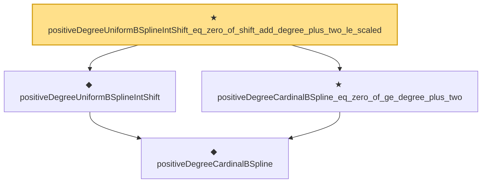

# Proof narrative — positiveDegreeUniformBSplineIntShift_eq_zero_of_shift_add_degree_plus_two_le_scaled

Root: **positiveDegreeUniformBSplineIntShift_eq_zero_of_shift_add_degree_plus_two_le_scaled** (theorem) `Statlib/Nonparametric/Approximation/SplineFacts.lean:328` · topic `Nonparametric`
Closure: 4 declarations across 2 files. Generated from `proof_graph.json` — no files were moved.

Reading order (foundations first, headline last):

    ◆ `positiveDegreeCardinalBSpline` — noncomputable def · `Statlib/Nonparametric/Vocabulary/Spline.lean:82`  _(also used by 14: positiveDegreeCardinalBSpline_continuous, positiveDegreeCardinalBSpline_eq_zero_of_nonpos, positiveDegreeExtendedUniformBSpline_linearIndependent_on_Icc, …)_
  ◆ `positiveDegreeUniformBSplineIntShift` — noncomputable def · `Statlib/Nonparametric/Vocabulary/Spline.lean:113`  _(also used by 13: positiveDegreeUniformBSplineIntShift_continuous, positiveDegreeUniformBSplineIntShift_eq_zero_of_scaled_le_shift, positiveDegreeExtendedUniformBSpline_eq_zero_of_shift_add_degree_plus_two_le_scaled, …)_
  ★ `positiveDegreeCardinalBSpline_eq_zero_of_ge_degree_plus_two` — theorem · `Statlib/Nonparametric/Approximation/SplineFacts.lean:52`  _(also used by 6: positiveDegreeExtendedUniformBSpline_eq_zero_of_shift_add_degree_plus_two_le_scaled, tensorProductPositiveDegreeExtendedBSplineBasis_eq_zero_of_exists_shift_add_degree_plus_two_le_scaled, positiveDegreeCardinalBSpline_succ_eq_weighted_adjacent, …)_
★ `positiveDegreeUniformBSplineIntShift_eq_zero_of_shift_add_degree_plus_two_le_scaled` — theorem · `Statlib/Nonparametric/Approximation/SplineFacts.lean:328` **← headline**

## Dependency diagram

