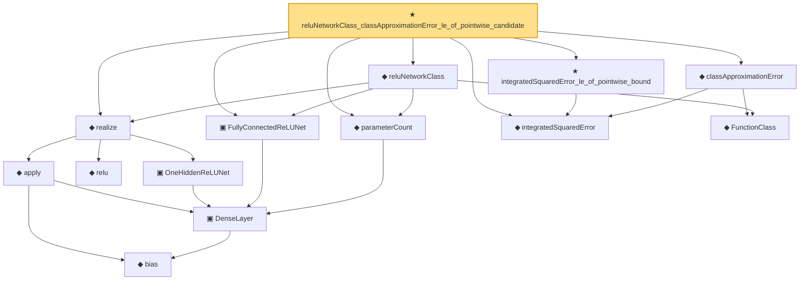

# Proof narrative — reluNetworkClass_classApproximationError_le_of_pointwise_candidate

Root: **reluNetworkClass_classApproximationError_le_of_pointwise_candidate** (theorem) `Statlib/Nonparametric/Approximation/NeuralNetwork.lean:11` · topic `Nonparametric`
Closure: 14 declarations across 6 files. Generated from `proof_graph.json` — no files were moved.

Reading order (foundations first, headline last):

      ◆ `bias` — noncomputable def · `Statlib/Nonparametric/Vocabulary/Estimator.lean:28`  _(also used by 24: exists_fullyConnectedReLUNet_mul_approx_on_box, exists_fullyConnectedReLUNet_linear_combination_two, exists_fullyConnectedReLUNet_coordinate_mul_approx_on_box, …)_
    ▣ `DenseLayer` — structure · `Statlib/Nonparametric/Vocabulary/NeuralNetwork.lean:23`  _(also used by 13: exists_fullyConnectedReLUNet_finite_linear_combination_approx, exists_fullyConnectedReLUNet_product_of_depth_one_approximants_on_box, exists_fullyConnectedReLUNet_finite_centered_monomial_polynomial_approx_on_box, …)_
  ◆ `parameterCount` — def · `Statlib/Nonparametric/Vocabulary/NeuralNetwork.lean:39`  _(also used by 32: reluNetworkClass_classApproximationError_le_of_candidate_ise, reluNetworkClass_classApproximationError_le_of_exists_pointwise, exists_fullyConnectedReLUNet_unitInterval_square_approx, …)_
  ▣ `FullyConnectedReLUNet` — structure · `Statlib/Nonparametric/Vocabulary/NeuralNetwork.lean:167`  _(also used by 48: reluNetworkClass_classApproximationError_le_of_candidate_ise, reluNetworkClass_classApproximationError_le_of_exists_pointwise, exists_fullyConnectedReLUNet_unitInterval_square_approx, …)_
    ▣ `OneHiddenReLUNet` — structure · `Statlib/Nonparametric/Vocabulary/NeuralNetwork.lean:47`  _(also used by 6: parameterCount, toFullyConnected, unitIntervalSquareReLUHingeNet, …)_
    ◆ `relu` — def · `Statlib/Nonparametric/Vocabulary/NeuralNetwork.lean:15`  _(also used by 44: squareReLUHingeInterpolant_error_le_of_mem_cell, unitIntervalSquareReLUHingeNet_realize, exists_fullyConnectedReLUNet_interval_square_approx, …)_
    ◆ `apply` — noncomputable def · `Statlib/Nonparametric/Vocabulary/NeuralNetwork.lean:30`  _(also used by 79: unit_cube_grid_finite_measurable_cover, kernel_holder_bias_integratedSquaredError_bound, classApproximationError_le_of_exists_pointwise_bound, …)_
  ◆ `realize` — noncomputable def · `Statlib/Nonparametric/Vocabulary/NeuralNetwork.lean:55`  _(also used by 51: reluNetworkClass_classApproximationError_le_of_candidate_ise, reluNetworkClass_classApproximationError_le_of_exists_pointwise, unitIntervalSquareReLUHingeNet_realize, …)_
  ◆ `integratedSquaredError` — noncomputable def · `Statlib/Nonparametric/Vocabulary/Risk.lean:60`  _(also used by 32: supNormBall_classApproximationError_self_le_zero, holder_net_integrated_squared_error_bound, holder_class_approximation_error_le_of_net_member, …)_
    ◆ `FunctionClass` — abbrev · `Statlib/Nonparametric/Vocabulary/FunctionClasses.lean:16`  _(also used by 23: holder_class_approximation_error_le_of_net_member, kernel_smoother_classApproximationError_le_of_holder_bias_member, kernel_smoother_classApproximationError_le_of_holder_bias_rate, …)_
  ◆ `reluNetworkClass` — def · `Statlib/Nonparametric/Vocabulary/NeuralNetwork.lean:219`  _(also used by 47: reluNetworkClass_classApproximationError_le_of_candidate_ise, reluNetworkClass_classApproximationError_le_of_exists_pointwise, exists_reluNetworkClass_holderSmooth_local_approx_on_centered_box_with_symbolic_budget, …)_
  ◆ `classApproximationError` — noncomputable def · `Statlib/Nonparametric/Vocabulary/Risk.lean:75`  _(also used by 21: supNormBall_classApproximationError_self_le_zero, holder_class_approximation_error_le_of_net_member, holder_ball_class_approximation_error_self_le_zero, …)_
  ★ `integratedSquaredError_le_of_pointwise_bound` — theorem · `Statlib/Nonparametric/Approximation/Metric.lean:10`  _(also used by 11: holder_net_integrated_squared_error_bound, holder_class_approximation_error_le_of_net_member, selector_indicator_holder_series_integrated_squared_error_bound, …)_
★ `reluNetworkClass_classApproximationError_le_of_pointwise_candidate` — theorem · `Statlib/Nonparametric/Approximation/NeuralNetwork.lean:11` **← headline**

## Dependency diagram

```mermaid
flowchart TD
  n0["◆ bias"]
  n1["▣ DenseLayer"]
  n2["◆ parameterCount"]
  n3["▣ FullyConnectedReLUNet"]
  n4["▣ OneHiddenReLUNet"]
  n5["◆ relu"]
  n6["◆ apply"]
  n7["◆ realize"]
  n8["◆ integratedSquaredError"]
  n9["◆ FunctionClass"]
  n10["◆ reluNetworkClass"]
  n11["◆ classApproximationError"]
  n12["★ integratedSquaredError_le_of_pointwise_bound"]
  n13["★ reluNetworkClass_classApproximationError_le_of_pointwise_candidate"]
  n1 --> n0
  n2 --> n1
  n3 --> n1
  n4 --> n1
  n6 --> n1
  n6 --> n0
  n7 --> n4
  n7 --> n5
  n7 --> n6
  n10 --> n2
  n10 --> n9
  n10 --> n3
  n10 --> n7
  n11 --> n9
  n11 --> n8
  n12 --> n8
  n13 --> n2
  n13 --> n3
  n13 --> n7
  n13 --> n8
  n13 --> n10
  n13 --> n11
  n13 --> n12
  class n13 headline;
  classDef headline fill:#ffe08a,stroke:#d4a017,stroke-width:2px;
  classDef axiomNode fill:#ffd0d0,stroke:#c0392b,stroke-dasharray:4 2;
```
