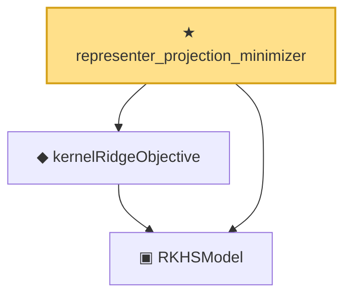

# Proof narrative — representer_projection_minimizer

Root: **representer_projection_minimizer** (theorem) `Statlib/Nonparametric/KernelRegression/Representer.lean:22` · topic `Nonparametric`
Closure: 3 declarations across 2 files. Generated from `proof_graph.json` — no files were moved.

Reading order (foundations first, headline last):

  ▣ `RKHSModel` — structure · `Statlib/Nonparametric/Vocabulary/RKHS.lean:16`  _(also used by 28: rkhs_eval_bound, rkhsBall_uniform_bound, rkhsBall_lipschitz, …)_
  ◆ `kernelRidgeObjective` — noncomputable def · `Statlib/Nonparametric/Vocabulary/RKHS.lean:29`  _(also used by 2: krr_closed_form_pos_lam, representer_minimizer_mem_span_of_pos_lam)_
★ `representer_projection_minimizer` — theorem · `Statlib/Nonparametric/KernelRegression/Representer.lean:22` **← headline**

## Dependency diagram

