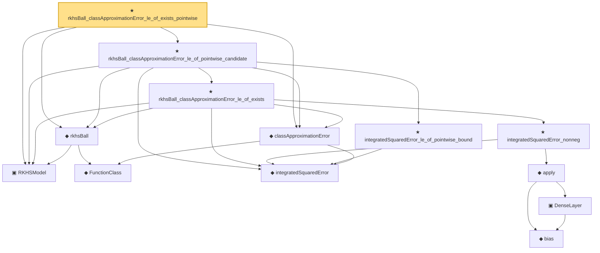

# Proof narrative — rkhsBall_classApproximationError_le_of_exists_pointwise

Root: **rkhsBall_classApproximationError_le_of_exists_pointwise** (theorem) `Statlib/Nonparametric/Approximation/RKHS.lean:187` · topic `Nonparametric`
Closure: 13 declarations across 7 files. Generated from `proof_graph.json` — no files were moved.

Reading order (foundations first, headline last):

  ▣ `RKHSModel` — structure · `Statlib/Nonparametric/Vocabulary/RKHS.lean:16`  _(also used by 26: rkhs_eval_bound, rkhsBall_uniform_bound, rkhsBall_lipschitz, …)_
    ◆ `FunctionClass` — abbrev · `Statlib/Nonparametric/Vocabulary/FunctionClasses.lean:16`  _(also used by 23: holder_class_approximation_error_le_of_net_member, kernel_smoother_classApproximationError_le_of_holder_bias_member, kernel_smoother_classApproximationError_le_of_holder_bias_rate, …)_
    ◆ `integratedSquaredError` — noncomputable def · `Statlib/Nonparametric/Vocabulary/Risk.lean:60`  _(also used by 30: supNormBall_classApproximationError_self_le_zero, holder_net_integrated_squared_error_bound, holder_class_approximation_error_le_of_net_member, …)_
  ◆ `classApproximationError` — noncomputable def · `Statlib/Nonparametric/Vocabulary/Risk.lean:75`  _(also used by 19: supNormBall_classApproximationError_self_le_zero, holder_class_approximation_error_le_of_net_member, holder_ball_class_approximation_error_self_le_zero, …)_
  ◆ `rkhsBall` — def · `Statlib/Nonparametric/Vocabulary/RKHS.lean:24`  _(also used by 13: rkhsBall_uniform_bound, rkhsBall_lipschitz, rkhsBall_kernelMetric_lipschitz, …)_
    ★ `integratedSquaredError_le_of_pointwise_bound` — theorem · `Statlib/Nonparametric/Approximation/Metric.lean:10`  _(also used by 11: holder_net_integrated_squared_error_bound, holder_class_approximation_error_le_of_net_member, selector_indicator_holder_series_integrated_squared_error_bound, …)_
          ◆ `bias` — noncomputable def · `Statlib/Nonparametric/Vocabulary/Estimator.lean:28`  _(also used by 24: exists_fullyConnectedReLUNet_mul_approx_on_box, exists_fullyConnectedReLUNet_linear_combination_two, exists_fullyConnectedReLUNet_coordinate_mul_approx_on_box, …)_
          ▣ `DenseLayer` — structure · `Statlib/Nonparametric/Vocabulary/NeuralNetwork.lean:23`  _(also used by 16: exists_fullyConnectedReLUNet_finite_linear_combination_approx, exists_fullyConnectedReLUNet_product_of_depth_one_approximants_on_box, exists_fullyConnectedReLUNet_finite_centered_monomial_polynomial_approx_on_box, …)_
        ◆ `apply` — noncomputable def · `Statlib/Nonparametric/Vocabulary/NeuralNetwork.lean:30`  _(also used by 79: unit_cube_grid_finite_measurable_cover, kernel_holder_bias_integratedSquaredError_bound, classApproximationError_le_of_exists_pointwise_bound, …)_
      ★ `integratedSquaredError_nonneg` — theorem · `Statlib/Nonparametric/Approximation/Metric.lean:153`
    ★ `rkhsBall_classApproximationError_le_of_exists` — theorem · `Statlib/Nonparametric/Approximation/RKHS.lean:130`
  ★ `rkhsBall_classApproximationError_le_of_pointwise_candidate` — theorem · `Statlib/Nonparametric/Approximation/RKHS.lean:158`
★ `rkhsBall_classApproximationError_le_of_exists_pointwise` — theorem · `Statlib/Nonparametric/Approximation/RKHS.lean:187` **← headline**

## Dependency diagram

