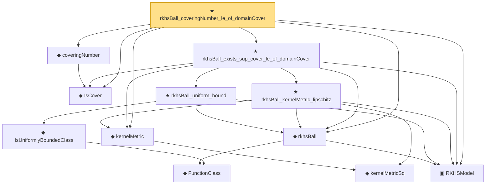

# Proof narrative — rkhsBall_coveringNumber_le_of_domainCover

Root: **rkhsBall_coveringNumber_le_of_domainCover** (theorem) `Statlib/Nonparametric/Approximation/RKHS.lean:419` · topic `Nonparametric`
Closure: 12 declarations across 5 files. Generated from `proof_graph.json` — no files were moved.

Reading order (foundations first, headline last):

  ▣ `RKHSModel` — structure · `Statlib/Nonparametric/Vocabulary/RKHS.lean:16`  _(also used by 25: rkhs_eval_bound, rkhsBall_lipschitz, kernelMetricSq_eq_norm_sub_sq, …)_
  ◆ `IsCover` — def · `Statlib/StatFoundation/Vocabulary/CoveringNumbers.lean:75`  _(also used by 10: rkhsBall_coveringNumber_le_of_L2_internal, rkhsBall_logEntropy_L2_le, rkhsBall_logEntropyIntegral_truncated_le, …)_
    ◆ `kernelMetricSq` — def · `Statlib/Nonparametric/Vocabulary/KernelMethods.lean:58`  _(also used by 1: kernelMetricSq_eq_norm_sub_sq)_
  ◆ `kernelMetric` — noncomputable def · `Statlib/Nonparametric/Vocabulary/KernelMethods.lean:67`  _(also used by 5: rkhsBall_coveringNumber_le_of_L2_internal, rkhsBall_logEntropy_L2_le, rkhsBall_logEntropyIntegral_truncated_le, …)_
  ◆ `coveringNumber` — noncomputable def · `Statlib/StatFoundation/Vocabulary/CoveringNumbers.lean:81`  _(also used by 10: rkhsBall_coveringNumber_le_of_L2_internal, rkhsBall_logEntropy_L2_le, rkhsBall_logEntropy_L2_le_of_range, …)_
    ◆ `FunctionClass` — abbrev · `Statlib/Nonparametric/Vocabulary/FunctionClasses.lean:16`  _(also used by 23: holder_class_approximation_error_le_of_net_member, kernel_smoother_classApproximationError_le_of_holder_bias_member, kernel_smoother_classApproximationError_le_of_holder_bias_rate, …)_
  ◆ `rkhsBall` — def · `Statlib/Nonparametric/Vocabulary/RKHS.lean:24`  _(also used by 12: rkhsBall_lipschitz, rkhsBall_classApproximationError_le_of_exists, rkhsBall_classApproximationError_le_of_pointwise_candidate, …)_
      ◆ `IsUniformlyBoundedClass` — def · `Statlib/Nonparametric/Vocabulary/FunctionClasses.lean:32`  _(also used by 1: rkhsBall_exists_finite_internal_L2_net)_
    ★ `rkhsBall_uniform_bound` — theorem · `Statlib/Nonparametric/Approximation/RKHS.lean:27`  _(also used by 3: rkhsBall_coveringNumber_le_of_L2_internal, rkhsBall_logEntropy_L2_le_of_range, rkhsBall_exists_finite_internal_L2_net)_
    ★ `rkhsBall_kernelMetric_lipschitz` — theorem · `Statlib/Nonparametric/Approximation/RKHS.lean:92`  _(also used by 1: rkhsBall_coveringNumber_le_of_L2_internal)_
  ★ `rkhsBall_exists_sup_cover_le_of_domainCover` — theorem · `Statlib/Nonparametric/Approximation/RKHS.lean:215`
★ `rkhsBall_coveringNumber_le_of_domainCover` — theorem · `Statlib/Nonparametric/Approximation/RKHS.lean:419` **← headline**

## Dependency diagram

