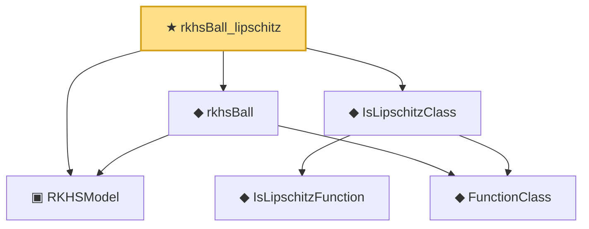

# Proof narrative — rkhsBall_lipschitz

Root: **rkhsBall_lipschitz** (theorem) `Statlib/Nonparametric/Approximation/RKHS.lean:41` · topic `Nonparametric`
Closure: 6 declarations across 3 files. Generated from `proof_graph.json` — no files were moved.

Reading order (foundations first, headline last):

  ▣ `RKHSModel` — structure · `Statlib/Nonparametric/Vocabulary/RKHS.lean:15`  _(also used by 6: rkhs_eval_bound, rkhsBall_uniform_bound, rkhsBall_classApproximationError_le_of_exists, …)_
    ◆ `FunctionClass` — abbrev · `Statlib/Nonparametric/Vocabulary/FunctionClasses.lean:16`  _(also used by 20: holder_classApproximationError_le_of_net_member, kernel_smoother_classApproximationError_le_of_holder_bias_member, kernel_smoother_classApproximationError_le_of_holder_bias_rate, …)_
    ◆ `IsLipschitzFunction` — def · `Statlib/Nonparametric/Vocabulary/FunctionClasses.lean:36`
  ◆ `IsLipschitzClass` — def · `Statlib/Nonparametric/Vocabulary/FunctionClasses.lean:40`
  ◆ `rkhsBall` — def · `Statlib/Nonparametric/Vocabulary/RKHS.lean:23`  _(also used by 4: rkhsBall_uniform_bound, rkhsBall_classApproximationError_le_of_exists, rkhsBall_classApproximationError_le_of_pointwise_candidate, …)_
★ `rkhsBall_lipschitz` — theorem · `Statlib/Nonparametric/Approximation/RKHS.lean:41` **← headline**

## Dependency diagram

