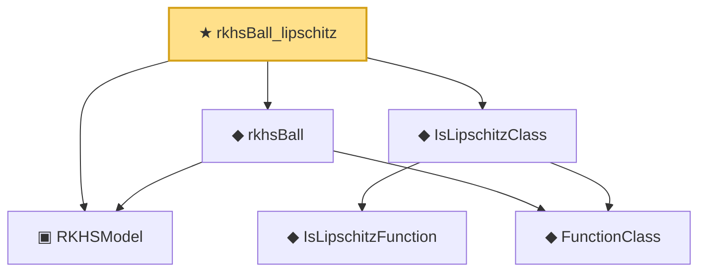

# Proof narrative — rkhsBall_lipschitz

Root: **rkhsBall_lipschitz** (theorem) `Statlib/Nonparametric/Approximation/RKHS.lean:48` · topic `Nonparametric`
Closure: 6 declarations across 3 files. Generated from `proof_graph.json` — no files were moved.

Reading order (foundations first, headline last):

  ▣ `RKHSModel` — structure · `Statlib/Nonparametric/Vocabulary/RKHS.lean:16`  _(also used by 28: rkhs_eval_bound, rkhsBall_uniform_bound, kernelMetricSq_eq_norm_sub_sq, …)_
    ◆ `FunctionClass` — abbrev · `Statlib/Nonparametric/Vocabulary/FunctionClasses.lean:16`  _(also used by 23: holder_class_approximation_error_le_of_net_member, kernel_smoother_classApproximationError_le_of_holder_bias_member, kernel_smoother_classApproximationError_le_of_holder_bias_rate, …)_
    ◆ `IsLipschitzFunction` — def · `Statlib/Nonparametric/Vocabulary/FunctionClasses.lean:36`
  ◆ `IsLipschitzClass` — def · `Statlib/Nonparametric/Vocabulary/FunctionClasses.lean:40`
  ◆ `rkhsBall` — def · `Statlib/Nonparametric/Vocabulary/RKHS.lean:24`  _(also used by 15: rkhsBall_uniform_bound, rkhsBall_kernelMetric_lipschitz, rkhsBall_classApproximationError_le_of_exists, …)_
★ `rkhsBall_lipschitz` — theorem · `Statlib/Nonparametric/Approximation/RKHS.lean:48` **← headline**

## Dependency diagram

```mermaid
flowchart TD
  n0["▣ RKHSModel"]
  n1["◆ FunctionClass"]
  n2["◆ IsLipschitzFunction"]
  n3["◆ IsLipschitzClass"]
  n4["◆ rkhsBall"]
  n5["★ rkhsBall_lipschitz"]
  n3 --> n1
  n3 --> n2
  n4 --> n0
  n4 --> n1
  n5 --> n0
  n5 --> n3
  n5 --> n4
  class n5 headline;
  classDef headline fill:#ffe08a,stroke:#d4a017,stroke-width:2px;
  classDef axiomNode fill:#ffd0d0,stroke:#c0392b,stroke-dasharray:4 2;
```
