# Proof narrative — rkhsBall_rademacher_complexity_dudley_le

Root: **rkhsBall_rademacher_complexity_dudley_le** (theorem) `Statlib/Nonparametric/Approximation/RKHS.lean:3126` · topic `Nonparametric`
Closure: 42 declarations across 15 files. Generated from `proof_graph.json` — no files were moved.

Reading order (foundations first, headline last):

  ▣ `RKHSModel` — structure · `Statlib/Nonparametric/Vocabulary/RKHS.lean:16`  _(also used by 18: rkhsBall_lipschitz, kernelMetricSq_eq_norm_sub_sq, evaluationFunctional_apply, …)_
  ◆ `IsCover` — def · `Statlib/StatFoundation/Vocabulary/CoveringNumbers.lean:75`  _(also used by 4: rkhsBall_exists_sup_cover_le_of_domainCover, rkhsBall_coveringNumber_le_of_domainCover, rademacher_complexity_dudley_bound, …)_
    ◆ `kernelMetricSq` — def · `Statlib/Nonparametric/Vocabulary/KernelMethods.lean:58`  _(also used by 1: kernelMetricSq_eq_norm_sub_sq)_
  ◆ `kernelMetric` — noncomputable def · `Statlib/Nonparametric/Vocabulary/KernelMethods.lean:67`  _(also used by 2: rkhsBall_exists_sup_cover_le_of_domainCover, rkhsBall_coveringNumber_le_of_domainCover)_
  ◆ `rademacherSign` — def · `Statlib/StatFoundation/Vocabulary/EmpiricalProcess.lean:50`  _(also used by 13: l1_linear_rademacher_complexity_bound, finite_l1_quadratic_rademacher_coord_bound, finite_l1_quadratic_rademacher_coord_energy_bound, …)_
  ◆ `empiricalRademacherComplexity` — noncomputable def · `Statlib/StatFoundation/Vocabulary/EmpiricalProcess.lean:56`  _(also used by 4: finite_l1_quadratic_rademacher_coord_energy_bound, rademacher_complexity_dudley_bound, finite_class_rademacher_complexity, …)_
    ◆ `FunctionClass` — abbrev · `Statlib/Nonparametric/Vocabulary/FunctionClasses.lean:16`  _(also used by 23: holder_class_approximation_error_le_of_net_member, kernel_smoother_classApproximationError_le_of_holder_bias_member, kernel_smoother_classApproximationError_le_of_holder_bias_rate, …)_
  ◆ `rkhsBall` — def · `Statlib/Nonparametric/Vocabulary/RKHS.lean:24`  _(also used by 6: rkhsBall_lipschitz, rkhsBall_classApproximationError_le_of_exists, rkhsBall_classApproximationError_le_of_pointwise_candidate, …)_
  ◆ `rademacherComplexity` — noncomputable def · `Statlib/StatFoundation/Vocabulary/EmpiricalProcess.lean:67`  _(also used by 5: rademacher_complexity_dudley_bound, empirical_process_dudley_bound, rademacher_generalization_bound, …)_
  ★ `rkhs_eval_bound` — theorem · `Statlib/Nonparametric/Approximation/RKHS.lean:21`
    ◆ `coveringNumber` — noncomputable def · `Statlib/StatFoundation/Vocabulary/CoveringNumbers.lean:81`  _(also used by 3: rkhsBall_coveringNumber_le_of_domainCover, rademacher_complexity_dudley_bound, coveringNumber_mono_of_metric_le)_
    ◆ `logEntropy` — noncomputable def · `Statlib/StatFoundation/Vocabulary/CoveringNumbers.lean:85`  _(also used by 1: rademacher_complexity_dudley_bound)_
  ◆ `dudleyEntropyIntegral` — noncomputable def · `Statlib/StatFoundation/Vocabulary/CoveringNumbers.lean:101`  _(also used by 3: rademacher_complexity_dudley_bound, empirical_process_dudley_bound, uniformEntropyIntegral)_
          ◆ `bias` — noncomputable def · `Statlib/Nonparametric/Vocabulary/Estimator.lean:28`  _(also used by 24: exists_fullyConnectedReLUNet_mul_approx_on_box, exists_fullyConnectedReLUNet_linear_combination_two, exists_fullyConnectedReLUNet_coordinate_mul_approx_on_box, …)_
          ▣ `DenseLayer` — structure · `Statlib/Nonparametric/Vocabulary/NeuralNetwork.lean:23`  _(also used by 16: exists_fullyConnectedReLUNet_finite_linear_combination_approx, exists_fullyConnectedReLUNet_product_of_depth_one_approximants_on_box, exists_fullyConnectedReLUNet_finite_centered_monomial_polynomial_approx_on_box, …)_
  ◆ `apply` — noncomputable def · `Statlib/Nonparametric/Vocabulary/NeuralNetwork.lean:30`  _(also used by 74: unit_cube_grid_finite_measurable_cover, kernel_holder_bias_integratedSquaredError_bound, classApproximationError_le_of_exists_pointwise_bound, …)_
    ◆ `IsUniformlyBoundedClass` — def · `Statlib/Nonparametric/Vocabulary/FunctionClasses.lean:32`
    ★ `rkhsBall_uniform_bound` — theorem · `Statlib/Nonparametric/Approximation/RKHS.lean:27`  _(also used by 1: rkhsBall_exists_sup_cover_le_of_domainCover)_
        ★ `rkhsBall_kernelMetric_lipschitz` — theorem · `Statlib/Nonparametric/Approximation/RKHS.lean:92`  _(also used by 1: rkhsBall_exists_sup_cover_le_of_domainCover)_
        ★ `coveringNumber_subtype_le_external` — theorem · `Statlib/StatFoundation/Vocabulary/CoveringNumbers.lean:170`
      ★ `rkhsBall_coveringNumber_le_of_L2_internal` — theorem · `Statlib/Nonparametric/Approximation/RKHS.lean:451`
    ★ `rkhsBall_logEntropy_L2_le` — theorem · `Statlib/Nonparametric/Approximation/RKHS.lean:902`
    ★ `rkhsBall_logEntropy_L2_le_of_range` — theorem · `Statlib/Nonparametric/Approximation/RKHS.lean:1157`
    ★ `rkhsBall_logEntropyIntegral_truncated_le` — theorem · `Statlib/Nonparametric/Approximation/RKHS.lean:996`
  ★ `rkhsBall_dudleyEntropyIntegral_le` — theorem · `Statlib/Nonparametric/Approximation/RKHS.lean:1490`
  ◆ `finsetNth` — noncomputable def · `Statlib/Nonparametric/Approximation/RKHS.lean:2266`
  ◆ `symmetricClosure` — noncomputable def · `Statlib/StatFoundation/Vocabulary/EmpiricalProcess.lean:101`  _(also used by 2: rademacher_complexity_dudley_bound, empirical_process_dudley_bound)_
    · `dudley_exists_minimal_covering_number` — lemma · `Statlib/StatFoundation/EmpiricalProcess/DudleyEntropyIntegral.lean:13`  _(also used by 1: dudley_entropy_integral)_
      · `rademacher_sign_sum_exp_eq_prod` — private lemma · `Statlib/StatFoundation/EmpiricalProcess/RademacherSignMGF.lean:11`
      · `cosh_le_exp_half_sq_bound` — private lemma · `Statlib/StatFoundation/EmpiricalProcess/RademacherSignMGF.lean:37`
    · `rademacher_sign_mgf_bound` — lemma · `Statlib/StatFoundation/EmpiricalProcess/RademacherSignMGF.lean:41`  _(also used by 1: finite_class_rademacher_complexity)_
      · `subgaussian_integral_eq_zero` — lemma · `Statlib/StatFoundation/RandomVariable/SubGaussian/subgaussian_integral_eq_zero.lean:12`  _(also used by 4: cov_trace_concentration, subgaussianVector_hasMean_zero, dudley_entropy_integral, …)_
      · `subgaussian_mgf_mono_param` — lemma · `Statlib/StatFoundation/RandomVariable/SubGaussian/subgaussian_mgf_mono_param.lean:10`  _(also used by 5: decoupledOffDiagQuadForm_const_right_abs_tail_real_spectral, decoupledOffDiagQuadForm_const_right_abs_tail_real_frobenius, decoupledOffDiagQuadForm_const_right_abs_tail_real_of_coeff_norm_sq_le, …)_
      ★ `subgaussian_max_expectation_le` — theorem · `Statlib/StatFoundation/Concentration/ExponentialType/subgaussian_max_expectation_le.lean:13`  _(also used by 3: dudley_exists_subgaussian_max_bound, dudley_entropy_integral, finite_class_rademacher_complexity)_
    · `dudley_exists_chaining_increment_bound` — lemma · `Statlib/StatFoundation/EmpiricalProcess/DudleyEntropyIntegral.lean:215`  _(also used by 1: dudley_entropy_integral)_
  ★ `empirical_rademacher_complexity_dudley_bound_of_abs_le` — theorem · `Statlib/StatFoundation/EmpiricalProcess/DudleyRademacher.lean:1132`
    ◆ `l2NormSq` — noncomputable def · `Statlib/HighDim/Vocabulary/Norms.lean:13`  _(also used by 219: matrixRowVec_norm_sq, offDiagCoeffVec_norm_sq_le_frobenius, offDiagCoeffVec_norm_sq_integral_le_frobenius, …)_
      · `euclidean_norm_sq` — lemma · `Statlib/HighDim/Vocabulary/Norms.lean:89`  _(also used by 31: matrixRowVec_norm_sq, offDiagCoeffVec_norm_sq_le_frobenius, offDiagCoeffVec_norm_sq_integral_le_frobenius, …)_
    · `euclidean_norm_eq` — lemma · `Statlib/HighDim/Vocabulary/Norms.lean:95`  _(also used by 4: covering_number_sparse_ball, log_covering_number_sparse, extendByEquiv_norm, …)_
  ★ `dudleyEntropyIntegral_embedded_subset_le_two` — theorem · `Statlib/Nonparametric/Approximation/RKHS.lean:2269`
  ★ `rkhsBall_exists_finite_internal_L2_net` — theorem · `Statlib/Nonparametric/Approximation/RKHS.lean:2057`
★ `rkhsBall_rademacher_complexity_dudley_le` — theorem · `Statlib/Nonparametric/Approximation/RKHS.lean:3126` **← headline**

## Dependency diagram

```mermaid
flowchart TD
  n0["▣ RKHSModel"]
  n1["◆ IsCover"]
  n2["◆ kernelMetricSq"]
  n3["◆ kernelMetric"]
  n4["◆ rademacherSign"]
  n5["◆ empiricalRademacherComplexity"]
  n6["◆ FunctionClass"]
  n7["◆ rkhsBall"]
  n8["◆ rademacherComplexity"]
  n9["★ rkhs_eval_bound"]
  n10["◆ coveringNumber"]
  n11["◆ logEntropy"]
  n12["◆ dudleyEntropyIntegral"]
  n13["◆ bias"]
  n14["▣ DenseLayer"]
  n15["◆ apply"]
  n16["◆ IsUniformlyBoundedClass"]
  n17["★ rkhsBall_uniform_bound"]
  n18["★ rkhsBall_kernelMetric_lipschitz"]
  n19["★ coveringNumber_subtype_le_external"]
  n20["★ rkhsBall_coveringNumber_le_of_L2_internal"]
  n21["★ rkhsBall_logEntropy_L2_le"]
  n22["★ rkhsBall_logEntropy_L2_le_of_range"]
  n23["★ rkhsBall_logEntropyIntegral_truncated_le"]
  n24["★ rkhsBall_dudleyEntropyIntegral_le"]
  n25["◆ finsetNth"]
  n26["◆ symmetricClosure"]
  n27["· dudley_exists_minimal_covering_number"]
  n28["· rademacher_sign_sum_exp_eq_prod"]
  n29["· cosh_le_exp_half_sq_bound"]
  n30["· rademacher_sign_mgf_bound"]
  n31["· subgaussian_integral_eq_zero"]
  n32["· subgaussian_mgf_mono_param"]
  n33["★ subgaussian_max_expectation_le"]
  n34["· dudley_exists_chaining_increment_bound"]
  n35["★ empirical_rademacher_complexity_dudley_bound_of_abs_le"]
  n36["◆ l2NormSq"]
  n37["· euclidean_norm_sq"]
  n38["· euclidean_norm_eq"]
  n39["★ dudleyEntropyIntegral_embedded_subset_le_two"]
  n40["★ rkhsBall_exists_finite_internal_L2_net"]
  n41["★ rkhsBall_rademacher_complexity_dudley_le"]
  n3 --> n2
  n5 --> n4
  n7 --> n0
  n7 --> n6
  n8 --> n5
  n9 --> n0
  n10 --> n1
  n11 --> n10
  n12 --> n11
  n14 --> n13
  n15 --> n14
  n15 --> n13
  n16 --> n6
  n17 --> n0
  n17 --> n16
  n17 --> n7
  n18 --> n0
  n18 --> n7
  n18 --> n3
  n18 --> n2
  n19 --> n1
  n19 --> n10
  n20 --> n0
  n20 --> n1
  n20 --> n3
  n20 --> n10
  n20 --> n7
  n20 --> n15
  n20 --> n17
  n20 --> n18
  n20 --> n19
  n21 --> n0
  n21 --> n1
  n21 --> n3
  n21 --> n11
  n21 --> n7
  n21 --> n10
  n21 --> n20
  n21 --> n15
  n22 --> n0
  n22 --> n11
  n22 --> n7
  n22 --> n17
  n22 --> n10
  n23 --> n0
  n23 --> n1
  n23 --> n3
  n23 --> n11
  n23 --> n7
  n23 --> n21
  n23 --> n15
  n24 --> n0
  n24 --> n1
  n24 --> n3
  n24 --> n12
  n24 --> n7
  n24 --> n11
  n24 --> n21
  n24 --> n15
  n24 --> n10
  n24 --> n22
  n24 --> n23
  n28 --> n4
  n30 --> n4
  n30 --> n28
  n30 --> n29
  n34 --> n31
  n34 --> n32
  n34 --> n33
  n35 --> n5
  n35 --> n12
  n35 --> n26
  n35 --> n4
  n35 --> n27
  n35 --> n30
  n35 --> n34
  n35 --> n10
  n35 --> n1
  n35 --> n11
  n37 --> n36
  n38 --> n36
  n38 --> n37
  n39 --> n0
  n39 --> n7
  n39 --> n12
  n39 --> n26
  n39 --> n25
  n39 --> n11
  n39 --> n15
  n39 --> n38
  n39 --> n36
  n39 --> n10
  n39 --> n1
  n39 --> n22
  n40 --> n0
  n40 --> n7
  n40 --> n17
  n40 --> n16
  n41 --> n0
  n41 --> n1
  n41 --> n3
  n41 --> n5
  n41 --> n7
  n41 --> n8
  n41 --> n9
  n41 --> n12
  n41 --> n24
  n41 --> n25
  n41 --> n26
  n41 --> n35
  n41 --> n39
  n41 --> n40
  n41 --> n15
  n41 --> n4
  class n41 headline;
  classDef headline fill:#ffe08a,stroke:#d4a017,stroke-width:2px;
  classDef axiomNode fill:#ffd0d0,stroke:#c0392b,stroke-dasharray:4 2;
```

